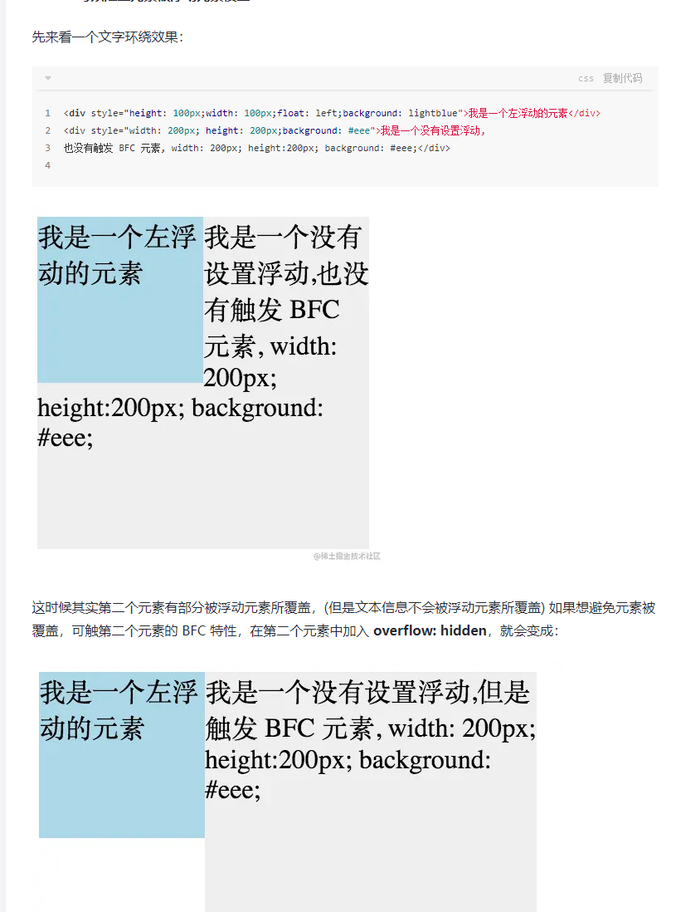
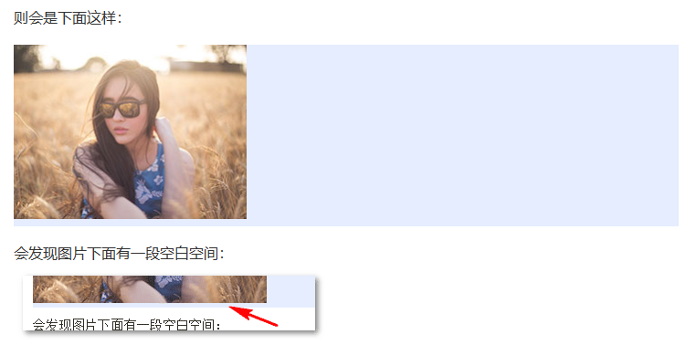
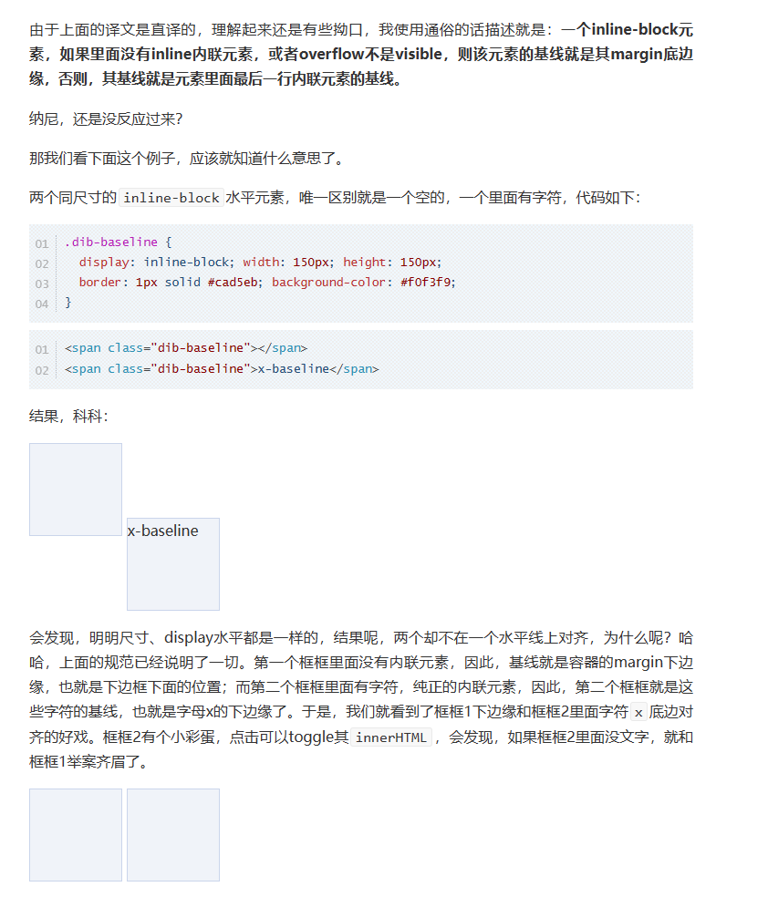

## :target伪类

**`:target`** [CSS](https://developer.mozilla.org/en-US/docs/Web/CSS) [伪类](https://developer.mozilla.org/en-US/docs/Web/CSS/Pseudo-classes) 代表一个唯一的页面元素(目标元素)，其[`id`](https://developer.mozilla.org/zh-CN/docs/Web/HTML/Global_attributes#attr-id) 与当前URL片段匹配

```html
<h3>Table of Contents</h3>
<ol>
 <li><a href="#p1">Jump to the first paragraph!</a></li>
 <li><a href="#p2">Jump to the second paragraph!</a></li>
 <li><a href="#nowhere">This link goes nowhere,
   because the target doesn't exist.</a></li>
</ol>
<h3>My Fun Article</h3>
<p id="p1">You can target <i>this paragraph</i> using a
  URL fragment. Click on the link above to try out!</p>
<p id="p2">This is <i>another paragraph</i>, also accessible
  from the links above. Isn't that delightful?</p>
```

```css
p:target {
  background-color: gold;
}

/* 在目标元素中增加一个伪元素*/
p:target::before {
  font: 70% sans-serif;
  content: "►";
  color: limegreen;
  margin-right: .25em;
}

/*在目标元素中使用italic样式*/
p:target i {
  color: red;
}
```

## outline和border

outline不占页面空间，不会影响元素尺寸和位置，不能像border一样只设置某一边。

## attr()

https://developer.mozilla.org/zh-CN/docs/Web/CSS/attr()

**注意:** `attr()` 理论上能用于所有的CSS属性但目前支持的仅有伪元素的 [`content`](https://developer.mozilla.org/zh-CN/docs/Web/CSS/content) 属性，其他的属性和高级特性目前是实验性的

CSS表达式 `attr()` 用来获取选择到的元素的某一HTML属性值，并用于其样式。它也可以用于伪元素，属性值采用伪元素所依附的元素。

```css
<p data-foo="hello">world</p>

p:before {
    content:attr(data-foo) " ";
}
```


## :nth-of-type :nth-child

`ele:nth-of-type(n)`表示在`ele`父元素下选择第n个`ele`元素

`ele:nth-child(n)`表示在`ele`父元素下第n个子元素

## CSS选择器的读取顺序是**从右向左**

https://www.bilibili.com/video/BV1xs4y1u7b2?share_source=copy_web

## inset

The **`inset`** [CSS](https://developer.mozilla.org/en-US/docs/Web/CSS) property is a shorthand that corresponds to the [`top`](https://developer.mozilla.org/en-US/docs/Web/CSS/top), [`right`](https://developer.mozilla.org/en-US/docs/Web/CSS/right), [`bottom`](https://developer.mozilla.org/en-US/docs/Web/CSS/bottom), and/or [`left`](https://developer.mozilla.org/en-US/docs/Web/CSS/left) properties. It has the same multi-value syntax of the [`margin`](https://developer.mozilla.org/en-US/docs/Web/CSS/margin) shorthand.

```
/* <length> values */
inset: 10px; /* value applied to all edges */
inset: 4px 8px; /* top/bottom left/right */
inset: 5px 15px 10px; /* top left/right bottom */
inset: 2.4em 3em 3em 3em; /* top right bottom left */
```


## pointer-events

`pointer-events`是一个用于 HTML 指针事件的属性，属性有很多值，但是对于浏览器来说，只有`auto`和`none`两个值可用，其它的几个是针对SVG的。

- auto——效果和没有定义pointer-events属性相同，鼠标不会穿透当前层。
- none——可以禁用 HTML 元素的 hover/focus/active 等动态效果，鼠标的动作将不能被该元素及其子元素所捕获，但是能够被其父元素所捕获。但是，当其后代元素的`pointer-events`属性指定其他值时，鼠标事件可以指向后代元素，在这种情况下，鼠标事件将在捕获或冒泡阶段触发父元素的事件侦听器。实际上默认就可以穿透当前层，因为pointer-events默认为auto

若HTML上两个元素之间没有包含关系，那么，鼠标事件就不会在这两个元素之间传递，通常情况上层的元素会覆盖下层的元素，导致下层元素捕获不到事件；此时将上层元素的 `pointer-events` 属性设置为 `none` ，则上层元素将不捕获事件，那么事件将被下层元素捕获到；

### 使用场景

+ 禁用 a 标签事件效果

在做 tab 切换的时候，当选中当前项，禁用当前标签的事件，只有切换其他 tab 的时候，才重新请求新的数据。

 ```html
   <!--CSS-->
   <style>
       .active{
           pointer-events: none;
       }
   </style>
   <!--HTML-->
   <ul>
       <li><a class="tab"></a></li>
       <li><a class="tab active"></a></li>
       <li><a class="tab"></a></li>
   </ul>复制代码
 ```

+ 切换开/关按钮状态

点击提交按钮的时候，为了防止用户一直点击按钮，发送请求，当请求未返回结果之前，给按钮增加 pointer-events: none，可以防止这种情况，这种情况在业务中也十分常见。

```html
 <!--CSS-->
.j-pro{ pointer-events: none; }
<!--HTML-->
<button r-model={this.submit()} r-class={{"j-pro": flag}}>提交</button>
<!--JS-->
submit: function(){
　　this.data.flag = true;
　　this.$request(url, {
　　　　// ... onload: function(json){
　　　　　　　　if(json.retCode == 200){
　　　　　　　　　　this.data.flag = false;
　　　　　　　　} }.bind(this)
　　　　// ...
　　});
}
```

+ 防止透明元素和可点击元素重叠不能点击

一些内容的展示区域，为了实现一些好看的 css 效果，当元素上方有其他元素遮盖，为了不影响下方元素的事件，给被遮盖的元素增加 pointer-events: none; 可以解决。

## p元素嵌套

p标签虽然是块级元素，但不可包含其他块级元素。像p标签 <h1 ~ 6>标签 这几个块元素只可包含内联元素（行内元素）,  所以p标签无法嵌套p div ul标签

p标签在遇到下一个块级元素时就闭合，在浏览器中会被渲染为两倍数量的p元素

## pre标签

pre标签可定义预格式化的文本。被包围在 <pre> 标签 元素中的文本通常会**保留空格和换行符**。而文本也会呈现为等宽字体。

**提示:** <pre> 标签的一个常见应用就是用来表示计算机的源代码。

## 选择器优先级

| 选择器类别                         | 权重   |
| ---------------------------------- | ------ |
| 内联样式                           | 1000   |
| ID选择器                           | 100    |
| 类、伪类选择器；属性选择器         | 10     |
| 元素选择器；子代选择器；相邻选择器 | 0      |
| 继承的样式                         | 无权值 |

```
权重计算规则：
1、第一等：代表内联样式，如: style=””，权值为1000。
2、第二等：代表ID选择器，如：#content，权值为0100。
3、第三等：代表类，伪类和属性选择器，如.content，权值为0010。
4、第四等：代表类型选择器和伪元素选择器，如div p，权值为0001。
5、通配符、子选择器、相邻选择器等的。如*、>、+,权值为0000。
6、继承的样式没有权值。
后代、子代选择器权值相加
权值相同时，以后定义的选择器为主
选择器权值计算不会超过自己的最大数量级
```

## line-height

主要是纯数字属性值

```
normal
```

取决于用户端。桌面浏览器（包括Firefox）使用默认值，约为`1.2`，这取决于元素的 `font-family`。

```
<数字>
```

该属性的应用值是这个无单位数字[`<数字>`](https://developer.mozilla.org/zh-CN/docs/Web/CSS/number)乘以该元素的字体大小。计算值与指定值相同。大多数情况下，这是设置`line-height`的**推荐方法**，不会在继承时产生不确定的结果。

```
<长度>
```

指定[`<长度>`](https://developer.mozilla.org/zh-CN/docs/Web/CSS/length)用于计算 line box 的高度。参考[`<长度>`](https://developer.mozilla.org/zh-CN/docs/Web/CSS/length)了解可使用的单位。以 **em** 为单位的值可能会产生不确定的结果。

```
<百分比>
```

与元素自身的字体大小有关。计算值是给定的百分比值乘以元素计算出的字体大小。**百分比**值可能会带来不确定的结果。

参考资料：

[line-height - CSS：层叠样式表 | MDN (mozilla.org)](https://developer.mozilla.org/zh-CN/docs/Web/CSS/line-height)


## 水平垂直居中

仅居中元素定宽高适用

- absolute + 负margin
- absolute + margin auto
- absolute + calc

居中元素不定宽高

- absolute + transform
- lineheight
- css-table
- flex
- grid

1. absolute + 负margin 宽高确定，父容器`position:relative`，子元素`position:absolute`

```html
<body>
  <div class="box">珠峰培训</div>
</body>

// 宽高确定
<style>
    html,
    body {
      height: 100%;
      overflow: hidden;
    }

    .box {
      box-sizing: border-box;
      width: 100px;
      height: 50px;
      line-height: 48px;
      text-align: center;
      font-size: 16px;
      border: 1px solid lightblue;
      background: lightcyan;
    }

    body {
      position: relative;
    }

    .box {
      position: absolute;
      top: 50%;
      left: 50%;
      margin-top: -25px;
      margin-left: -50px;
    }
  </style>

```

2. absolute + margin auto 宽高必须有，子元素`top: 0;bottom: 0;left: 0;right: 0;margin: auto;`

```html
<body>
  <div class="box">珠峰培训</div>
</body>
<style>
    html,
    body {
      height: 100%;
      overflow: hidden;
    }

    .box {
      box-sizing: border-box;
      width: 100px;
      height: 50px;
      line-height: 48px;
      text-align: center;
      font-size: 16px;
      border: 1px solid lightblue;
      background: lightcyan;
    }

    body {
      position: relative;
    }

    .box {
      position: absolute;
      top: 0;
      bottom: 0;
      left: 0;
      right: 0;
      margin: auto;
    }
  </style>
```

3. absolute + calc

```html
<body>
  <div class="box">珠峰培训</div>
</body>
// 宽高确定
<style>
    html,
    body {
      height: 100%;
      overflow: hidden;
    }

    .box {
      box-sizing: border-box;
      width: 100px;
      height: 50px;
      line-height: 48px;
      text-align: center;
      font-size: 16px;
      border: 1px solid lightblue;
      background: lightcyan;
    }

    body {
      position: relative;
    }

    .box {
      position: absolute;
      top: calc(50% - 50px);
    	left: calc(50% - 25px);
    }
  </style>
```

4. absolute + transform无视宽高

```html
<body>
  <div class="box">珠峰培训</div>
</body>
<style>
    html,
    body {
      height: 100%;
      overflow: hidden;
    }

    .box {
      box-sizing: border-box;
      /* width: 100px; */
      /* height: 50px; */
      line-height: 48px;
      text-align: center;
      font-size: 16px;
      border: 1px solid lightblue;
      background: lightcyan;
    }

    body {
      position: relative;
    }

    .box {
      position: absolute;
      top: 50%;
      left: 50%;
      transform: translate(-50%,-50%);
    }
  </style>
```

5. lineheight

把box设置为行内元素，通过`text-align`就可以做到水平居中，通过`vertical-align`在垂直方向做到居中，代码如下

```html
<div class="wp">
    <div class="box">123123</div>
</div>
<style>
.wp {
    line-height: 300px;
    text-align: center;
    font-size: 0px;
}
.box {
    font-size: 16px;
    display: inline-block;
    vertical-align: middle;
    line-height: initial;
    text-align: left; /* 修正文字 */
}
</style>
```

6. css-table

```html
<style>
.wp {
    line-height: 300px;
    text-align: center;
    font-size: 0px;
}
.box {
    font-size: 16px;
    display: inline-block;
    vertical-align: middle;
    line-height: initial;
    text-align: left; /* 修正文字 */
}
</style><div class="wp">
    <div class="box">123123</div>
</div>
<style>
.wp {
    display: table-cell;
    text-align: center;
    vertical-align: middle;
}
.box {
    display: inline-block;
}
</style>
```

7. flex

```html
<div class="wp">
    <div class="box">123123</div>
</div>
<style>
.wp {
    display: flex;
    justify-content: center;
    align-items: center;
}
</style>
```

8. grid


## 容器宽高等比例

> 原理: padding的百分比计算是根据父元素的宽度来计算。

内容写在`.child::after`伪类元素中

```html
<!DOCTYPE html>
<html lang="en">
<head>
  <style>
    .parent{
      height: 100px;
      width: 100px;
      background-color: lightseagreen;
    }
    .child{
      height: 0;
      /* 高度为宽度的50% */
      padding-bottom: 50%;
      position: relative;
    }
    .child::before{
      display: block;
      content: '宽高2:1';
      position: absolute;
      top: 0;
      bottom: 0;
      left: 0;
      right: 0;
      background-color: red;
    }
  </style>
</head>
<body>
  <div class="parent">
    <div class="child"></div>
  </div>
</body>
</html>
```

## display、visibility、opacity的区别

| **比较**           | **display:none** | **opacity:0**                                        | **visibility:hidden**                                     |
| ------------------ | ---------------- | ---------------------------------------------------- | --------------------------------------------------------- |
| **占据空间**       | **否**           | **是**                                               | **是**                                                    |
| **回流与渲染**     | **是**           | **否**                                               | **否**                                                    |
| **子代继承性**     | **不继承**       | **继承，并且子元素 不能通过 opacity: 1; 来取消隐藏** | **继承子元素可以通过设置 visibility: visible;来取消隐藏** |
| **子代反继承**     | **否**           | **否**                                               | **能**                                                    |
| **transition效果** | **无效**         | **有效**                                             | **hidden有效，visible立即显示**                           |
| **绑定的事件**     | **不响应**       | **能响应**                                           | **不响应**                                                |

**继承性和反继承性**

所谓继承，都是指子代继承父代的东西。反继承就是子代设置自己的属性变得和父代不一样。

很多时候，我们要让一个元素保留位置的同时不触发绑定在这个元素上的事件，此时要结合visibility、opacity、transition一起用才能实现这样的效果。（不得不说opacity和visibility结合了使用，使得同一个元素产生淡进淡出的效果很好用）。如下：

```css
div{
    visibility:hidden;
    opacity:0;
    transition:all .5s;
}
div:hover{
    visibility:visible;
    opacity:1;
}
```


## BFC

**区块格式化上下文**

当CSS的 **position** 属性为 **static** 或 **relative**，并且 **float** 为 **none** 时，其布局方式为普通流。

独立渲染区域

创建BFC的方式：

1. 浮动元素（float不为none，float默认为none）
2. 绝对定位、固定定位元素。（position值为absoluted、fixed，没有relative、static）
3. display值为**inline-block**、table-cell、flex、**flow-root**
4. overflow值为hidden、auto、scroll（除了visible）

能解决什么问题：

1. 边距重叠（兄弟元素外边距重叠，父子元素外边距重叠）

2. 包含内部浮动（防止浮动元素溢出到父元素的外部，子元素浮动造成父元素盒子高度塌陷）

3. 排除外部浮动（[区块格式化上下文 - Web 开发者指南 | MDN (mozilla.org)](https://developer.mozilla.org/zh-CN/docs/Web/Guide/CSS/Block_formatting_context#排除外部浮动)）

4. 浮动环绕文字（文本信息不会被浮动元素所覆盖[浮动 - 学习 Web 开发 | MDN (mozilla.org)](https://developer.mozilla.org/zh-CN/docs/Learn/CSS/CSS_layout/Floats)）

   

## fit-content

fit-content的效果和inline-block、absolute的效果类似，都能实现尺寸收缩效果

fit-content的使用时机：

1. 想保持display、position实现尺寸收缩
2. 让元素有一个确定的width、height

关于(2)的详细描述：

水平垂直居中的代码如下

```css
.center{
  position:absolute;
  left:50%;
  right:50%;
  transform:translate(-50%,-50%);
}

```

如果对上述代码的transform还有其它动画效果则会干扰transform的值

```css
.center{
  position:absolute;
  left:50%;
  right:50%;
  transform:translate(-50%,-50%);
  animation: oo 3s;
}
@keyframes oo {
	from {
		transform: translateY(20px)
	}
	to {
		transform: translateY(0px);
	}
}

```

解决：

```css
.center{
  position:absolute;
  width:fit-content;
  height:fit-content;
  inset:0;
}

```

fit-content也能用来更好的处理水平居中：（via[理解CSS3 max/min-content及fit-content等width值 « 张鑫旭-鑫空间-鑫生活 (zhangxinxu.com)](https://www.zhangxinxu.com/wordpress/2016/05/css3-width-max-contnet-min-content-fit-content/?shrink=1)）

```css
.box {
    background-color: #f0f3f9;
    padding: 10px;
    /* 这里左右方向是auto */
    margin: 10px auto 20px;
    overflow: hidden;
}

.inline-block {
    display: inline-block;
}
.fit-content {
    width: -webkit-fit-content;
    width: -moz-fit-content;
    width: fit-content;
}
```

```html
<strong>display:inline-block;</strong>
<div class="box inline-block">
    
    <p>display:inline-block居中要靠父元素，而width:fit-content直接margin:auto.</p>
</div>

<strong>width: fit-content;</strong>
<div class="box fit-content">
    
    <p>display:inline-block居中要靠父元素，而width:fit-content直接margin:auto.</p>
</div>
```

## viewport

在PC端上，设置viewport不生效,布局视口永远等于浏览器窗口的宽度。

```html
<meta name="viewport" content="width=device-width, initial-scale=1.0, maximum-scale=1.0, minimum-scale=1.0, user-scalable=no" />
```

属性：

```
width
```

控制视口的大小。这可以设置为特定像素数（如'width=600'），也可以设置为特殊值`device-width`，即 [100vw](https://developer.mozilla.org/zh-CN/docs/Web/CSS/length#视口_viewport_比例的长度)，100% 的视口宽度。最小值为 `1`。最大值为 `10000`。负值会被忽略。

```
height
```

控制视口的大小。这可以设置为特定像素数（如 `width=600`），也可以设置为特殊值 `device-height`，即 [100vh](https://developer.mozilla.org/zh-CN/docs/Web/CSS/length#视口_viewport_比例的长度)，100% 的视口高度。最小值为 `1`。最大值为 `10000`。负值会被忽略。

```
initial-scale
```

控制页面首次加载时显示的缩放倍数。最小值是 `0.1`。最大值是 `10`。默认值为 `1`。负值会被忽略。

```
minimum-scale
```

控制页面允许缩小的倍数。最小值是 `0.1`。最大值是 `10`。默认值为 `1`。负值会被忽略。

```
maximum-scale
```

控制页面允许放大的倍数。设置一个低于 `3` 的值将不具备无障碍访问性。最小值是 `0.1`。最大值是 `10`。默认值为 `1`。负值会被忽略。

```
user-scalable
```

控制是否允许页面上的放大和缩小操作。有效值为 `0`、`1`、`yes` 或 `no`。默认值为 `1`，与 `yes` 相同。

对于设置了初始或最大比例的页面，**这意味着宽度属性实际上转化为最小视口宽度**。例如，如果你的布局需要至少 500 像素的宽度，那么你可以使用以下标记。当屏幕的宽度超过 500 像素时，**浏览器将扩大视口**（而不是放大）以适应屏幕。

```html
<meta name="viewport" content="width=500, initial-scale=1" />
```

参考资料
[viewport meta 标记 - HTML（超文本标记语言） | MDN (mozilla.org)](https://developer.mozilla.org/zh-CN/docs/Web/HTML/Viewport_meta_tag)

## em和rem

em，相对单位，这个单位表示元素的 [`font-size`](https://developer.mozilla.org/zh-CN/docs/Web/CSS/font-size) 的计算值。如果用在[`font-size`](https://developer.mozilla.org/zh-CN/docs/Web/CSS/font-size) 属性本身，它则表示元素*继承*的 `font-size` 值。em不仅可以用作font-size的计算值，也可用于width等。

```css
 /* em的用法1：自己元素设置font-size的值来当作em的参照值 */
.div-em{
    font-size: 32px;  // 1em = 32px
    width: 10em;      // 10em = 10 x 32 = 320px
    height: 10em;     // 10em = 10 x 32 = 320px
    background-color: aquamarine;
}

 /* em的用法2：自己元素不设置，而父级元素设置font-size的值来当作em的参照值 */
.div-em-father{
    font-size: 64px;  // 1em = 64px
}

.div-em-child{
    width: 10em;     // 10em = 10 x 64 = 640px
    height: 10em;    // 10em = 10 x 64 = 640px
    background-color: cadetblue;
}
```

rem，相对单位，这个单位代表根元素（通常为<html> 元素）的 font-size 大小。当用在根元素的 font-size 上面时，它代表了它的初始值。

```css
/* rem的用法 */
html{
    font-size:16px;  // 1rem = 16px
}

.div-rem{
    width: 10rem;    // 10rem = 10 x 16 = 160px
    height: 10rem;   // 10rem = 10 x 16 = 160px
    font-size: 1rem; // 1rem = 16px
    background-color: #a58778;
}
```

```css
html{
  font-size: 2rem; // 2*16=32px
}
.d1{
  font-size: 2rem; // 2*32=64px
}
```

## 移动端适配

css中的像素只是一个抽象的单位，在不同的设备或不同的环境中，css中的1px所代表的设备物理像素是不同的。

**设备像素比dpr**，返回当前显示设备的*物理像素*分辨率与*CSS 像素*分辨率之比，它告诉浏览器应使用多少屏幕实际像素来绘制单个 CSS 像素。

访问：

```js
window.devicePixelRatio
```

参考资料

https://juejin.cn/post/6884042902587047943

[基于vw等viewport视区单位配合rem响应式排版和布局 « 张鑫旭-鑫空间-鑫生活 (zhangxinxu.com)](https://www.zhangxinxu.com/wordpress/2016/08/vw-viewport-responsive-layout-typography/)

[通过插件postcss-pxtorem轻松实现px到rem转换，完成移动端适配_SZ_FED的博客-CSDN博客](https://blog.csdn.net/llq886/article/details/105737987)

## flexible

```js
// set 1rem = viewWidth / 10
function setRemUnit () {
    var rem = docEl.clientWidth / 10
    docEl.style.fontSize = rem + 'px'
}
setRemUnit();
// reset rem unit on page resize
window.addEventListener('resize', setRemUnit)window.addEventListener('pageshow', function (e) {
    if (e.persisted) {
      setRemUnit()
    }
})
```

> lib-flexible这个过渡方案（本质上）已经可以放弃使用，不管是现在的版本还是以前的版本，都存有一定的问题。建议大家开始使用viewport来替代此方案。

## vh和vw

`flexible`方案就是模仿这种方案，因为早些时候`vw`还没有得到很好的兼容。

- `vw(Viewport's width)`：`1vw`等于视觉视口的`1%`
- `vh(Viewport's height)` :` 1vh` 为视觉视口高度的`1%`
- `vmin` : `vw` 和 `vh` 中的较小值
- `vmax` : 选取 `vw` 和 `vh` 中的较大值

缺陷：

- `px`转换成`vw`不一定能完全整除，因此有一定的像素差。
- 比如当容器使用`vw`，`margin`采用`px`时，很容易造成整体宽度超过`100vw`，从而影响布局效果。当然我们也是可以避免的，例如使用`padding`代替`margin`，结合`calc()`函数使用等等...

## 不同dpr下图片适配

**media   -webkit-min-device-pixel-ratio**

```css
.avatar{
            background-image: url(conardLi_1x.png);
        }
        @media only screen and (-webkit-min-device-pixel-ratio:2){
            .avatar{
                background-image: url(conardLi_2x.png);
            }
        }
        @media only screen and (-webkit-min-device-pixel-ratio:3){
            .avatar{
                background-image: url(conardLi_3x.png);
            }
        }

```

**-webkit-image-set**

```css
.avatar {
    background-image: -webkit-image-set( "conardLi_1x.png" 1x, "conardLi_2x.png" 2x );
}
```

**srcset**

```html

```

## 媒体查询

| 屏幕     | 设备 | 尺寸               |
| -------- | ---- | ------------------ |
| 超小屏幕 | 手机 | <768px             |
| 小屏幕   | 平板 | >=768px && <992px  |
| 中等屏幕 | PC   | >=992px && <1200px |
| 大屏幕   | PC   | >=1200px0          |
| 超大屏幕 | PC   | >=1680px           |

```css
/* 小屏幕设备 */
@media only screen and (max-width: 767px) {
  /* 在此编写小屏幕设备的样式 */
}

/* 中屏幕设备 */
@media only screen and (min-width: 768px) and (max-width: 991px) {
  /* 在此编写中屏幕设备的样式 */
}

/* 大屏幕设备 */
@media only screen and (min-width: 992px) and (max-width: 1199px) {
  /* 在此编写大屏幕设备的样式 */
}

/* 极大屏幕设备 */
@media only screen and (min-width: 1200px) {
  /* 在此编写极大屏幕设备的样式 */
}
```


## 幽灵空白节点

行盒、行内块之间在源代码中出现多个空白字符会造成空白折叠。

在**HTML5 文档声明**中，内联元素的所有解析和渲染表现就如同每个行框盒子的前面有一个“空白节点”一样。这个“空白节点”永远透明，不占据任何宽度，看不见也无法通过脚本获取，就好像幽灵一样，但又确确实实地存在，表现如同文本节点一样，因此，在张鑫旭大佬的《CSS 世界》一书中根据特点，将其称之为“幽灵空白节点”，也就是官方规范中的“`strut`”。


```html
<div style="background-color:#e5edff;"></div>
```

> 

**在HTML5文档声明下，块状元素内部的内联元素的行为表现，就好像块状元素内部还有一个（更有可能两个-前后）看不见摸不着没有宽度没有实体的空白节点，这个假想又似乎存在的空白节点，我称之为“幽灵空白节点”。**

图片初始的`vertical-align:baseline`其所在行的基线即对应当前图片元素的底边，英文字母`g y j`和部分汉字的基线会造成幽灵节点。

**一个inline-block元素，如果里面没有inline内联元素，或者overflow不是visible，则该元素的基线就是其margin底边缘，否则，其基线就是元素里面最后一行内联元素的基线。**

> 

参考资料

[CSS深入理解vertical-align和line-height的基友关系 « 张鑫旭-鑫空间-鑫生活 (zhangxinxu.com)](https://www.zhangxinxu.com/wordpress/2015/08/css-deep-understand-vertical-align-and-line-height/)

[css vertical-align你真的很了解嘛？ - 知乎 (zhihu.com)](https://zhuanlan.zhihu.com/p/28626505)

[带你探索神秘的“幽灵空白节点” - 知乎 (zhihu.com)](https://zhuanlan.zhihu.com/p/391118319)s

## flex

容器的 [`display`](https://developer.mozilla.org/zh-CN/docs/Web/CSS/display) 属性值改为 `flex` 或者 `inline-flex`，flex 容器中的所有 flex 元素都会有下列行为：

- 元素排列为一行 (`flex-direction` 属性的初始值是 `row`)。
- 元素从主轴的起始线开始。
- **元素不会在主维度方向拉伸，但是可以缩小。**
- **元素被拉伸来填充交叉轴大小。**
- [`flex-basis`](https://developer.mozilla.org/zh-CN/docs/Web/CSS/flex-basis) 属性为 `auto`。
- [`flex-wrap`](https://developer.mozilla.org/zh-CN/docs/Web/CSS/flex-wrap) 属性为 `nowrap`。

`align-items`属性可以使元素在交叉轴方向对齐。这个属性的初始值为`stretch`，这就是为什么 flex 元素**会默认被拉伸到最高元素的高度**。实际上，它们被拉伸来填满 flex 容器 —— 最高的元素定义了容器的高度。

**项目属性**

**order**：取值：默认0，用于决定项目排列顺序，数值越小，项目排列越靠前。

## colgroup

```html
<table border="1">
  <colgroup>
    <col span="2" style="background-color:red">
    <col style="background-color:yellow">
  </colgroup>
  <tr>
    <th>ISBN</th>
    <th>Title</th>
    <th>Price</th>
  </tr>
  <tr>
    <td>3476896</td>
    <td>My first HTML</td>
    <td>$53</td>
  </tr>
</table>
```

`<colgroup> `标签用于对表格中的列进行组合，以便对其进行格式化。

通过使用` <colgroup> `标签，可以向整个列应用样式，而不需要重复为每个单元格或每一行设置样式。

只能在 `<table> `元素之内，在任何一个` <caption>` 元素之后，在任何一个` <thead>`、`<tbody>`、`<tfoot>`、`<tr>` 元素之前使用 `<colgroup>` 标签。

## table-layout

```
auto
```

默认情况下，大多数浏览器使用自动表格布局算法。表格及其单元格的宽度会根据内容自动调整大小。

```
fixed
```

表格和列的宽度是由 `table` 和 `col` 元素的宽度或第一行单元格的宽度来设置的。后续行中的单元格不会影响列的宽度。

在“fixed”布局方法下，一旦下载并分析了第一行表格，整个表格就可以被渲染出来。这可以加快渲染时间，相比于“automatic”布局方法，但是后续单元格内容可能不适合提供的列宽。单元格使用 [`overflow`](https://developer.mozilla.org/zh-CN/docs/Web/CSS/overflow) 属性来确定是否要剪裁任何溢出的内容，但仅当表格具有已知宽度时才会生效；否则，它们不会溢出到单元格之外。

## justify-content

定义子元素在主轴上的对齐方式

- `flex-start`: 默认值，左对齐（或上对齐）。
- `flex-end`: 右对齐（或下对齐）。
- `center`: 居中对齐。
- `space-between`: 两端对齐，项目之间的间隔相等。
- `space-around`: 每个项目两侧的间隔相等，所以项目之间的间隔是项目与容器之间间隔的两倍。
- **`space-evenly`: 项目之间的间隔相等，包括项目与容器之间的间隔。**
