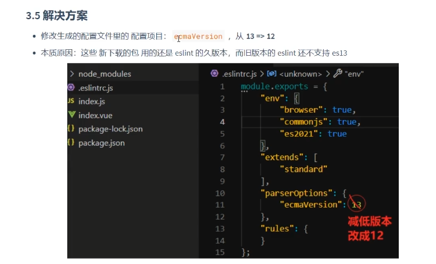
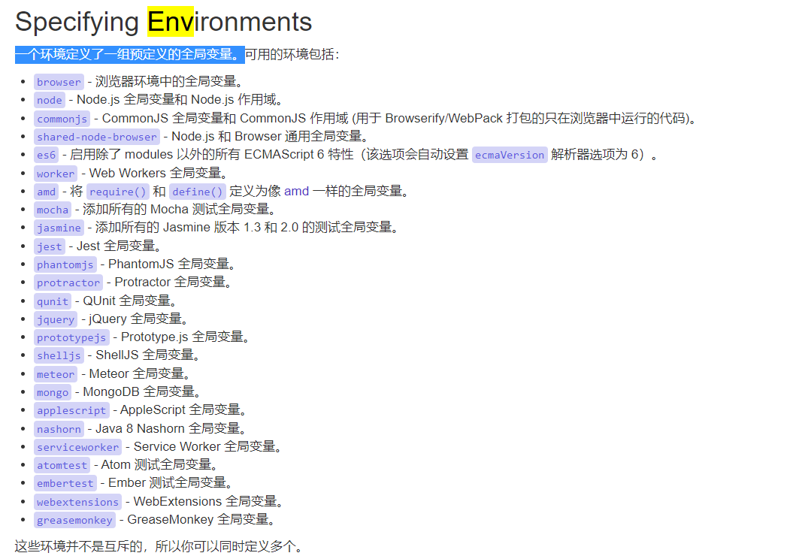
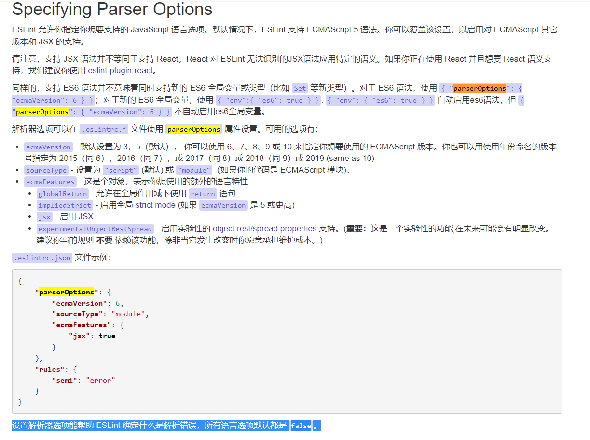

# ESLint

[传智播客 邹华栋](http://t.csdn.cn/hMWyT)

https://www.bilibili.com/video/BV1x341177X8?p=12&share_source=copy_web

[深入浅出 Eslint，告别 Lint 恐惧症 - 知乎 (zhihu.com)](https://zhuanlan.zhihu.com/p/558474060)

## 生成配置文件

> ESLint 可以创建独立的配置文件 .eslintrc.js  也可以直接在package.json中配置

```bash
npx  eslint --init
```

standard依赖于eslint@7.32.0




## ESLint配置文件入门

文件格式应使用`js`

JS模块风格建议使用`CommonJS`


### root

默认情况下，ESLint 会在所有父级目录里寻找配置文件，一直到根目录。如果你想要你所有项目都遵循一个特定的约定时，这将会很有用，但有时候会导致意想不到的结果。为了将 ESLint 限制到一个特定的项目，在你项目根目录下的 `package.json` 文件或者 `.eslintrc.*` 文件里的 `eslintConfig` 字段下设置 `"root": true`。ESLint 一旦发现配置文件中有 `"root": true`，它就会停止在父级目录中寻找。

```json
{
    "root": true
}
```

### env

```js
env: {
  browser: true,
  commonjs: true,
  es2021: true
},
```

`  browser: true`// 值为true则常见的变量如window,document未声明使用也不会报错

一个环境定义了一组预定义的全局变量。



### extends

```js
extends: [
  // 'standard'
  "eslint:recommended"
],
```

一个配置文件可以被基础配置中的已启用的规则继承。

`extends` 属性值可以是：

- 指定配置的字符串(配置文件的路径、可共享配置的名称、`eslint:recommended` 或 `eslint:all`)
- 字符串数组：每个配置继承它前面的配置

#### Using `"eslint:recommended"`

值为 `"eslint:recommended"` 的 `extends` 属性启用一系列核心规则，这些规则报告一些常见问题，在 [规则页面](https://eslint.bootcss.com/docs/rules/) 中被标记为 。这个推荐的子集只能在 ESLint 主要版本进行更新。

### Using a shareable configuration package

[可共享的配置](https://eslint.bootcss.com/docs/developer-guide/shareable-configs) 是一个 npm 包，它输出一个配置对象。要确保这个包安装在 ESLint 能请求到的目录下。

`extends` 属性值可以省略包名的前缀 `eslint-config-`。

```js
extends: [
	'standard'
],
```

### rules

`rules` 属性可以做下面的任何事情以扩展（或覆盖）规则：

- 启用额外的规则
- 改变继承的规则级别而不改变它的选项：
  - 基础配置：`"eqeqeq": ["error", "allow-null"]`
  - 派生的配置：`"eqeqeq": "warn"`
  - 最后生成的配置：`"eqeqeq": ["warn", "allow-null"]`
- 覆盖基础配置中的规则的选项
  - 基础配置：`"quotes": ["error", "single", "avoid-escape"]`
  - 派生的配置：`"quotes": ["error", "single"]`
  - 最后生成的配置：`"quotes": ["error", "single"]`

### globals

```js
globals: {
  "$" : true
},
```

当访问当前源文件内未定义的变量时，[no-undef](https://eslint.bootcss.com/docs/rules/no-undef) 规则将发出警告。如果你想在一个源文件里使用全局变量，推荐你在 ESLint 中定义这些全局变量，这样 ESLint 就不会发出警告了。你可以使用注释或在配置文件中定义全局变量。

要在你的 JavaScript 文件中，用注释指定全局变量，格式如下：

```
/* global var1, var2 */
```

这定义了两个全局变量，`var1` 和 `var2`。如果你想选择性地指定这些全局变量可以被写入(而不是只被读取)，那么你可以用一个 `"writable"` 的标志来设置它们:

```
/* global var1:writable, var2:writable */
```

要在配置文件中配置全局变量，请将 `globals` 配置属性设置为一个对象，该对象包含以你希望使用的每个全局变量。对于每个全局变量键，将对应的值设置为 `"writable"` 以允许重写变量，或 `"readonly"` 不允许重写变量。例如：

```JSON
{
    "globals": {
        "var1": "writable",
        "var2": "readonly"
    }
}
```

在这些例子中 `var1` 允许被重写，`var2` 不允许被重写。

可以使用字符串 `"off"` 禁用全局变量。例如，在大多数 ES2015 全局变量可用但 `Promise` 不可用的环境中，你可以使用以下配置:

```JSON
{
    "env": {
        "es6": true
    },
    "globals": {
        "Promise": "off"
    }
}
```

由于历史原因，布尔值 `false` 和字符串值 `"readable"` 等价于 `"readonly"`。类似地，布尔值 `true` 和字符串值 `"writeable"` 等价于 `"writable"`。但是，不建议使用旧值。

> false表只读，true表读写

### parser

ESLint 默认使用[Espree](https://github.com/eslint/espree)作为其解析器，你可以在配置文件中指定一个不同的解析器，只要该解析器符合下列要求：

1. 它必须是一个 Node 模块，可以从它出现的配置文件中加载。通常，这意味着应该使用 npm 单独安装解析器包。
2. 它必须符合 [parser interface](https://eslint.bootcss.com/docs/developer-guide/working-with-plugins#working-with-custom-parsers)。

注意，即使满足这些兼容性要求，也不能保证一个外部解析器可以与 ESLint 正常配合工作，ESLint 也不会修复与其它解析器不兼容的相关 bug。

为了表明使用该 npm 模块作为你的解析器，你需要在你的 `.eslintrc` 文件里指定 `parser` 选项。例如，下面的配置指定了 Esprima 作为解析器：

```
{
    "parser": "esprima",
    "rules": {
        "semi": "error"
    }
}
```

以下解析器与 ESLint 兼容：

- [Esprima](https://www.npmjs.com/package/esprima)
- [Babel-ESLint](https://www.npmjs.com/package/babel-eslint) - 一个对[Babel](https://babeljs.io/)解析器的包装，使其能够与 ESLint 兼容。
- [@typescript-eslint/parser](https://www.npmjs.com/package/@typescript-eslint/parser) - 将 TypeScript 转换成与 estree 兼容的形式，以便在ESLint中使用。

注意，在使用自定义解析器时，为了让 ESLint 在处理非 ECMAScript 5 特性时正常工作，配置属性 `parserOptions` 仍然是必须的。解析器会被传入 `parserOptions`，但是不一定会使用它们来决定功能特性的开关。

### parserOptions

指定你想要支持的 JavaScript 语言选项。



### plugins

ESLint 支持使用第三方插件。在使用插件之前，你必须使用 npm 安装它。

在配置文件里配置插件时，可以使用 `plugins` 关键字来存放插件名字的列表。插件名称可以省略 `eslint-plugin-` 前缀。

```json
{
    "plugins": [
        "plugin1",
        "eslint-plugin-plugin2"
    ]
}
```
