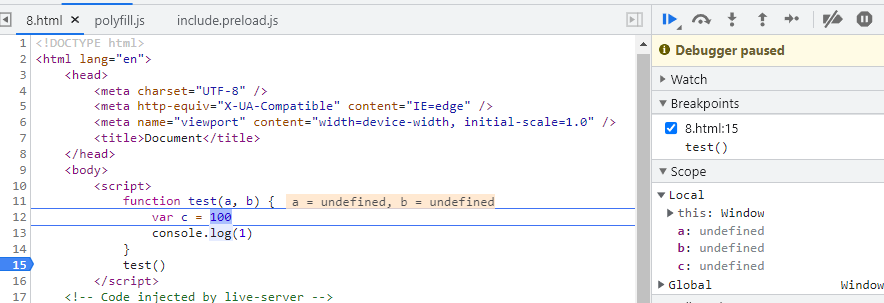
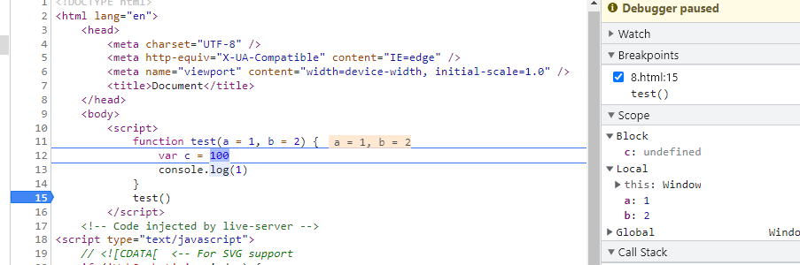
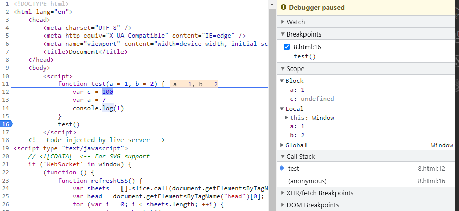
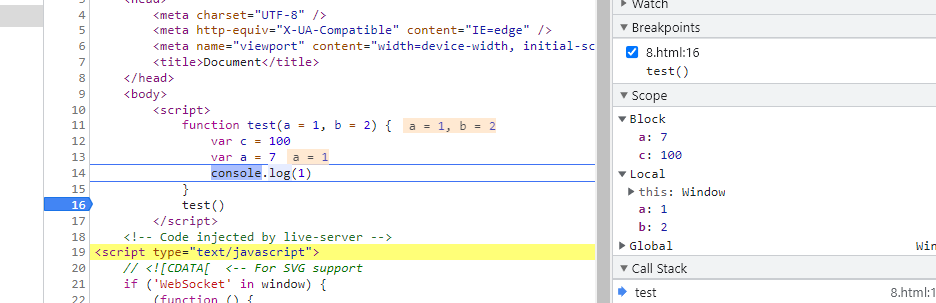
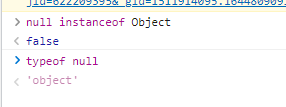

# JS面试题

## var、let、const的区别

1. var定义的变量，没有块的概念，可以跨块访问, 不能跨函数访问。
2. let定义的变量，只能在块作用域里访问，不能跨块访问，也不能跨函数访问。
3. const用来定义常量，使用时必须初始化(即必须赋值)，**只能在块作用域里访问**，而且不能修改。
4. 同一个变量只能使用一种方式声明，不然会报错

[var、let、const 的本质区别是什么 - 知乎 (zhihu.com)](https://zhuanlan.zhihu.com/p/373652940)

## 监听元素进入视口

http://www.ruanyifeng.com/blog/2016/11/intersectionobserver_api.html

## 原生拖放

https://www.cnblogs.com/xiaohuochai/p/5886618.html

## 拷贝数组

日常开发中，数组的拷贝是一个会经常遇到的场景。其实实现数组的拷贝有很多骚技巧。

`Array.slice`

```js
const arr = [1, 2, 3, 4, 5];
const copyArr = arr.slice();
```

**展开操作符**

```js
const arr = [1, 2, 3, 4, 5];
const copyArr = [...arr];
```

**使用 `Array` 构造函数和展开操作符**

```js
const arr = [1, 2, 3, 4, 5];
const copyArr = new Array(...arr);
```

`Array.concat`

```js
const arr = [1, 2, 3, 4, 5];
const copyArr = arr.concat();
```


## 数组去重

```js
const arr = [1, 1, '1', 17, true, true, false, false, 'true', 'a', {}, {}];
// => [1, '1', 17, true, false, 'true', 'a', {}, {}]
```

**方法1：利用Set**

**缺点：**无法识别相同对象和数组；

```js
const res1 = Array.from(new Set(arr));
```

ES6 提供了新的数据结构 Set。它类似于数组，但是成员的值都是唯一的，没有重复的值。

`Set`本身是一个构造函数，用来生成 Set 数据结构。

`Set`函数可以接受一个数组（或者具有` iterable` 接口的其他数据结构）作为参数，用来初始化。

`Array.from()` 方法从一个类似数组或可迭代对象创建一个新的，浅拷贝的数组实例。

**方法2：利用`indexOf includes filter`**

```js
// 缺点：indexOf无法区分NaN;需要特殊处理；
const unique2 = arr => {
  const res = [];
  for (let i = 0; i < arr.length; i++) {
    if (res.indexOf(arr[i]) === -1) res.push(arr[i]);
  }
  return res;
}

const unique3 = arr => {
  const res = [];
  for (let i = 0; i < arr.length; i++) {
    if (!res.includes(arr[i])) res.push(arr[i]);
  }
  return res;
}

// 缺点：indexOf无法区分NaN;需要特殊处理；
const unique4 = arr => {
  return arr.filter((item, index) => {
    return arr.indexOf(item) === index;
  });
}

var unique = (arr) =>  {
   if (!Array.isArray(arr)) return;
   return arr.reduce((prev,cur) => prev.includes(cur) ? prev : [...prev,cur],[]);
}
```


## 箭头函数中，`this`是固定的，不可变的

```js
const obj = {
    a: () => {
        console.log(this.id)  // 此处的this指向window
    }
}
var id = '1'
obj.a() // '1'
obj.a.call({
    id:'2'
}) // '1'
```

## 原型链

当谈到继承时，JavaScript 只有一种结构：对象。每个实例对象（ object ）都有一个私有属性（称之为 `__proto__` ）指向它的构造函数的原型对象（`prototype`）。该原型对象也有一个自己的原型对象( `__proto__` ) ，层层向上直到一个对象的原型对象为 `null`。根据定义，`null` 没有原型，并作为这个**原型链**中的最后一个环节。

JavaScript 对象是动态的属性“包”（指其自己的属性）。JavaScript 对象有一个指向一个原型对象的链。当试图访问一个对象的属性时，它不仅仅在该对象上搜寻，还会搜寻该对象的原型，以及该对象的原型的原型，依次层层向上搜索，直到找到一个名字匹配的属性或到达原型链的末尾。

```js
/**
 * 对应名称
 * prototype:原型
 * __proto__:原型链 链接点
 * 
 * 从属关系
 * prototype->函数的一个属性 :对象{}
 * __proto__ ->对象Object的一个属性 :对象{}
 * 对象的__proto__保存着改对象的构造函数的prototype
 */
function Test(params) {
  this.a = 1
  this.b = 333
}
console.log(Test.prototype)

Test.prototype.b = 2

const test = new Test()
console.log(test.__proto__)
console.log(Test.prototype === test.__proto__)

// Test.prototype 也是一个对象,因此它也有__proto__
console.log(Test.prototype.__proto__)
console.log(Object.prototype.__proto__) // 最顶层的__proto__为null 

Object.prototype.c = 3

console.log(test)

/**
 * test:{
 *  b:333,
 *  a:1,
 *  __proto__:Test.prototype={
 *    b:2,
 *    __proto__:Object.prototype={
 *      c:3
 *    }
 *  }
 * }
 */
console.log(test.a)
console.log(test.b)
console.log(test.c)


// Function Object : 既是函数又是对象
console.log(Test.__proto__ === Function.prototype) // true

console.log(Function.__proto__)
console.log(Function.prototype)
console.log(Function.__proto__ === Function.prototype) // true 内置规定

// const obj={}
// const obj=new Object()

console.log(typeof Object) // functon
console.log(Object.__proto__ === Function.prototype) // true
console.log(Object.__proto__ === Function.__proto__) // true

// test => {a:1,b:333}
// 不考察原型链
console.log(test.hasOwnProperty('a')) // true
console.log(test.hasOwnProperty('b')) // true
console.log(test.hasOwnProperty('c')) // false

// 考察原型链
console.log('a' in test) // true
console.log('b' in test) // true
console.log('c' in test) // true

// test.constructor -> 实例化test对象的构造函数
console.log(test.constructor === Test)
function Test1(params) {
  this.a=1111
}
test.constructor=Test1
console.log(test)
console.log(test.__proto__===Test.prototype)

```


## 防抖 节流

防抖

> 本质上是清除上次定时器，重新声明一个新的定时器

```js
const debounce = (func, wait, ...args) => {
  let timeout;
  return function(){
    const context = this;
    if (timeout) clearTimeout(timeout);
    timeout = setTimeout(() => {
      func.apply(context, args)
    },wait);
  }
}
```

```js
// 第一次函数一定执行，不会被第二次覆盖掉
const debounce = (func, wait, ...args) => {
  let timeout;
  return function(){
    const context = this;
    if (timeout) cleatTimeout(timeout);
    let callNow = !timeout;
    timeout = setTimeout(() => {
      timeout = null;
    },wait)
    
    if(callNow) func.apply(context,args)
   }
}
```


```js
let Debounce = function (fn, delay = 300, immediate = false) {
  let timer = null // 闭包存储setTimeout状态
  return function () {
    let self = this // 事件源this
    let args = arguments // 接收事件源的event
    if (timer) {
      clearTimeout(timer) // 清除定时器,timer变量仍然保存着计时器ID
    } // 存在就清除执行fn的定时器
    if (immediate) { // 立即执行
      let callNow = !timer // 执行fn的状态
      console.log(`callNow: `, callNow)
      timer = setTimeout(function () {
        timer = null
      }, delay)
      if (callNow) fn.apply(self, args)
    } else { // 非立即执行
      timer = setTimeout(function () { // 或者使用箭头函数将this指向dom
        fn.apply(self, args)
      }, delay)
    }
  }
}

let con1 = document.querySelector('.con1')
let con2 = document.querySelector('.con2')
let con3 = document.querySelector('.con3')

let addNum = function (args) {
  console.log('addnum')
  // console.log(this, args)
  // this.innerText = (+this.innerText) + 1
}

con1.onclick = addNum // 无防抖

con2.onclick = Debounce(addNum) // 防抖

con3.onclick = Debounce(addNum, 300, true) // 防抖（立即执行）
```

节流

> 节流不需要clearTimeout

```js
const throttle = (func, wait, ...args) => {
  let pre = 0;
  return function(){
    const context = this;
    let now = +Date.now();
    if (now - pre >= wait){
       func.apply(context, args);
       pre = now
    }
  }
}
```

```js
const throttle = (func, wait, ...args) => {
  let timeout;
  return function(){
    const context = this;
    if(!timeout){
      timeout = setTimeout(() => {
        timeout = null;
        func.apply(context,args);
      },wait)
    }
  }
}
```


```js
// 是否立即执行
let ThrottlePro = function (fn, delay = 500, immediate = false) {
    let preTime = 0 // 记录上一次执行时间
    return function () {
        let self = this, // 保留执行时候的的this
            args = [...arguments], // 执行时候的传入参数
            nowTime = +new Date(), // 记录当前的时间
            flag = nowTime - preTime >= delay // 执行命令
        if (immediate) { // 是否立即执行
            if (!flag) return
            preTime = nowTime // 更新执行时间
            fn.apply(self, args)
        } else {
            if (!flag) return // 不满足执行条件
            preTime = nowTime
            setTimeout(function () {
                fn.apply(self, args)
            }, delay)
        }
    }
}
```

## event loop

每个宏任务之后，引擎会立即执行微任务队列中的所有任务，然后再执行其他的宏任务，或渲染，或进行其他任何操作。

```
宏任务 → 所有微任务 → 下一个宏任务
```

```js
题 1：

setTimeout(function () {
    console.log(1)
});
new Promise(function(resolve,reject){
    console.log(2)
    resolve(3)
}).then(function(val){
    console.log(val)
})
console.log(4)

Result:
2 → 4 → 3 → 1
```

```js
题 2：

new Promise(resolve => {
    resolve(1);
    
    Promise.resolve().then(() => {
    	// t2
    	console.log(2)
    });
    console.log(4)
}).then(t => {
	// t1
	console.log(t)
});
console.log(3);

Result:
4 → 3 → 2 → 1
```


## valueOf和toString

### valueOf转换规则

非原始值(也就是对象)重写规则如下：

| 对象     | valueOf返回值        |
| -------- | -------------------- |
| Array    | 数组本身             |
| Boolean  | 布尔值               |
| Date     | 返回毫秒形式的时间戳 |
| Function | 函数本身             |
| Number   | 数字值               |
| Object   | 对象本身             |
| String   | 字符串值             |

#### 对象转换为布尔值

1. 直接转换为true（包装类型也一样），不调用valueOf和toString

#### 对象转换为数字

在预期会将对象用作数字使用时，比如参与算术运算等等操作，对象转换为数字会依次调用valueOf和toString方法，具体规则如下：

1. 如果对象具有`valueOf`方法且返回原始值(string、number、boolean、undefined、null)，则将该原始值转换为数字(转换失败会返回NaN)，并返回这个数字
2. 如果对象具有`toString`方法且返回原始值(string、number、boolean、undefined、null)，则将该原始值转换为数字(转换失败会返回NaN)，并返回这个数字
3. 转换失败，抛出`TypeError`

#### 对象转换为字符串

1. 如果对象具有`toString`方法且返回原始值(string、number、boolean、undefined、null)，则将该原始值转换为字符串，并返回该字符串
2. 如果对象具有`valueOf`方法且返回原始值(string、number、boolean、undefined、null)，则将该原始值转换为字符串，并返回该字符串
3. 转换失败，抛出`TypeError`

### toString转换规则

| 对象     | toString返回值                                               |
| -------- | ------------------------------------------------------------ |
| Array    | 以逗号分割的字符串，如[1,2]的toString返回值为"1,2"           |
| Boolean  | "true"                                                       |
| Date     | 可读的时间字符串，如"Tue Oct 15 2019 12:20:56 GMT+0800 (中国标准时间)" |
| Function | 声明函数的JS源代码字符串                                     |
| Number   | "数字值"                                                     |
| Object   | "[object Object]"                                            |
| String   | "字符串"                                                     |

### 面试题

```
var a = {};
var b = {};
var c = {};
c[a] = 1;
c[b] = 2;

console.log(c[a]);
console.log(c[b]);
复制代码
```

### 题解

由于对象的key是字符串，所以`c[a]`和`c[b]`中的`a`和`b`会执行[对象到字符串]的转换。

根据转换规则, `a`和`b`都转换为了`[object Object]`，所以`c[a]`和`c[b]`操作的是同一个键。

答案是`输出两个2`，c对象的最终结构如下：

```
{
  '[object Object]':2
}
```


## 函数累加

问题：用 `JS `实现一个无限累加的函数 `add`，示例如下：

```js
add(1); // 1
add(1)(2);  // 3
add(1)(2)(3)； // 6
add(1)(2)(3)(4)； // 10 
// 以此类推
```


```js
function add(a) {
  function sum(b) { // 使用闭包
    a = b ? a + b : a; // 累加
    return sum;
  }
  sum.toString = function () { // 重写toSting() 方法 把结果a返回出去
    return a;
  }
  return sum; // 返回一个函数
}
```

> `add()`每次都会返回一个函数`sum`，直到最后一个没被调用，默认会触发`toString`方法，所以我们这里重写`toString`方法，并返回累计的最终值`a`

当一个对象转换成原始值时，先查看对象是否有`valueOf`方法，如果有并且返回值是一个原始值，则直接返回这个值；如果没有`valueOf`或返回的不是原始值，那么调用`toString`方法，返回字符串表示。

```js
function add(){
    // 1 把所有参数转换成数组
    let args = Array.prototype.slice.call(arguments)
    // 2 再次调用add函数，传递合并当前与之前的参数
    let fn = function() {
        let arg_fn = Array.prototype.slice.call(arguments)
        return add.apply(null, args.concat(arg_fn))
    }
    // 3 最后默认调用，返回合并的值
    fn.toString = function() {
        return args.reduce(function(a, b) {
            return a + b
        })
    }
    return fn
}

// ES6写法
function add () {
    let args = [...arguments];
    let fn = function(){
        return add.apply(null, args.concat([...arguments]))
    } 
    fn.toString = () => args.reduce((a, b) => a + b)
    return fn;
}
```


## 函数默认参数的作用域

1. 普通情况下，a b c 都在局部作用域里



2. 函数参数有默认值时，a b在局部作用域里，c在块作用域里



3. 函数形参和函数体内都声明了同一个变量名的变量a，代码执行第16行时，块级作用域中a的值取自局部作用域中a的值。

   代码执行第13行时，块作用域中a的值为7，局部作用域中a的值为1。

   如果进入函数时，局部作用域形参有默认值则会给块作用域中同名的变量赋默认值。






```html
<script>
  var x=1
  function test(x,y=function(){x=3;console.log(x)}){
    /*
      局部作用域Local
      x => undefined => 3
      y => function(){x=3;console.log(x)} // 第2个输出:3

    */

      /*
        块作用域 Block
        x => undefined => 2
      */
      console.log(x) // 第1个输出:undefined
      var x=2
      y()
      console.log(x) // 第3个输出:2
  }
  test()
  console.log(x) // 第4个输出:1
</script>
```


```html
<script>
  var x=1
  function test(x=4,y=function(){x=3;console.log(x)}){
    /*
      局部作用域Local
      x => 4 => 3
      y => function(){x=3;console.log(x)} // 第2个输出:3
    */

      /*
        块作用域 Block
        x => 4 => 2
      */
      console.log(x) // 第1个输出:4
      var x=2
      y()
      console.log(x) // 第3个输出:2
  }
  test()
  console.log(x) // 第4个输出:1
</script>
```


```html
<script>
  /*
    全局作用域 Global
    x => 1 => 3
  */
  var x=1
  function test(a,y=function(){x=3;console.log(x)}){
    /*
      局部作用域Local
      a => undefined
      y => function(){x=3;console.log(x)} // 第2个输出:3
    */

      /*
        块作用域 Block
        x => undefined
      */
      console.log(x) // 第1个输出:undefined
      var x=2
      y()
      console.log(x) // 第3个输出:2
  }
  test()
  console.log(x) // 第4个输出:3
</script>
```


```html
<script>
  /*
    全局作用域 Global
  */
  var x=1
  function test(x,y=function(){x=3;console.log(x)}){
    /*
      局部作用域Local
      x => undefined => 3
      y => function(){x=3;console.log(x)} // 第2个输出:3
    */

      /*
        块作用域 Block
      */
      console.log(x) // 第1个输出: undefined
      // var x=2
      y()
      console.log(x) // 第3个输出:3
  }
  test()
  console.log(x) // 第4个输出:1
</script>
```


```html
<script>
  /*
    全局作用域 Global
    x => 1 => 3
  */
  var x = 1
  function yy() {
    x = 3
    console.log(x) // 第2个输出:3
  }
  function test(x, y = yy) {
    /*
      局部作用域 Local
      x => undefined
      y => yy
    */

    /*
        块作用域 Block
        x => undefined => 2
      */
      console.log(x) //  第1个输出:undefined
      var x = 2
      y()
      console.log(x) // 第3个输出:2
  }
  test()
  console.log(x) // 第4个输出:3
</script>
```


## new做了什么事情

1. 创建一个空对象
2. 将空对象的原型指向构造函数的原型对象
3. 执行时将构造函数内部的this指向空对象


## typeof instanceof toString



在 javascript 的最初版本中，使用的 32 位系统，为了性能考虑使用低位存储了变量的类型信息：

- 000：对象
- 010：浮点数
- 100：字符串
- 110：布尔
- 1：整数

对于 `undefined` 和 `null` 来说，这两个值的信息存储是有点特殊的。     

`null`：对应机器码的 NULL 指针，一般是全零

`undefined`：用 −2^30 整数来表示 

所以，`typeof` 在判断 `null` 的时候就出现问题了，由于 `null` 的所有机器码均为0，因此直接被当做了对象来看待。

### typeof返回值

- "undefined"
- "object"
- "boolean"
- "number"
- "bigint"
- "string"
- "symbol"
- "function"

```js
typeof null // 'object'
typeof undefined; // "undefined"
typeof false; // "boolean"
typeof 1; // "number"
typeof '1'; // "string"
typeof {}; // "object" 
typeof []; // "object" 
typeof new Date(); // "object"
typeof Symbol(); // "Symbol"
typeof 123n // 'bigint'
typeof function foo() {}; // 'function'
```

### instanceof

**instanceof** **运算符**用于检测构造函数的 `prototype` 属性是否出现在某个实例对象的原型链上。

#### 手写instanceof

```javascript
function my_instance_of(leftVaule, rightVaule) {
    if(typeof leftVaule !== 'object' || leftVaule === null) return false;
    let rightProto = rightVaule.prototype,
        leftProto = leftVaule.__proto__;
    while (true) {
        if (leftProto === null) {
            return false;
        }
        if (leftProto === rightProto) {
            return true;
        }
        leftProto = leftProto.__proto__
    }
}
```

### toString

```js
var toString=Object.prototype.toString;

console.log(toString.call(und));  // [object Undefined]
console.log(toString.call(nul));  // [object Null]
console.log(toString.call(boo));  // [object Boolean]
console.log(toString.call(num));  // [object Number]
console.log(toString.call(str));  // [object String]
console.log(toString.call(obj));  // [object Object]
console.log(toString.call(arr));  // [object Array]
console.log(toString.call(fun));  // [object Function]
console.log(toString.call(date));  // [object Date]
console.log(toString.call(reg));  // [object RegExp]
console.log(toString.call(err));  // [object Error]
console.log(toString.call(arg));  // [object Arguments]
```

+ 使用 typeof 来判断基本数据类型是可行的,需要注意的是typeof判断null类型时的问题
+ 判断一个对象考虑用instanceof，但是instanceof判断一个数组的时候,它可以被instanceof判断为Object
+ 比较准确的的判断对象实例的类型，采取`Object.prototype.toString.call()`方法

## 箭头函数

如何检测函数是不是箭头函数：

箭头函数不能作为构造函数被new关键字调用，可以通过判断函数对象是否存在`prototype`来判断（不完善）

```js
(() => {}).prototype // undefined
(function() {}).prototype // {constructor: f}
```

箭头函数和普通函数的区别

1. 没有自己的this
2. call apply bind无法改变this指向
3. 不能作为构造函数使用，不能被new关键字调用，没有prototype
4. 没有arguments

## 如何判断当前函数是否被new调用

在通过[new](https://developer.mozilla.org/zh-CN/docs/Web/JavaScript/Reference/Operators/new)运算符被初始化的函数或构造方法中，`new.target`返回一个指向构造方法或函数的引用。在普通的函数调用中，`new.target` 的值是`undefined`。