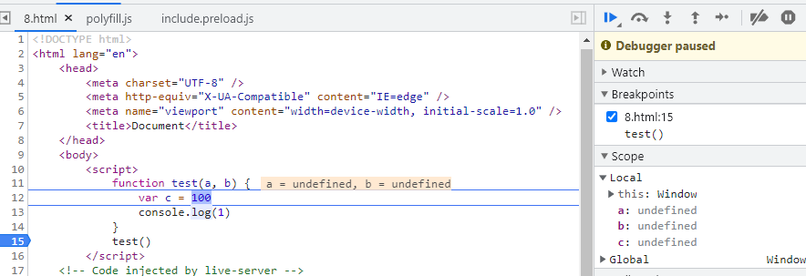

## sessionStorage

sessionStorage不能在多个窗口或选项卡之间共享数据，但是，当通过window.open或链接打开新页面时，新页面会复制上一个页面的sessionStorage。

参考链接：

[面试官：sessionStorage可以在多个Tab之间共享数据吗？ (qq.com)](https://mp.weixin.qq.com/s/tPZifwZFOBDoHv36U11gkQ)

## 如何判断当前函数是否被new调用

在通过[new](https://developer.mozilla.org/zh-CN/docs/Web/JavaScript/Reference/Operators/new)运算符被初始化的函数或构造方法中，`new.target`返回一个指向构造方法或函数的引用。在普通的函数调用中，`new.target` 的值是`undefined`。

## 箭头函数

如何检测函数是不是箭头函数：

箭头函数不能作为构造函数被new关键字调用，可以通过判断函数对象是否存在`prototype`来判断（不完善）

```js
(() => {}).prototype // undefined
(function() {}).prototype // {constructor: f}
```

箭头函数和普通函数的区别

1. 没有自己的this
2. call apply bind无法改变this指向
3. 不能作为构造函数使用，不能被new关键字调用，没有prototype
4. 没有arguments


## 防抖 节流

防抖

> 本质上是清除上次定时器，重新声明一个新的定时器

```js
const debounce = (func, wait, ...args) => {
  let timeout;
  return function(){
    const context = this;
    if (timeout) clearTimeout(timeout);
    timeout = setTimeout(() => {
      func.apply(context, args)
    },wait);
  }
}
```

```js
// 第一次函数一定执行，不会被第二次覆盖掉
const debounce = (func, wait, ...args) => {
  let timeout;
  return function(){
    const context = this;
    if (timeout) cleatTimeout(timeout);
    let callNow = !timeout;
    timeout = setTimeout(() => {
      timeout = null;
    },wait)

    if(callNow) func.apply(context,args)
   }
}
```


```js
let Debounce = function (fn, delay = 300, immediate = false) {
  let timer = null // 闭包存储setTimeout状态
  return function () {
    let self = this // 事件源this
    let args = arguments // 接收事件源的event
    if (timer) {
      clearTimeout(timer) // 清除定时器,timer变量仍然保存着计时器ID
    } // 存在就清除执行fn的定时器
    if (immediate) { // 立即执行
      let callNow = !timer // 执行fn的状态
      console.log(`callNow: `, callNow)
      timer = setTimeout(function () {
        timer = null
      }, delay)
      if (callNow) fn.apply(self, args)
    } else { // 非立即执行
      timer = setTimeout(function () { // 或者使用箭头函数将this指向dom
        fn.apply(self, args)
      }, delay)
    }
  }
}

let con1 = document.querySelector('.con1')
let con2 = document.querySelector('.con2')
let con3 = document.querySelector('.con3')

let addNum = function (args) {
  console.log('addnum')
  // console.log(this, args)
  // this.innerText = (+this.innerText) + 1
}

con1.onclick = addNum // 无防抖

con2.onclick = Debounce(addNum) // 防抖

con3.onclick = Debounce(addNum, 300, true) // 防抖（立即执行）
```

节流

> 节流不需要clearTimeout

```js
const throttle = (func, wait, ...args) => {
  let pre = 0;
  return function(){
    const context = this;
    let now = +Date.now();
    if (now - pre >= wait){
       func.apply(context, args);
       pre = now
    }
  }
}
```

```js
const throttle = (func, wait, ...args) => {
  let timeout;
  return function(){
    const context = this;
    if(!timeout){
      timeout = setTimeout(() => {
        timeout = null;
        func.apply(context,args);
      },wait)
    }
  }
}
```


```js
// 是否立即执行
let ThrottlePro = function (fn, delay = 500, immediate = false) {
    let preTime = 0 // 记录上一次执行时间
    return function () {
        let self = this, // 保留执行时候的的this
            args = [...arguments], // 执行时候的传入参数
            nowTime = +new Date(), // 记录当前的时间
            flag = nowTime - preTime >= delay // 执行命令
        if (immediate) { // 是否立即执行
            if (!flag) return
            preTime = nowTime // 更新执行时间
            fn.apply(self, args)
        } else {
            if (!flag) return // 不满足执行条件
            preTime = nowTime
            setTimeout(function () {
                fn.apply(self, args)
            }, delay)
        }
    }
}
```


## 数组去重

```js
const arr = [1, 1, '1', 17, true, true, false, false, 'true', 'a', {}, {}];
// => [1, '1', 17, true, false, 'true', 'a', {}, {}]
```

**方法1：利用Set**

**缺点：**无法识别相同对象和数组；

```js
const res1 = Array.from(new Set(arr));
```

ES6 提供了新的数据结构 Set。它类似于数组，但是成员的值都是唯一的，没有重复的值。

`Set`本身是一个构造函数，用来生成 Set 数据结构。

`Set`函数可以接受一个数组（或者具有` iterable` 接口的其他数据结构）作为参数，用来初始化。

`Array.from()` 方法从一个类似数组或可迭代对象创建一个新的，浅拷贝的数组实例。

**方法2：利用`indexOf includes filter`**

```js
// 缺点：indexOf无法区分NaN;需要特殊处理；
const unique2 = arr => {
  const res = [];
  for (let i = 0; i < arr.length; i++) {
    if (res.indexOf(arr[i]) === -1) res.push(arr[i]);
  }
  return res;
}

const unique3 = arr => {
  const res = [];
  for (let i = 0; i < arr.length; i++) {
    if (!res.includes(arr[i])) res.push(arr[i]);
  }
  return res;
}

// 缺点：indexOf无法区分NaN;需要特殊处理；
const unique4 = arr => {
  return arr.filter((item, index) => {
    return arr.indexOf(item) === index;
  });
}

var unique = (arr) =>  {
   if (!Array.isArray(arr)) return;
   return arr.reduce((prev,cur) => prev.includes(cur) ? prev : [...prev,cur],[]);
}
```


## 箭头函数中，`this`是固定的，不可变的

```js
const obj = {
    a: () => {
        console.log(this.id)  // 此处的this指向window
    }
}
var id = '1'
obj.a() // '1'
obj.a.call({
    id:'2'
}) // '1'
```


## 拷贝数组

`Array.slice`

```js
const arr = [1, 2, 3, 4, 5];
const copyArr = arr.slice();
```

**展开操作符**

```js
const arr = [1, 2, 3, 4, 5];
const copyArr = [...arr];
```

**使用 `Array` 构造函数和展开操作符**

```js
const arr = [1, 2, 3, 4, 5];
const copyArr = new Array(...arr);
```

`Array.concat`

```js
const arr = [1, 2, 3, 4, 5];
const copyArr = arr.concat();
```

## 原生拖放

https://www.cnblogs.com/xiaohuochai/p/5886618.html

## 监听元素进入视口

http://www.ruanyifeng.com/blog/2016/11/intersectionobserver_api.html

## 函数默认参数的作用域

1. 普通情况下，a b c 都在局部作用域里



2. 函数参数有默认值时，a b在局部作用域里，c在块作用域里


3. 函数形参和函数体内都声明了同一个变量名的变量a，代码执行第16行时，块级作用域中a的值取自局部作用域中a的值。

   代码执行第13行时，块作用域中a的值为7，局部作用域中a的值为1。

   如果进入函数时，局部作用域形参有默认值则会给块作用域中同名的变量赋默认值。


```html
<script>
  var x=1
  function test(x,y=function(){x=3;console.log(x)}){
    /*
      局部作用域Local
      x => undefined => 3
      y => function(){x=3;console.log(x)} // 第2个输出:3

    */

      /*
        块作用域 Block
        x => undefined => 2
      */
      console.log(x) // 第1个输出:undefined
      var x=2
      y()
      console.log(x) // 第3个输出:2
  }
  test()
  console.log(x) // 第4个输出:1
</script>
```


```html
<script>
  var x=1
  function test(x=4,y=function(){x=3;console.log(x)}){
    /*
      局部作用域Local
      x => 4 => 3
      y => function(){x=3;console.log(x)} // 第2个输出:3
    */

      /*
        块作用域 Block
        x => 4 => 2
      */
      console.log(x) // 第1个输出:4
      var x=2
      y()
      console.log(x) // 第3个输出:2
  }
  test()
  console.log(x) // 第4个输出:1
</script>
```


```html
<script>
  /*
    全局作用域 Global
    x => 1 => 3
  */
  var x=1
  function test(a,y=function(){x=3;console.log(x)}){
    /*
      局部作用域Local
      a => undefined
      y => function(){x=3;console.log(x)} // 第2个输出:3
    */

      /*
        块作用域 Block
        x => undefined
      */
      console.log(x) // 第1个输出:undefined
      var x=2
      y()
      console.log(x) // 第3个输出:2
  }
  test()
  console.log(x) // 第4个输出:3
</script>
```


```html
<script>
  /*
    全局作用域 Global
  */
  var x=1
  function test(x,y=function(){x=3;console.log(x)}){
    /*
      局部作用域Local
      x => undefined => 3
      y => function(){x=3;console.log(x)} // 第2个输出:3
    */

      /*
        块作用域 Block
      */
      console.log(x) // 第1个输出: undefined
      // var x=2
      y()
      console.log(x) // 第3个输出:3
  }
  test()
  console.log(x) // 第4个输出:1
</script>
```


```html
<script>
  /*
    全局作用域 Global
    x => 1 => 3
  */
  var x = 1
  function yy() {
    x = 3
    console.log(x) // 第2个输出:3
  }
  function test(x, y = yy) {
    /*
      局部作用域 Local
      x => undefined
      y => yy
    */

    /*
        块作用域 Block
        x => undefined => 2
      */
      console.log(x) //  第1个输出:undefined
      var x = 2
      y()
      console.log(x) // 第3个输出:2
  }
  test()
  console.log(x) // 第4个输出:3
</script>
```


## forin和forof

`forin`用于遍历对象的键，`forof`用于遍历对象键的值。

`for...in`用于遍历对象的可枚举属性键名，会遍历对象继承（原型链）的属性。输出顺序不确定，一般先排序输出非负整数键，其次按定义顺序输出其他键。

`for...of`循环用于遍历可迭代对象的值，而不是键名。

Symbol 值作键名时，不可遍历。

## 判断属性是否存在

Object.keys 对象自有的可枚举属性

obj.hasOwnProperty(key) 对象自有属性

key in obj 对象自有属性+原型链上的属性
