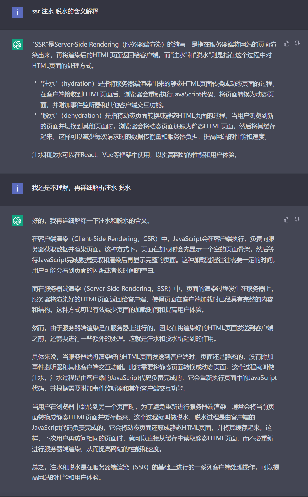

# NuxtJS

## SSR脱水 喝水的概念

[React SSR中的hydrate是什么意思？ | 黯羽轻扬 (ayqy.net)](http://www.ayqy.net/blog/ssr-hydrate/)

[如何理解 SSR 中的 hydrate？ - 知乎 (zhihu.com)](https://zhuanlan.zhihu.com/p/323174003)



## cookie-universal-nuxt

## 子组件meta标签覆盖父组件

H5应用的meta标签可以在`nuxt.config.js`中通过`head`字段进行配置，也可以在子组件中的`head`字段进行配置。

`nuxt.config.js`

```js
head: {
  meta: [
    { charset: 'utf-8' },
    { name: 'viewport', content: 'width=device-width, initial-scale=1' }
  ],
  link: [
    { rel: 'stylesheet', href: 'https://fonts.googleapis.com/css?family=Roboto' }
  ]
}
```

`page1.vue`

```js
export default {
  head () {
    return {
      title: `Page 1 (${this.name}-side)`,
      meta: [
        { hid: 'description', name: 'description', content: 'Page 1 description' }
      ]
    }
  }
}
```

为了避免子组件中的 meta 标签不能正确覆盖父组件中相同的标签而产生重复的现象，建议利用 `hid` 键为 meta 标签配一个唯一的标识编号。
