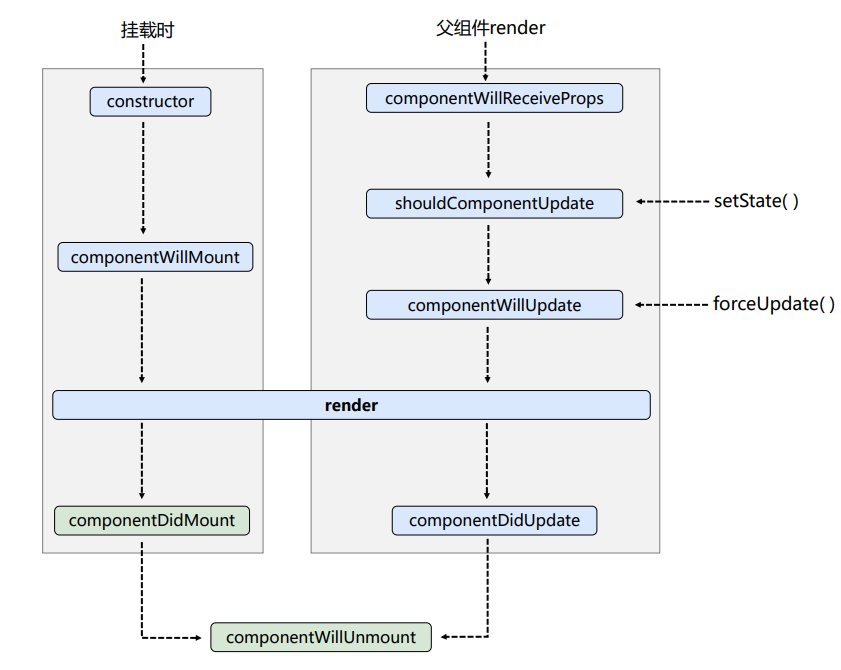
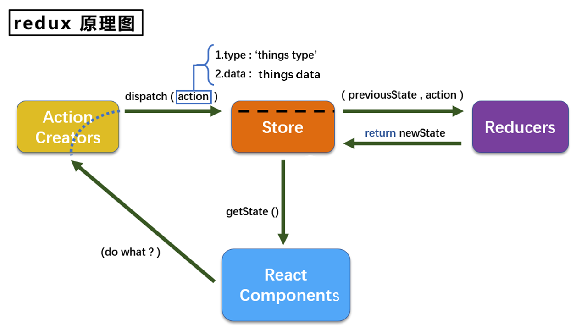

# React

## JSX表达式

全称：JavaScript XML

本质是`React.createElement(component,props,...children)`方法的语法糖

作用：简化创建`React`虚拟DOM(元素)对象，最终产生的就是一个JS对象

基本语法规则

+ 遇到`<`开头的代码，以标签的语法解析：html同名标签转换为html同名元素，其他标签需要特别解析
+ 遇到以`{`开头的代码，以JS语法解析：标签中`JS表达式`必须用`{}`包含
+ 元素的类名列表的属性名，应使用`className`而不是`class`
+ 元素的内联样式，要用`style={{key:value}}`的形式
+ 只有一个根标签
+ 标签必须闭合，单标签需要以`/>`结尾
+ 标签首字母小写，则转为同名的html元素，如果没有对应同名元素则报错
+ 标签首字母大写，则渲染对应组件，若组件未定义则报错

 

## 类组件

+ 组件名称大写（不管是类组件 函数组件）
+ 类组件必须继承自`React.Component`
+ 类组件必须实现`render`函数


## 类组件实例的三大属性-state


## 类组件实例的三大属性-props

### 基本使用

```javascript
//创建组件
class Person extends React.Component{
  render(){
    const {name,age,sex} = this.props
    return (
      <ul>
        <li>姓名：{name}</li>
        <li>性别：{sex}</li>
        <li>年龄：{age+1}</li>
      </ul>
    )
  }
}
//渲染组件到页面
ReactDOM.render(<Person name="jerry" age={19}  sex="男"/>,document.getElementById('test1'))
ReactDOM.render(<Person name="tom" age={18} sex="女"/>,document.getElementById('test2'))

const p = {name:'老刘',age:18,sex:'女'}
// ReactDOM.render(<Person name={p.name} age={p.age} sex={p.sex}/>,document.getElementById('test3'))
ReactDOM.render(<Person {...p}/>,document.getElementById('test3')) // 解构赋值 语法糖

//此处console.log(...p)在babel环境下不会报错,普通js环境下会报错.
//注意区分在传递props时的{...p}写法与通常的{...p}克隆对象字面量写法的差异.传递props时的{}表示解析js
```

### 类型和默认值

> 注意，props是只读的

```javascript
<!-- 引入prop-types，用于对组件标签属性进行限制 -->
<script type="text/javascript" src="../js/prop-types.js"></script>
//创建组件
class Person extends React.Component{
  render(){
    // console.log(this);
    const {name,age,sex} = this.props
    //props是只读的 *********
    //this.props.name = 'jack' //此行代码会报错，因为props是只读的
    return (
      <ul>
        <li>姓名：{name}</li>
        <li>性别：{sex}</li>
        <li>年龄：{age+1}</li>
      </ul>
    )
  }
}
//类的静态属性 对标签属性进行类型、必要性的限制 
Person.propTypes = { // 注意静态属性的键名为propTypes首字母小写,而下方的内置对象PropTypes首字母为大写
  name:PropTypes.string.isRequired, //限制name必传，且为字符串  PropTypes或React.PropTypes
  sex:PropTypes.string,//限制sex为字符串
  age:PropTypes.number,//限制age为数值
  speak:PropTypes.func,//限制speak为函数
}
// PropTypes在React15以前是React内置对象,即React.PropTypes; React16以后弃用,需要引入prop-types

//类的静态属性 指定默认标签属性值
Person.defaultProps = {
  sex:'男',//sex默认值为男
  age:18 //age默认值为18
}
//渲染组件到页面
ReactDOM.render(<Person name={100} speak={speak}/>,document.getElementById('test1'))
ReactDOM.render(<Person name="tom" age={18} sex="女"/>,document.getElementById('test2'))

const p = {name:'老刘',age:18,sex:'女'}
// ReactDOM.render(<Person name={p.name} age={p.age} sex={p.sex}/>,document.getElementById('test3'))
ReactDOM.render(<Person {...p}/>,document.getElementById('test3'))

function speak(){
  console.log('我说话了');
}
```

### 简写

```js
//创建组件
class Person extends React.Component{

  constructor(props){
    //构造器是否接收props，是否传递给super，取决于：是否希望在构造器中通过this访问props
    // console.log(props);
    super(props)
    console.log('constructor',this.props);
  }

  //对标签属性进行类型、必要性的限制
  static propTypes = {
    name:PropTypes.string.isRequired, //限制name必传，且为字符串
    sex:PropTypes.string,//限制sex为字符串
    age:PropTypes.number,//限制age为数值
  }

  //指定默认标签属性值
  static defaultProps = {
    sex:'男',//sex默认值为男
    age:18 //age默认值为18
  }
  
  render(){
    // console.log(this);
    const {name,age,sex} = this.props
    //props是只读的
    //this.props.name = 'jack' //此行代码会报错，因为props是只读的
    return (
      <ul>
        <li>姓名：{name}</li>
        <li>性别：{sex}</li>
        <li>年龄：{age+1}</li>
      </ul>
    )
  }
}

//渲染组件到页面
ReactDOM.render(<Person name="jerry"/>,document.getElementById('test1'))
```

> [React.Component – React (reactjs.org)](https://zh-hans.reactjs.org/docs/react-component.html#constructor)
>
> 在 React 组件挂载之前，会调用它的构造函数。在为 React.Component 子类实现构造函数时，应在其他语句之前前调用 `super(props)`。否则，`this.props` **在构造函数中**可能会出现未定义的 bug。
>
> 这里可以在构造函数中直接访问传入的实参`props`，而不是访问`this.props`
>
> （在构造函数外是可以访问`this.props`的？）


## 函数组件使用props

```javascript
//创建组件
function Person (props){
  const {name,age,sex} = props
  return (
      <ul>
        <li>姓名：{name}</li>
        <li>性别：{sex}</li>
        <li>年龄：{age}</li>
      </ul>
    )
}
Person.propTypes = {
  name:PropTypes.string.isRequired, //限制name必传，且为字符串
  sex:PropTypes.string,//限制sex为字符串
  age:PropTypes.number,//限制age为数值
}

//指定默认标签属性值
Person.defaultProps = {
  sex:'男',//sex默认值为男
  age:18 //age默认值为18
}
//渲染组件到页面
ReactDOM.render(<Person name="jerry"/>,document.getElementById('test1'))
```


## 类组件实例的三大属性-refs

### 字符串形式的ref

```javascript
//创建组件
class Demo extends React.Component{
  //展示左侧输入框的数据
  showData = ()=>{
    const {input1} = this.refs
    alert(input1.value)
  }
  //展示右侧输入框的数据
  showData2 = ()=>{
    const {input2} = this.refs
    alert(input2.value)
  }
  render(){
    return(
      <div>
        <input ref="input1" type="text" placeholder="点击按钮提示数据"/>&nbsp;
        <button onClick={this.showData}>点我提示左侧的数据</button>&nbsp;
        <input ref="input2" onBlur={this.showData2} type="text" placeholder="失去焦点提示数据"/>
      </div>
    )
  }
}
//渲染组件到页面
ReactDOM.render(<Demo a="1" b="2"/>,document.getElementById('test'))
```

### 回调形式的ref

```javascript
//创建组件
class Demo extends React.Component{
  //展示左侧输入框的数据
  showData = ()=>{
    const {input1} = this
    alert(input1.value)
  }
  //展示右侧输入框的数据
  showData2 = ()=>{
    const {input2} = this
    alert(input2.value)
  }
  render(){
    return(
      <div>
        <input ref={c => this.input1 = c } type="text" placeholder="点击按钮提示数据"/>&nbsp;
        <button onClick={this.showData}>点我提示左侧的数据</button>&nbsp;
        <input onBlur={this.showData2} ref={c => this.input2 = c } type="text" placeholder="失去焦点提示数据"/>&nbsp;
      </div>
    )
  }
}
//渲染组件到页面
ReactDOM.render(<Demo a="1" b="2"/>,document.getElementById('test'))
```

> ### 关于回调 refs 的说明
>
> 如果 `ref` 回调函数是以内联函数的方式定义的，在更新过程中它会被执行两次，第一次传入参数 `null`，然后第二次会传入参数 DOM 元素。这是因为在每次渲染时会创建一个新的函数实例，所以 React 清空旧的 ref 并且设置新的。通过将 ref 的回调函数定义成 class 的绑定函数的方式可以避免上述问题，**但是大多数情况下它是无关紧要的**。

```javascript
//创建组件
class Demo extends React.Component{

  state = {isHot:false}

  showInfo = ()=>{
    const {input1} = this
    alert(input1.value)
  }

  changeWeather = ()=>{
    //获取原来的状态
    const {isHot} = this.state
    //更新状态
    this.setState({isHot:!isHot})
  }

  saveInput = (c)=>{
    this.input1 = c;
    console.log('@',c);
  }

  render(){
    const {isHot} = this.state
    return(
      <div>
        <h2>今天天气很{isHot ? '炎热':'凉爽'}</h2>
        {/*<input ref={(c)=>{this.input1 = c;console.log('@',c);}} type="text"/><br/><br/>*/}
        <input ref={this.saveInput} type="text"/><br/><br/>
        <button onClick={this.showInfo}>点我提示输入的数据</button>
        <button onClick={this.changeWeather}>点我切换天气</button>
      </div>
    )
  }
}
//渲染组件到页面
ReactDOM.render(<Demo/>,document.getElementById('test'))
```


### createRef

```javascript
//创建组件
class Demo extends React.Component{
  /* 
    React.createRef调用后可以返回一个容器，该容器可以存储被ref所标识的节点,该容器是“专人专用”的
    */
  myRef = React.createRef()
  myRef2 = React.createRef()
  //展示左侧输入框的数据
  showData = ()=>{
    alert(this.myRef.current.value);
  }
  //展示右侧输入框的数据
  showData2 = ()=>{
    alert(this.myRef2.current.value);
  }
  render(){
    return(
      <div>
        <input ref={this.myRef} type="text" placeholder="点击按钮提示数据"/>&nbsp;
        <button onClick={this.showData}>点我提示左侧的数据</button>&nbsp;
        <input onBlur={this.showData2} ref={this.myRef2} type="text" placeholder="失去焦点提示数据"/>&nbsp;
      </div>
    )
  }
}
//渲染组件到页面
ReactDOM.render(<Demo a="1" b="2"/>,document.getElementById('test'))
```


## 事件处理

React 元素的事件处理和 DOM 元素的很相似，但是有一点语法上的不同：

- React 事件的命名采用小驼峰式（camelCase），而不是纯小写。
- 使用 JSX 语法时你需要传入一个函数作为事件处理函数，而不是一个字符串。

React中的事件是通过事件委托方式处理的(委托给组件最外层的元素)，通过event.target得到发生事件的DOM元素对象。


## 非受控组件与受控组件

### 非受控组件

表单数据交由DOM节点来处理

```javascript
class NameForm extends React.Component {
  constructor(props) {
    super(props);
    this.handleSubmit = this.handleSubmit.bind(this);
    this.input = React.createRef();
  }

  handleSubmit(event) {
    alert('A name was submitted: ' + this.input.current.value);
    event.preventDefault();
  }

  render() {
    return (
      <form onSubmit={this.handleSubmit}>
        <label>
          Name:
          <input type="text" ref={this.input} />
        </label>
        <input type="submit" value="Submit" />
      </form>
    );
  }
}
```


### 受控组件

在 HTML 中，表单元素（如`<input>`、 `<textarea>` 和 `<select>`）通常自己维护 state，并根据用户输入进行更新。而在 React 中，可变状态（mutable state）通常保存在组件的 state 属性中，并且只能通过使用 [`setState()`](https://zh-hans.reactjs.org/docs/react-component.html#setstate)来更新。

我们可以把两者结合起来，使 React 的 state 成为“唯一数据源”。渲染表单的 React 组件还控制着用户输入过程中表单发生的操作。被 React 以这种方式控制取值的表单输入元素就叫做“受控组件”。

```javascript
class NameForm extends React.Component {
  constructor(props) {
    super(props);
    this.state = {value: ''};

    this.handleChange = this.handleChange.bind(this);
    this.handleSubmit = this.handleSubmit.bind(this);
  }

  handleChange(event) {
    this.setState({value: event.target.value});
  }

  handleSubmit(event) {
    alert('提交的名字: ' + this.state.value);
    event.preventDefault();
  }

  render() {
    return (
      <form onSubmit={this.handleSubmit}>
        <label>
          名字:
          <input type="text" value={this.state.value} onChange={this.handleChange} />
        </label>
        <input type="submit" value="提交" />
      </form>
    );
  }
}
```

由于在表单元素上设置了 `value` 属性，因此显示的值将始终为 `this.state.value`，这使得 React 的 state 成为唯一数据源。由于 `handlechange` 在每次按键时都会执行并更新 React 的 state，因此显示的值将随着用户输入而更新。

对于受控组件来说，输入的值始终由 React 的 state 驱动。


## 高阶函数和函数柯里化

高阶函数：如果一个函数符合下面2个规范中的任何一个，那该函数就是高阶函数。

1. 若A函数，接收的参数是一个函数，那么A就可以称之为高阶函数。

2. 若A函数，调用的返回值依然是一个函数，那么A就可以称之为高阶函数。

常见的高阶函数有：Promise、setTimeout、arr.map()等等


函数柯里化：柯里化是指这样一个函数(假设叫做createCurry)，他接收函数A作为参数，运行后能够返回一个新的函数。并且这个新的函数能够处理函数A的剩余参数。


## 组件生命周期

旧



`componentWillReceiveProps`首次挂载不会触发，更新`props`才会触发

新

`componentWillMount` `componentWillReceiveProps` `componentWillUpdate`需要加`UNSAFE_`前缀

.png)

**static getDerivedStateFromProps()**

```js
static getDerivedStateFromProps(props, state)
```

`getDerivedStateFromProps` 会在调用 render 方法之前调用，并且在初始挂载及后续更新时都会被调用。它应返回一个对象来更新 state，如果返回 `null` 则不更新任何内容。

此方法适用于[罕见的用例](https://zh-hans.reactjs.org/blog/2018/06/07/you-probably-dont-need-derived-state.html#when-to-use-derived-state)，即 state 的值在任何时候都取决于 props。


**getSnapshotBeforeUpdate()**

```js
getSnapshotBeforeUpdate(prevProps, prevState)
```

`getSnapshotBeforeUpdate()` 在最近一次渲染输出（提交到 DOM 节点）之前调用。它使得组件能在发生更改之前从 DOM 中捕获一些信息（例如，滚动位置）。**此生命周期方法的任何返回值将作为参数传递给 `componentDidUpdate()`。**

此用法并不常见，但它可能出现在 UI 处理中，如需要以特殊方式处理滚动位置的聊天线程等。

应返回 snapshot 的值（或 `null`）。


**componentDidUpdate()**

```javascript
componentDidUpdate(prevProps, prevState, snapshot)
```

`componentDidUpdate()` 会在更新后会被立即调用。首次渲染不会执行此方法。

当组件更新后，可以在此处对 DOM 进行操作。如果你对更新前后的 props 进行了比较，也可以选择在此处进行网络请求。（例如，当 props 未发生变化时，则不会执行网络请求）。

如果组件实现了 `getSnapshotBeforeUpdate()` 生命周期（不常用），则它的返回值将作为 `componentDidUpdate()` 的第三个参数 “snapshot” 参数传递。否则此参数将为 undefined。


## 列表渲染与Diffing

用index作为key可能会引发的问题：

1. 若对数据进行：逆序添加、逆序删除等破坏顺序操作:

   会产生没有必要的真实DOM更新 ==> 界面效果没问题, 但效率低。

2. 如果结构中还包含输入类的DOM：

   会产生错误DOM更新 ==> 界面有问题。

3. 注意！如果不存在对数据的逆序添加、逆序删除等破坏顺序操作，

   仅用于渲染列表用于展示，使用index作为key是没有问题的。


## 样式的模块化

`index.module.css`

```css
.title{
	background-color: orange;
}
```

`hello.jsx`

```js
import React,{Component} from 'react'
import hello from './index.module.css'

export default class Hello extends Component{
	render(){
		return <h2 className={hello.title}>Hello,React!</h2>
	}
}
```


## 脚手架

`react-scripts eject` 暴露webpack配置

### react脚手架配置代理总结

#### 方法一

> 在package.json中追加如下配置

```json
"proxy":"http://localhost:5000"
```

说明：

1. 优点：配置简单，前端请求资源时可以不加任何前缀。
2. 缺点：不能配置多个代理。
3. 工作方式：上述方式配置代理，当请求了3000不存在的资源时，那么该请求会转发给5000 （优先匹配前端资源，前端3000，后端5000）


#### 方法二

1. 第一步：创建代理配置文件

   ```
   在src下创建配置文件：src/setupProxy.js
   ```

2. 编写setupProxy.js配置具体代理规则：

   ```js
   const proxy = require('http-proxy-middleware')
   
   module.exports = function(app) {
     app.use(
       proxy('/api1', {  //api1是需要转发的请求(所有带有/api1前缀的请求都会转发给5000)
         target: 'http://localhost:5000', //配置转发目标地址(能返回数据的服务器地址)
         changeOrigin: true, //控制服务器接收到的请求头中host字段的值
         /*
         	changeOrigin设置为true时，服务器收到的请求头中的host为：localhost:5000
         	changeOrigin设置为false时，服务器收到的请求头中的host为：localhost:3000
         	changeOrigin默认值为false，但我们一般将changeOrigin值设为true
         */
         pathRewrite: {'^/api1': ''} //去除请求前缀，保证交给后台服务器的是正常请求地址(必须配置)
       }),
       proxy('/api2', { 
         target: 'http://localhost:5001',
         changeOrigin: true,
         pathRewrite: {'^/api2': ''}
       })
     )
   }
   ```

说明：

1. 优点：可以配置多个代理，可以灵活的控制请求是否走代理。
2. 缺点：配置繁琐，前端请求资源时必须加前缀。


## pubsub-js


## react-router-dom

### 基本使用

1. 导航区a标签改为Link标签

   ```html
   <Link className="list-group-item" to="/home">Home</Link>
   ```

2. 展示区写Route标签进行路径匹配

   ```html
   <Route path="/about" component={About} />
   ```

3. `<App/>`的最外侧包裹一个`<BrowserRouter>`或`<HashRouter>`

### 路由组件与一般组件

1. 写法

   ```html
   一般组件：
   <Demo/>
   路由组件
   <Route path="/demo" component={Demo}>
   ```

2. 存放位置不同

   一般组件：components文件夹

   路由组件：pages文件夹

3. 接收到的props不同

   一般组件：使用时传递了什么就能接收到什么

   **路由组件**(必须是路由组件)：接收到三个固定属性

										history:
													go: ƒ go(n)
													goBack: ƒ goBack()
													goForward: ƒ goForward()
													push: ƒ push(path, state)
													replace: ƒ replace(path, state)
										location:
													pathname: "/about"
													search: ""
													state: undefined
										match:
													params: {}
													path: "/about"
													url: "/about"

### navlink

NavLink可以实现路由链接的高亮，通过activeClassName指定样式名

标签体荣是一个特殊的标签属性，通过`this.props.children`可以获取标签体内容


### switch

```html
<Route path="/about" component={About}/>
<Route path="/about" component={Abc}/> // /about路由会同时展示About和Abc组件
<Route path="/home" component={Home}/>
<Route path="/home" component={Test}/> // /home路由会同时展示Home和Test组件
```

路由组件会一直匹配下去，为提高路由匹配效率，应使用`Switch`实现单一匹配，即`path`和`component`一一对应

```html
<Switch>
	<Route path="/about" component={About}/>
	<Route path="/home" component={Home}/>
	<Route path="/home" component={Test}/> // /home不会匹配到此处
</Switch>
```

### 解决多级路径刷新页面样式丢失的问题

> /a/b路由下刷新页面，访问静态文件会访问localhost:3000/a/xxx.css

			1.public/index.html 中 引入样式时不写 ./ 写 / （常用）
			2.public/index.html 中 引入样式时不写 ./ 写 %PUBLIC_URL% （常用）
			3.使用HashRouter /#/后的内容是前端资源,不访问localhost:3000 访问样式文件时忽略/#/后的内容
### 路由的严格匹配与模糊匹配

			1.默认使用的是模糊匹配（简单记：【输入的路径】必须包含要【匹配的路径】，且顺序要一致）
			2.开启严格匹配：<Route exact path="/about" component={About}/>
			3.严格匹配不要随便开启，需要再开，有些时候开启会导致无法继续匹配二级路由
			  (/home/news 不能匹配/home)
### Redirect的使用	

				1.一般写在所有路由注册的最下方，当所有路由都无法匹配时，跳转到Redirect指定的路由
				2.具体编码：
						<Switch>
							<Route path="/about" component={About}/>
							<Route path="/home" component={Home}/>
							<Redirect to="/about"/>
						</Switch>

### 嵌套路由

```
			1.注册子路由时要写上父路由的path值
			2.路由的匹配是按照注册路由的顺序进行的
```

### 路由通讯

			1.params参数
						路由链接(携带参数)：<Link to='/demo/test/tom/18'}>详情</Link>
						注册路由(声明接收)：<Route path="/demo/test/:name/:age" component={Test}/>
						接收参数：this.props.match.params
			2.search参数
						路由链接(携带参数)：<Link to='/demo/test?name=tom&age=18'}>详情</Link>
						注册路由(无需声明，正常注册即可)：<Route path="/demo/test" component={Test}/>
						接收参数：this.props.location.search
						备注：获取到的search是urlencoded编码字符串，需要借助querystring解析
			3.state参数
						路由链接(携带参数)：<Link to={{pathname:'/demo/test',state:{name:'tom',age:18}}}>详情</Link>
						注册路由(无需声明，正常注册即可)：<Route path="/demo/test" component={Test}/>
						接收参数：this.props.location.state
						备注：刷新也可以保留住参数
### 编程式路由导航

				借助this.prosp.history对象上的API对操作路由跳转、前进、后退
						-this.prosp.history.push()
						-this.prosp.history.replace()
						-this.prosp.history.goBack()
						-this.prosp.history.goForward()
						-this.prosp.history.go()
### withRouter

非路由组件的props对象不具备location，history，match

```jsx
import React, { Component } from 'react'
import {withRouter} from 'react-router-dom'

class Header extends Component {

	back = ()=>{
		this.props.history.goBack()
	}

	forward = ()=>{
		this.props.history.goForward()
	}

	go = ()=>{
		this.props.history.go(-2)
	}

	render() {
		console.log('Header组件收到的props是',this.props);
		return (
			<div className="page-header">
				<h2>React Router Demo</h2>
				<button onClick={this.back}>回退</button>&nbsp;
				<button onClick={this.forward}>前进</button>&nbsp;
				<button onClick={this.go}>go</button>
			</div>
		)
	}
}

export default withRouter(Header)

//withRouter可以加工一般组件，让一般组件具备路由组件所特有的API
//withRouter的返回值是一个新组件
```

### BrowserRouter与HashRouter的区别

		1.底层原理不一样：
					BrowserRouter使用的是H5的history API，不兼容IE9及以下版本。
					HashRouter使用的是URL的哈希值。
		2.path表现形式不一样
					BrowserRouter的路径中没有#,例如：localhost:3000/demo/test
					HashRouter的路径包含#,例如：localhost:3000/#/demo/test
		3.刷新后对路由state参数的影响
					(1).BrowserRouter没有任何影响，因为state保存在history对象中。
					(2).HashRouter刷新后会导致路由state参数的丢失！！！
		4.备注：HashRouter可以用于解决一些路径错误相关的问题。


## redux



## react-redux

基本使用

		(1).明确两个概念：
					1).UI组件:不能使用任何redux的api，只负责页面的呈现、交互等。
					2).容器组件：负责和redux通信，将结果交给UI组件。
		(2).如何创建一个容器组件————靠react-redux 的 connect函数
						connect(mapStateToProps,mapDispatchToProps)(UI组件)
							-mapStateToProps:映射状态，返回值是一个对象
							-mapDispatchToProps:映射操作状态的方法，返回值是一个对象
		(3).备注1：容器组件中的store是靠props传进去的，而不是在容器组件中直接引入
		(4).备注2：mapDispatchToProps，也可以是一个对象
优化

		(1).容器组件和UI组件整合一个文件
		(2).无需自己给容器组件传递store，给<App/>包裹一个<Provider store={store}>即可。
		(3).使用了react-redux后也不用再自己检测redux中状态的改变了，容器组件可以自动完成这个工作。
		(4).mapDispatchToProps也可以简单的写成一个对象
		(5).一个组件要和redux“打交道”要经过哪几步？
						(1).定义好UI组件---不暴露
						(2).引入connect生成一个容器组件，并暴露，写法如下：
								connect(
									state => ({key:value}), //映射状态
									{key:xxxxxAction} //映射操作状态的方法
								)(UI组件)
						(4).在UI组件中通过this.props.xxxxxxx读取和操作状态
