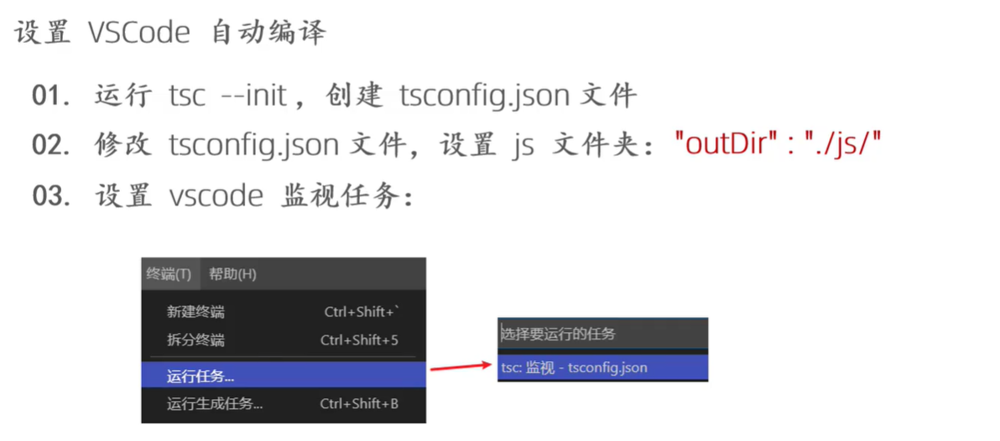
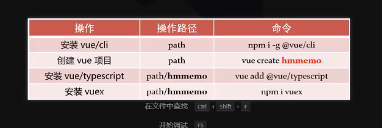
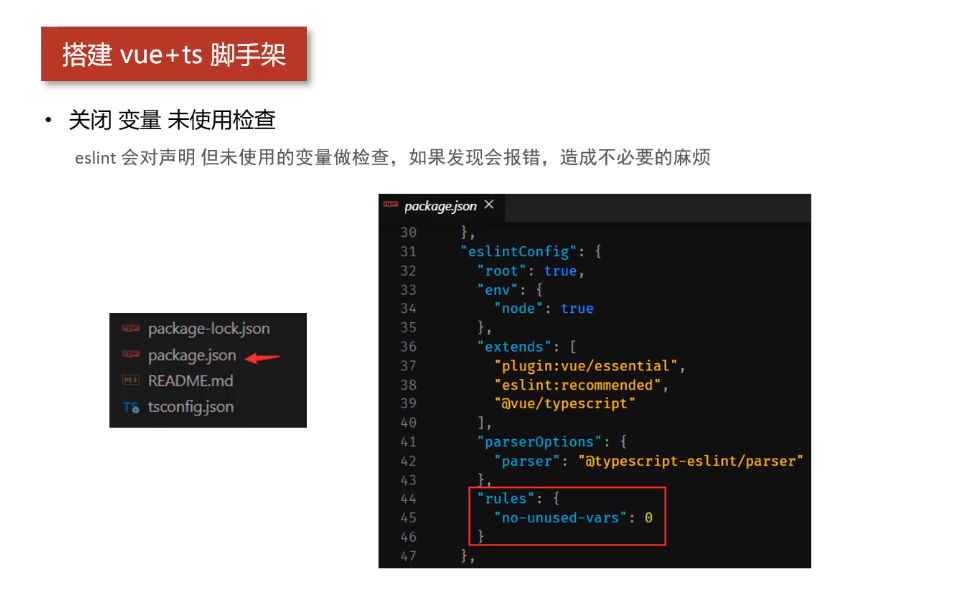

# TypeScript

## 使用ts-node加速开发

https://blog.csdn.net/qq_39969226/article/details/105806754

## 安装

`npm i -g typescript`

`tsc -v `校验typescript

tsc作用：负责将ts代码转为浏览器和nodejs识别的js代码

## 自动编译ts文件



终端中输入`tsc -w`

## type和interface的区别

[TypeScript type 和 interface 的区别 - CodeSky 代码之空](https://www.codesky.me/archives/typescript-difference-type-interface.wind)

## function

### 可选参数

JavaScript里，每个参数都是可选的，可传可不传。 没传参的时候，它的值就是undefined。 在TypeScript里我们可以在参数名旁使用 `?`实现可选参数的功能。 比如，我们想让last name是可选的：

```ts
function buildName(firstName: string, lastName?: string) {
    if (lastName)
        return firstName + " " + lastName;
    else
        return firstName;
}

let result1 = buildName("Bob");  // works correctly now
let result2 = buildName("Bob", "Adams", "Sr.");  // error, too many parameters
let result3 = buildName("Bob", "Adams");  // ah, just right
```

**可选参数必须跟在必须参数后面**。 如果上例我们想让first name是可选的，那么就必须调整它们的位置，把first name放在后面。

### 默认参数

在TypeScript里，我们也可以为参数提供一个默认值当用户没有传递这个参数或传递的值是`undefined`时。 它们叫做有默认初始化值的参数。 让我们修改上例，把last name的默认值设置为`"Smith"`。

```ts
function buildName(firstName: string, lastName = "Smith") {
    return firstName + " " + lastName;
}

let result1 = buildName("Bob");                  // works correctly now, returns "Bob Smith"
let result2 = buildName("Bob", undefined);       // still works, also returns "Bob Smith"
let result3 = buildName("Bob", "Adams", "Sr.");  // error, too many parameters
let result4 = buildName("Bob", "Adams");         // ah, just right
```

**在所有必须参数后面的带默认初始化的参数都是可选的**，与可选参数一样，在调用函数的时候可以省略。 也就是说可选参数与末尾的默认参数共享参数类型。

**与普通可选参数不同的是，带默认值的参数不需要放在必须参数的后面。** 如果带默认值的参数出现在必须参数前面，用户必须明确的传入 `undefined`值来获得默认值。 例如，我们重写最后一个例子，让 `firstName`是带默认值的参数：

```ts
function buildName(firstName = "Will", lastName: string) {
    return firstName + " " + lastName;
}

let result1 = buildName("Bob");                  // error, too few parameters
let result2 = buildName("Bob", "Adams", "Sr.");  // error, too many parameters
let result3 = buildName("Bob", "Adams");         // okay and returns "Bob Adams"
let result4 = buildName(undefined, "Adams");     // okay and returns "Will Adams"
```

## class

## 理解 `private`

当成员被标记成 `private`时，它就不能在声明它的类的外部访问。比如：

```ts
class Animal {
    private name: string;
    constructor(theName: string) { this.name = theName; }
}

new Animal("Cat").name; // 错误: 'name' 是私有的.
```

## 抽象类

## 接口

## 问号?

data入参可能为null,undefined，通常我们的写法是直接上if判断啥的，然后再取data中的属性，但是有了问号点(?.)写法就简单很多了，看下面例子：

1.typescript写法：

```typescript
//1.data可能为null,undefined , row也可能为null,undefined
//2.假设data完整结构 {row:{name:'aaa'}}
function getData(data: any){
	let name = data?.row?.name
}
```

2.普通写法

```js
//1.data可能为null,undefined , row也可能为null,undefined
//2.假设data完整结构 {row:{name:'aaa'}}
function getData(data: any){
	let name;
	if (data && data.row) {
		name = data.row.name
	}
}
```

从上面写法可以看出来问号点(?.)的写法其实等价于例2的if判断、三元运算符（let a = b == null ? null : b.a）

## vue中添加ts






## vue-property-decorator


```vue
@Component({
  name: "App",  // 当前组件name属性
  components: { // 注册子组件
    HelloWorld,
  },
  filters: {},  // 过滤器
  directives: {}, // 自定义指令
})
```

### @Component

#### name

#### components

表示该组件引入了哪些子组件

```vue
<template>
  <div id="app">
    <HelloWorld />
  </div>
</template>

<script lang="ts">
@Component({
  components: {
    HelloWorld, // 声明子组件的引用
  }
})
export default class App extends Vue {}
</script>
```

#### filters

过滤器

```vue
<template>
  <div>{{msg | addWorld}}</div>
</template>

<script lang="ts">
@Component({
  filters: {
    addWorld: (value: string) => `${value} world`,
  },
})
export default class App extends Vue {
  private msg = 'Hello' // filter 之后显示 hello world
}
</script>
```

### @Prop()

父子组件传递数据 props的修饰符

`@Prop(options: (PropOptions | Constructor[] | Constructor) = {})`

装饰器接收一个参数，这个参数可以有三种写法：

- `Constructor`，例如`String，Number，Boolean`等原生构造函数，用于指定 `prop` 的类型；
- `Constructor[]`，指定 `prop` 的可选类型；
- `PropOptions`，可以使用以下选项：`type，default，required，validator`。

```typescript
  @Prop(String) public propA: string | undefined;
  @Prop([String, Number]) public propB!: string | number;
  @Prop({
    type: String,
    default: "abc",
  })
```

父组件:

```vue
<template>
  <div id="app">
    <PropComponent :count='count' />
  </div>
</template>
<script lang="ts">
@Component({
    components: {PropComponent}
})
class Parent extends Vue {
  private count = 101
}
</script>
```

子组件:

```vue
<template>
  <div>{{count}}</div>
</template>

<script lang="ts">
@Component
export default class PropsComponent extends Vue {
  @Prop({
    type: Number,
    validator: (value) => {
      return value > 100;
    },
    required: true
  }) private count!: string // !表示有值, 否则 ts 会告警未初始化
}
</script>
```

### @PropSync()

与 Prop 的区别是子组件可以对 props 进行更改, 并同步给父组件

`@PropSync`装饰器与`@prop`用法类似，二者的区别在于：

- `@PropSync` 装饰器接收两个参数：
  `propName: string` 表示父组件传递过来的属性名；必填
  `options: Constructor | Constructor[] | PropOptions` 与`@Prop`的第一个参数一致；
- `@PropSync` 会生成一个新的计算属性。

```typescript
import { Vue, Component, PropSync } from 'vue-property-decorator'

@Component
export default class MyComponent extends Vue {
  @PropSync('propA', { type: String, default: 'abc' }) public syncedPropA!: string
}
```

等同于下面的`js`写法

```js
export default {
  props: {
    propA: {
      type: String,
      default: 'abc'
    }
  },
  computed: {
    syncedPropA: {
      get() {
        return this.propA
      },
      set(value) {
        this.$emit('update:propA', value)
      }
    }
  }
}
```

子组件:

```vue
<template>
  <div>
    <p>{{count}}</p>
    <button @click="innerCount += 1">increment</button>
  </div>
</template>

<script lang="ts">
@Component
export default class PropSyncComponent extends Vue {
  @PropSync('count') private innerCount!: number // 注意@PropSync 里的参数不能与定义的实例属性同名, 因为还是那个原理, props 是只读的.
}
```

父组件: 注意父组件里绑定 props 时需要加修饰符 `.sync`

```vue
<template>
    <PropSyncComponent :count.sync="count"/>
</template>
<script lang="ts">
@Component({
  components: {PropSyncComponent}
})
export default class PropSyncComponent extends Vue {
  @PropSync('count') private innerCount!: number // 注意@PropSync 里的参数不能与定义的实例属性同名, 因为还是那个原理, props 是只读的.
}
</script>
```

### @Model

`@Model`装饰器允许我们在一个组件上自定义`v-model`，接收两个参数：

- `event: string` 事件名。
- `options: Constructor | Constructor[] | PropOptions` 与`@Prop`的第一个参数一致。

```js
import { Vue, Component, Model } from 'vue-property-decorator'

@Component
export default class MyInput extends Vue {
  @Model('change', { type: String, default: '123' }) public value!: string
}
```

等同于下面的`js`写法

```js
export default {
  model: {
    prop: 'value',
    event: 'change'
  },
  props: {
    value: {
      type: String,
      default: '123'
    }
  }
}
```

上面例子中指定的是`change`事件，所以我们还需要在`template`中加上相应的事件：

```js
<template>
  <input
    type="text"
    :value="value"
    @change="$emit('change', $event.target.value)"
  />
</template>
```

### @Watch

装饰器接收两个参数：

- `path: string` 被侦听的属性名；

- `options?: WatchOptions={} options`

  可以包含两个属性 ：

  `immediate?:boolean` 侦听开始之后是否立即调用该回调函数；
  `deep?:boolean` 被侦听的对象的属性被改变时，是否调用该回调函数；

**侦听开始，发生在`beforeCreate`勾子之后，`created`勾子之前**

```js
import { Vue, Component, Watch } from 'vue-property-decorator'

@Component
export default class MyInput extends Vue {
  @Watch('msg')
  public onMsgChanged(newValue: string, oldValue: string) {}

  @Watch('arr', { immediate: true, deep: true })
  public onArrChanged1(newValue: number[], oldValue: number[]) {}

  @Watch('arr')
  public onArrChanged2(newValue: number[], oldValue: number[]) {}
}
```

等同于下面的`js`写法

```js
export default {
  watch: {
    msg: [
      {
        handler: 'onMsgChanged',
        immediate: false,
        deep: false
      }
    ],
    arr: [
      {
        handler: 'onArrChanged1',
        immediate: true,
        deep: true
      },
      {
        handler: 'onArrChanged2',
        immediate: false,
        deep: false
      }
    ]
  },
  methods: {
    onMsgVhanged(newValue, oldValue) {},
    onArrChange1(newValue, oldValue) {},
    onArrChange2(newValue, oldValue) {}
  }
}
```

### @Emit

- `@Emit` 装饰器接收一个可选参数，该参数是`$Emit`的第一个参数，充当事件名。如果没有提供这个参数，`$Emit`会将回调函数名的`camelCase`转为`kebab-case`，并将其作为事件名；
- `@Emit`会将回调函数的返回值作为第二个参数，如果返回值是一个`Promise`对象，`$emit`会在`Promise`对象被标记为`resolved`之后触发；
- `@Emit`的回调函数的参数，会放在其返回值之后，一起被`$emit`当做参数使用。

```js
import { Vue, Component, Emit } from 'vue-property-decorator'

@Component
export default class MyComponent extends Vue {
  count = 0
  @Emit()
  public addToCount(n: number) {
    this.count += n
  }
  @Emit('reset')
  public resetCount() {
    this.count = 0
  }
  @Emit()
  public returnValue() {
    return 10
  }
  @Emit()
  public onInputChange(e) {
    return e.target.value
  }
  @Emit()
  public promise() {
    return new Promise(resolve => {
      setTimeout(() => {
        resolve(20)
      }, 0)
    })
  }
}
```

等同于下面的`js`写法

```js
export default {
  data() {
    return {
      count: 0
    }
  },
  methods: {
    addToCount(n) {
      this.count += n
      this.$emit('add-to-count', n)
    },
    resetCount() {
      this.count = 0
      this.$emit('reset')
    },
    returnValue() {
      this.$emit('return-value', 10)
    },
    onInputChange(e) {
      this.$emit('on-input-change', e.target.value, e)
    },
    promise() {
      const promise = new Promise(resolve => {
        setTimeout(() => {
          resolve(20)
        }, 0)
      })
      promise.then(value => {
        this.$emit('promise', value)
      })
    }
  }
}

```

### @Ref

`@Ref` 装饰器接收一个可选参数，用来指向元素或子组件的引用信息。如果没有提供这个参数，会使用装饰器后面的属性名充当参数

```js
import { Vue, Component, Ref } from 'vue-property-decorator'
import { Form } from 'element-ui'

@Componentexport default class MyComponent extends Vue {
  @Ref() readonly loginForm!: Form
  @Ref('changePasswordForm') readonly passwordForm!: Form

  public handleLogin() {
    this.loginForm.validate(valide => {
      if (valide) {
        // login...
      } else {
        // error tips
      }
    })
  }
}
```

等同于下面的`js`写法

```js
export default {
  computed: {
    loginForm: {
      cache: false,
      get() {
        return this.$refs.loginForm
      }
    },
    passwordForm: {
      cache: false,
      get() {
        return this.$refs.changePasswordForm
      }
    }
  }
}
```


## 巧用查找类型

```ts
interface Person {
  addr: {
    city: string,
    street: string,
    num: number,
  }
}
```

当需要使用 `addr` 的类型时，除了把类型提出来

```ts
interface Address {
  city: string,
  street: string,
  num: number,
}
interface Person {
  addr: Address,
}
```

还可以

```ts
Person["addr"] // This is Address.
```

## namespace

TypeScript与ECMAScript 2015一样，任何包含顶级`import`或者`export`的文件都被当成一个模块。相反地，如果一个文件不带有顶级的`import`或者`export`声明，那么它的内容被视为全局可见的（因此对模块也是可见的）。当两个或更多个不同的代码库中的类型名称冲突时，使用命名空间可以帮助避免这个问题。

命名空间中通过`export`将想要暴露的部分导出，如果不用export 导出是无法读取其值的。

```ts
namespace a {
    export const Time: number = 1000
    export const fn = <T>(arg: T): T => {
        return arg
    }
    fn(Time)
}

namespace b {
     export const Time: number = 1000
     export const fn = <T>(arg: T): T => {
        return arg
    }
    fn(Time)
}
 
a.Time
b.Time
```

如果两个或多个命名空间具有相同的名称，并且它们在不同的文件中定义，那么这些命名空间的内容在编译时会进行合并。

**命名空间的简化**（不常用）

```ts
import MVLCN = MyVeryLongAndComplexNamespace;  
  
let myObject: MVLCN.MyInterface = { /* ... */ };  
let myInstance = new MVLCN.MyClass(/* ... */);
```

通过简短的别名`MVLCN`来访问`MyVeryLongAndComplexNamespace`

[学习TypeScript16（namespace命名空间）_一个文件不带有顶级的import或者export声明,那么它的内容被视为全局可见的-CSDN博客](https://blog.csdn.net/qq1195566313/article/details/122544685)

## 为js文件提供类型声明

导入`.js`文件时，TS会自动加载与其文件同名的`.d.ts`文件，以提供类型声明

`declare`关键字：用于类型声明，为其他地方已存在的变量声明类型，而不是创建一个新的变量

1. 对于type interface等明确是ts类型的可以省略declare
2. 对于let function等应该使用declare关键字明确指出此处是用于类型声明

## 声明文件d.ts

```ts
declare var 声明全局变量
declare function 声明全局方法
declare class 声明全局类
declare enum 声明全局枚举类型
declare namespace 声明（含有子属性的）全局对象
interface 和 type 声明全局类型
/// <reference /> 三斜线指令
```

[学习TypeScript18（声明文件d.ts）_.d.ts refrence-CSDN博客](https://xiaoman.blog.csdn.net/article/details/122558474)

**三斜线指令**

`/// <reference types="..." />`

这个指令用于声明对某个第三方包的类型依赖。

```ts
/// <reference types="lodash" /> 
```

`/// <reference path="..." />`

这个指令用于告诉 TypeScript 编译器在编译时包含指定的 TypeScript 声明文件（`.d.ts` 文件）。

这个指令用于告诉 TypeScript 编译器在编译过程中包含其他文件。一个三斜线引用路径是相对于包含它的文件的，如果不是根文件。

[三斜线指令 · TypeScript中文网 · TypeScript——JavaScript的超集 (tslang.cn)](https://www.tslang.cn/docs/handbook/triple-slash-directives.html)

在现代 TypeScript 开发中，由于模块解析和配置文件的改进（如 `tsconfig.json`），许多传统的 `/// <reference ... />` 指令的使用已经减少或不再必要。
