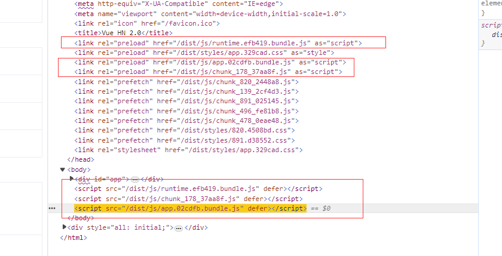

# Vue SSR

https://www.yuque.com/guoba7/xh8mvb/dfrqiq

[vue服务器端渲染 - Wayne-Zhu - 博客园 (cnblogs.com)](https://www.cnblogs.com/zhuzhenwei918/p/9266407.html)

[实例PK ( Vue服务端渲染 VS 浏览器端渲染 ) - 知乎 (zhihu.com)](https://zhuanlan.zhihu.com/p/25936718)

[vue2.x SSR 服务端渲染从零剖析构建，优缺点解读 - 会写代码的赖先生 - 博客园 (cnblogs.com)](https://www.cnblogs.com/ljx20180807/p/14041490.html)

[vue-cli3 SSR 服务端渲染从零剖析构建 - 会写代码的赖先生 - 博客园 (cnblogs.com)](https://www.cnblogs.com/ljx20180807/p/14047857.html)

[Vue-cli3 SSR程序实现热更新功能 (yuque.com)](https://www.yuque.com/guoba7/xckx8s/htyg45)

[Vue SSR Vuex 数据预取和状态 (yuque.com)](https://www.yuque.com/guoba7/xckx8s/wrw4ww)

[Vue SSR 优化 (yuque.com)](https://www.yuque.com/guoba7/xckx8s/nlmh78)

[laijinxian/vue2.x-ssr-template: 基于vue2.x 的 vue-cli2.x 以及 vue-cli3.x 版本 ssr 服务端渲染 (github.com)](https://github.com/laijinxian/vue2.x-ssr-template)

[lentoo/vue-cli-ssr-example: 基于 vue-cli3构建的一个SSR应用程序 (github.com)](https://github.com/lentoo/vue-cli-ssr-example)

[通过vue-cli3构建一个SSR应用程序 - 掘金 (juejin.cn)](https://juejin.cn/post/6844903678646681607)

[基于vue-cli3 SSR 程序实现热更新功能 - 掘金 (juejin.cn)](https://juejin.cn/post/6844903693373046792)

[5.4.3 SSR的作用及Vue-SSR在网易的实践 (yuque.com)](https://www.yuque.com/guoba7/xh8mvb/dfrqiq#N5D7R)

[聊一聊 Vue-SSR 激活失败（Vue hydration fails）-51CTO.COM](https://www.51cto.com/article/701710.html)

[What to do when Vue hydration fails | blog.Lichter.io](https://blog.lichter.io/posts/vue-hydration-error/)

[彻底理解服务端渲染 - SSR原理 · Issue #30 · yacan8/blog (github.com)](https://github.com/yacan8/blog/issues/30)

sw-precache-webpack-plugin

register-service-worker

## preload prefetch dns-prefetch

`preload` 用于提前加载用于当前页面的资源，而 `prefetch` 则是用于加载未来（比如下一个页面）会用到的资源。

**preload会提高资源加载优先级，prefetch会降低资源加载优先级。**

**preload**安排脚本以更高的优先级进行下载和缓存。但它并不加载和执行脚本，需要自己找到合适的地方将其显式嵌入。

当指定列恶rel="preload"时，要使用as指定其资源类型

```html
<link rel="preload" href="style.css" as="style" />
```



**prefetch**此属性标识下一个导航可能需要的资源，浏览器会认为这个资源目前不会用到，但可能下个页面会用到，于是**会将对应资源的下载优先级降为最低（Lowest）**。

在其他资源加载好了之后，下载队列空闲了，该资源才被下载缓存起来。

```html
<link rel="prefetch" href="lib/jquery.min.js" as="script">
```

**dns-prefetch**空闲时间预先对指定域名进行DNS解析，在真正请求该域名下资源时，可以省掉 DNS 查询这一步。

```html
<link rel="dns-prefetch" href="https://cdn-s1.somecdnsite.com">
```

应用场景：

- 常用的 cdn 资源所在的域名先连接好
- 视频不播放，在用户点击播放前，先连上对应域名

**preconnect**不仅进行DNS解析，还预先建立TCP连接（在HTTPS下还会进行TLS握手）。当网页需要加载资源时，连接已经建立，可以立即开始传输数据，从而进一步减少了延迟。通常用于那些需要频繁通信的服务器，如WebSocket服务器。

```html
<link rel="preconnect" href="https://cdn-s1.somecdnsite.com">
```

> 通过 preconnect 和别的域建立连接后，应该尽快的使用它，因为浏览器会关闭所有在 10 秒内未使用的连接。不必要的预连接会延迟其他重要资源，因此要限制 preconnect 连接域的数量。

## 坑：

1. 重复请求

2. [vue-router: 在App.vue中获取不到正确的路由？ - 掘金 (juejin.cn)](https://juejin.cn/post/6844904148408745997)

   客户端存在该问题，server端不存在，会有两端一致性问题

# SEO

## title标签

是爬虫重点的爬取对象，填写的文字要对网页内容有准确而简洁的描述，能够吸引用户点击，而且长度要适中。

## meta标签

属性：`http-equiv` `name` `content`

`name` 和 `content` 属性可以一起使用，以名 - 值对的方式给文档提供元数据，其中 name 作为元数据的名称，content 作为元数据的值。 

**keywords**

```html
<meta name ="keywords" content="这是keywords的内容">
```

`keywords`标签目前对SEO的影响可以忽略不计

**description**告诉搜索引擎你的网站主要内容

```html
<meta name ="description" content="这是description的内容">
```

**robots**告诉搜索机器人哪些页面需要索引，哪些页面不需要索引

```html
<meta name ="robots" content="none">
```

**author**标注网页的作者

```html
<meta name="author" content="author name">
```

**http-equiv**

```html
<meta http-equiv="expires" content="Fri, 12 Jan 2001 18:18:18 GMT"> 用于设定网页的到期时间
<meta http-equiv="Pragma" content="no-cache"> 禁止浏览器从本地计算机的缓存中访问页面内容
<!-- 其中的2是指停留2秒钟后自动刷新到URL网址 -->
<meta http-equiv="Refresh" content="2;URL=http://www.juejin.com"> 自动刷新并指向新页面
<!-- 必须使用GMT的时间格式 -->
<meta http-equiv="Set-Cookie" content="cookievalue=xxx; expires=Friday, 10-Nov-2023 18:18:18 GMT； path=/"> 如果网页过期，那么存盘的cookie将被删除
<!-- 用来防止别人在框架里调用自己的页面 -->
<meta http-equiv="Window-target" content="_top"> 强制页面在当前窗口以独立页面显
<!-- 设定页面使用的字符集 -->
<meta http-equiv="content-Type" content="text/html; charset=gb2312"> 设定页面使用的字符集
```


参考资料：

[(1 封私信 / 25 条消息) 网站头部的keywords标签对SEO到底有没有效? - 知乎 (zhihu.com)](https://www.zhihu.com/question/21504401)

[(1 封私信 / 25 条消息) SEO网站文章keywords标签应该怎样填写才算是最符合优化的？ - 知乎 (zhihu.com)](https://www.zhihu.com/question/578714454)

[一文带你弄懂 前端SEO优化 - 掘金 (juejin.cn)](https://juejin.cn/post/7300118821532778511?searchId=20240228195738AB09620BEFAE598FC551#heading-1)

## 语义化标签

### h标签

从H1到H6（重要性从高到低）一共有6个，而且在页面中的作用性极高，所以不能乱用，得根据内容的重要性进行排列，最后不要有断层，比如从H1直接到H3，错过了H2；另外，H1标签最好只存在一个。

### img标签

img的alt属性，为搜索引擎提供替代文本，图片使用alt标签优化，对搜索引擎排名产生积极影响；另外，网速不佳等原因造成无法加载图片文件时，将在图片的位置显示alt里的文字

### 其他

HTML5新出的 Header, Nav，Aside，Article，Footer等语义化标签，这些都能帮助爬虫更好的获取页面内容

## robots.txt

是一个给爬虫下指令的文本文件，能让其合理地抓取网站内资源，而且可以将网站不重要的内容、模块等进行屏蔽，从而抓取更多有价值高质量的内容和网页，提高网站排名。

**User-agent:** 后面填你要针对的搜索引擎，*代表全部搜索引擎

**Disallow:** 后面填你要禁止抓取的网站内容和文件夹，/做前缀

**Allow:** 后面填你允许抓取的网站内容，文件夹和链接，/做前缀

**Crawl-delay:** 后面填数字，意思是抓取延迟，小网站不建议使用

**Sitemap:** 站点地图的存放位置

## 内链和外链

Nofollow与Dofollow链接

```html
<a href="htts://www.xnbeast.com/blog">
<a href="htts://www.xnbeast.com/blog" rel="nofollow">
```

Dofollow链接可以帮助你在搜索引擎排名。而Nofollow链接则不会。

网站添加nofollow就是告诉搜索引擎蜘蛛不要爬取这条出站链接

**使用场景**

　　1、在站点内链中使用nofollow属性

　　如：联系我们，公司简介，广告服务，关于我们等页面，我们就可以在链接上加上nofollow，使首页的权重不传递给这些页面，从而引导权重传递给更有价值的页面，也能让权重更为集中；因为这些页面对于搜索引擎或用户来讲显然没有太大意义，所以不需要赋予权值。

　　2、用在网站的导出链接

　　比如广告链接，本身用户是进入网站在去点击广告，只给带去流量，不是要带去权重，所以加nofollow不会产生影响。对于其他只要是不需要传递权重的外部链接，我们都可以nofollow掉。

　　3、用在友链中

　　对于一些已经降权、被k、使用作弊手段、被黑、或者缺少管理的网站链接，我们可以加上nofollow不要传递权重过去加以屏蔽，或者直接删除掉。当然别人网站友链对自己的链接加了nofollow时，若自己网站没有问题，则把对方友链删了就行，这是对方的一种不信任行为，我们不需要顾忌，直接删除该友链。

　　4、用在垃圾评论，广告留言

　　在很多网站底部，会有留言评论功能，很多人就会利用这个功能，留下链接宣传自己的站点，这个时候为了防止网站权重流失，我们需要加上nofollow屏蔽掉。

**nofollow的作用**

　　1、节约蜘蛛资源

　　对于每个网站，搜索引擎每天派出的蜘蛛是有限的，我们尽量要把蜘蛛引导在最有用的链接上，这样也能利于重要页面的收录。

　　2、集中网站权重避免分散

　　每个页面链接最初都会被赋予一定的权值，我们需要将这些权值引导到重要的页面上(需要做排名的页面，需求性高的页面)，这样会更加有利于网站的排名；而不是将权重分配到“关于我们”、“联系我们”等没有价值的页面上

**用法疑点**

在谷歌中nofollow限制很严格，表示让蜘蛛不要追踪索引该链接，而且不要传递权重。

在百度方面则没有这么严格，平时我们也能看到很多例子，加了nofollow一样会被索引，建立快照，所以在百度方面我们大概认为该链接不会传递权重，但是蜘蛛会追踪该链接并建立索引。

参考资料：
[nofollow是什么意思及nofollow作用 - 知乎 (zhihu.com)](https://zhuanlan.zhihu.com/p/146095916)

## 面包屑导航

告诉爬虫当前所处的位置，提供抓取路径的引导，让其更快速的了解网站的整体架构，在抓取网页时也能清楚知道网页的层级及分类索引，有助于提升搜索结果的排名。此外，设定面包屑之后，网站在搜索结果页上也会呈现网址路径，因此可以适时在面包屑的名称中加入关键词，增加用户点击率

## 服务端渲染（SSR）

## 网站性能

网站打开速度越快，识别效果越好，否则爬虫会认为该网站对用户不友好，降低爬取效率，这时候就要考虑压缩文件体积之类的性能优化了。

## 使用https

Google和其他搜索引擎已经明确表示，他们更喜欢使用HTTPS，因为它提供更高的安全性和更好的用户体验。当您的网站使用HTTPS时，搜索引擎会将其视为更可信和更安全的网站，从而为其排名增加积极因素。

## 提交站点收录

To be improved

## 网站设置伪静态页面

伪静态页面是指动态网页通过重写URL的方法实现去掉动态网页的参数,但在实际的网页目录中并没有必要实现存在重写的页面

伪静态化就是将动态页面的url转换成以 .html 等结尾的静态页面url，以增强搜索引擎的友好性（符合搜索引擎的抓取规则），同时方便用户输入和记忆。

参考资料：

[⛳前端进阶：SEO 全方位解决方案 - 掘金 (juejin.cn)](https://juejin.cn/post/7241813423460581435?searchId=20240228195738AB09620BEFAE598FC551)

## sitemap

To be improved
