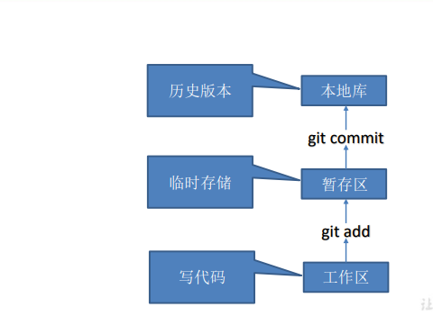
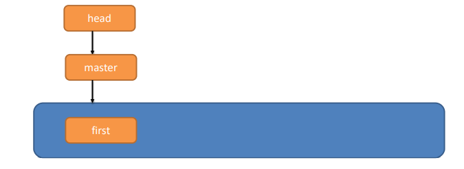
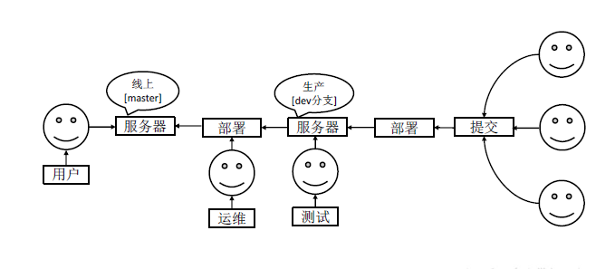
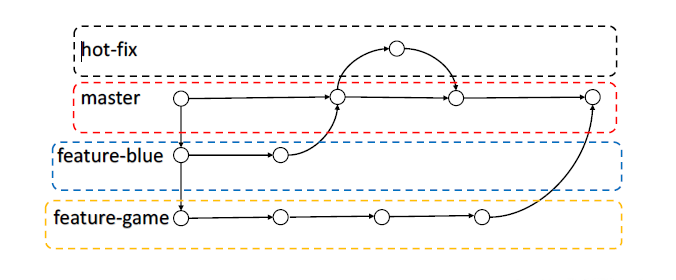
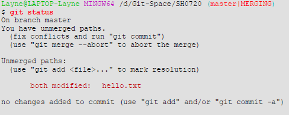
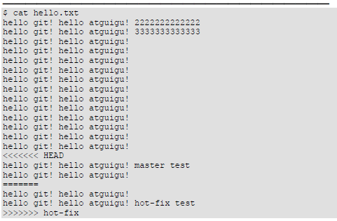
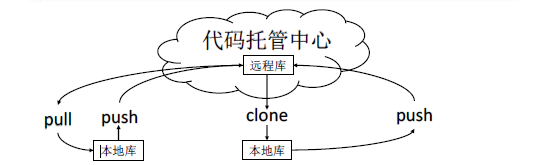
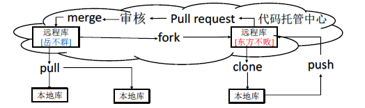

# Git

## 工作机制

32

## 常用命令

| 命令                    | 作用                                              |
| ----------------------- | ------------------------------------------------- |
| git init                | 初始化本地库                                      |
| git status              | 查看本地库状态                                    |
| git add .               | 将所有工作区文件添加到暂存区                      |
| git commit -m 'xxx'     | 将暂存区提交到本地库                              |
| git reflog              | 查看历史记录，所有分支，包括被删除的commit和reset |
| git log                 | 显示从最近到最远的详细提交日志                    |
| git reset --hard 版本号 | 版本穿梭                                          |
| git rm --cached file    | 删除仓库 暂存区中的文件，保留本地的文件           |

Git 切换版本，底层其实是移动的 HEAD 指针，具体原理如下图所示。



## 用户签名

```bash
git config --global user.name 用户名 
git config --global user.email 邮箱

// 保存在 C:/users/xxx/.gitconfig
```

## 分支操作





### 分支命令

| 命令                | 作用                             |
| ------------------- | -------------------------------- |
| git branch 分支名   | 创建分支                         |
| git branch          | 列出当前分支清单                 |
| git branch -v       | 查看各个分支最后一个提交信息     |
| git checkout 分支名 | 切换分支                         |
| git merge 分支名    | 把指定的分支合并到**当前分支**上 |

### 合并冲突

冲突产生的表现  后面状态为 MERGING


1. 查看状态（检测到有文件 有两处修改）



2. 编辑有冲突的文件，删除特殊符号，决定要使用的内容

特殊符号：<<<<<<< HEAD 当前分支的代码 ======= 合并过来的代码 >>>>>>> hot-fix



3. 添加到暂存区
4. 执行提交

master、hot-fix 其实都是指向具体版本记录的指针。当前所在的分支，其实是由HEAD
决定的。所以创建分支的本质就是多创建一个指针。
HEAD 如果指向master，那么我们现在就在master 分支上。
HEAD 如果指向hotfix，那么我们现在就在hotfix 分支上。


## 团队协作

团队内协作



## 远程仓库

| 命令                           | 作用                                       |
| ------------------------------ | ------------------------------------------ |
| git remote -v                  | 查看                                       |
| git remote add 别名 远程地址   | 起别名                                     |
| git push 别名 分支             | 将本地分支内容推送到远程仓库               |
| git clone 远程仓库             | 拉取远程仓库内容到本地                     |
| git pull 远程仓库别名 远程分支 | 将远程仓库制定分支拉取并与当前本地分支合并 |

本地有仓库，远程仓库无内容

```git
git add *
git commit -m '提交的信息'
git remote add origin https://github.com/JUST-Limbo/Note.git
git push origin 分支名(默认只有一个master分支)
```

注意：push是将本地库代码推送到远程库，如果本地库代码跟远程库代码版本不一致，push的操作是会被拒绝的。也就是说， 要想 push成功，一定要保证本地库的版本要比远程库的版本高！ 因此一个成熟的程序员在动手改本地代码之前，一定会先检查下远程库跟本地代码的区别！如果本地的代码版本已经落后，切记要先 pull拉取一下远程库的代码，将本地代码更新到最新以后，然后再修改，提交，推送

## 跨团队协作



## eslint


## rebase

git pull = git fetch + git merge

git pull --rebase = git fetch + git rebase

merge会产生新节点，之前的提交分开显示

rebase不会产生新节点，是将两个分支融合成一个线性提交


## 撤销commit
