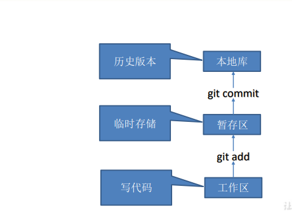
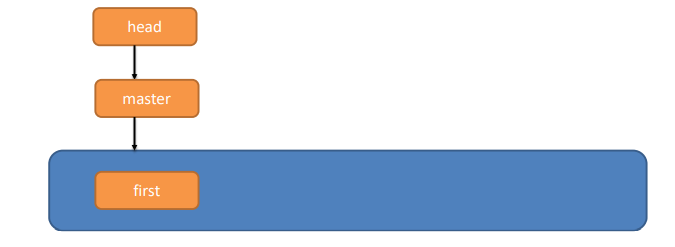
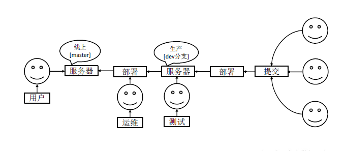
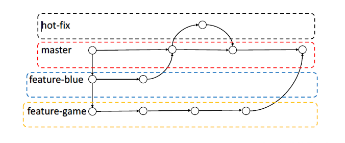
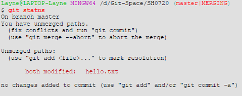
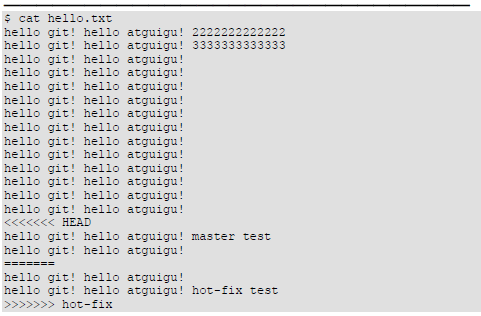
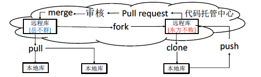
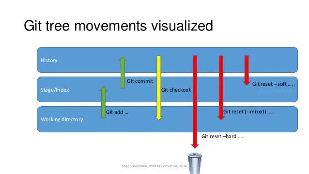

## 工作机制



## 常用命令

| 命令                    | 作用                                              |
| ----------------------- | ------------------------------------------------- |
| git init                | 初始化本地库                                      |
| git status              | 查看本地库状态                                    |
| git add .               | 将所有工作区文件添加到暂存区                      |
| git commit -m 'xxx'     | 将暂存区提交到本地库                              |
| git reflog              | 查看历史记录，所有分支，包括被删除的commit和reset |
| git log                 | 显示从最近到最远的详细提交日志                    |
| git reset --hard 版本号 | 版本穿梭                                          |
| git rm --cached file    | 删除仓库 暂存区中的文件，保留本地的文件           |

Git 切换版本，底层其实是移动的 HEAD 指针，具体原理如下图所示。



## 用户签名

```bash
git config --global user.name 用户名
git config --global user.email 邮箱

// 保存在 C:/users/xxx/.gitconfig
```

## 分支操作





### 分支命令

| 命令                                  | 作用                             |
| ------------------------------------- | -------------------------------- |
| git branch 分支名                     | 创建分支                         |
| git branch                            | 列出当前分支清单                 |
| git branch -v                         | 查看各个分支最后一个提交信息     |
| git branch --delete 分支名            | 删除本地分支                     |
| git branch -D 分支名                  |                                  |
| git push origin --delete 分支名       | 删除远程分支                     |
| git push origin :分支名               | (分支名前的冒号代表删除)         |
| git checkout 分支名                   | 切换分支                         |
| git checkout --orphan 分支名          | 创建空白分支                     |
| git merge 分支名                      | 把指定的分支合并到**当前分支**上 |
| git push --set-upstream origin 分支名 | 将本地新分支推送到远端           |
| git branch -m <oldname> <newname>     | 重命名本地分支 **-M**强制执行    |
| git branch -m <newname>               | 重命名当前活动的分支             |

### 合并冲突

冲突产生的表现  后面状态为 MERGING


1. 查看状态（检测到有文件 有两处修改）



2. 编辑有冲突的文件，删除特殊符号，决定要使用的内容

特殊符号：<<<<<<< HEAD 当前分支的代码 ======= 合并过来的代码 >>>>>>> hot-fix



3. 添加到暂存区
4. 执行提交

master、hot-fix 其实都是指向具体版本记录的指针。当前所在的分支，其实是由HEAD
决定的。所以创建分支的本质就是多创建一个指针。
HEAD 如果指向master，那么我们现在就在master 分支上。
HEAD 如果指向hotfix，那么我们现在就在hotfix 分支上。

## 远程仓库

| 命令                           | 作用                                       |
| ------------------------------ | ------------------------------------------ |
| git remote -v                  | 查看                                       |
| git remote add <name> <url>    | 起别名                                     |
| git push 别名 分支             | 将本地分支内容推送到远程仓库               |
| git clone 远程仓库             | 拉取远程仓库内容到本地                     |
| git pull 远程仓库别名 远程分支 | 将远程仓库指定分支拉取并与当前本地分支合并 |

本地有仓库，远程仓库无内容

```git
git add *
git commit -m '提交的信息'
git remote add origin https://github.com/JUST-Limbo/Note.git
git push origin 分支名(默认只有一个master分支)
```

注意：push是将本地库代码推送到远程库，如果本地库代码跟远程库代码版本不一致，push的操作是会被拒绝的。也就是说， 要想 push成功，一定要保证本地库的版本要比远程库的版本高！ 因此一个成熟的程序员在动手改本地代码之前，一定会先检查下远程库跟本地代码的区别！如果本地的代码版本已经落后，切记要先 pull拉取一下远程库的代码，将本地代码更新到最新以后，然后再修改，提交，推送

## 跨团队协作



## rebase

git pull = git fetch + git merge

git pull --rebase = git fetch + git rebase

merge会产生新节点，之前的提交分开显示

rebase不会产生新节点，是将两个分支融合成一个线性提交


## 回退



**reset三种模式区别**

**--hard**：重置位置的同时，直接将 **working Tree工作目录**、 **index 暂存区**及 **repository** 都重置成目标**Reset**节点的內容,所以效果看起来等同于清空暂存区和工作区。

**--soft**：重置位置的同时，保留**working Tree工作目录**和**index暂存区**的内容，只让**repository**中的内容和 **reset** 目标节点保持一致，因此原节点和**reset**节点之间的【差异变更集】会放入**index暂存区**中(**Staged files**)。所以效果看起来就是工作目录的内容不变，暂存区原有的内容也不变，只是原节点和**Reset**节点之间的所有差异都会放到暂存区中。

**--mixed（默认）**：重置位置的同时，只保留**Working Tree工作目录**的內容，但会将 **Index暂存区** 和 **Repository** 中的內容更改和reset目标节点一致，因此原节点和**Reset**节点之间的【差异变更集】会放入**Working Tree工作目录**中。所以效果看起来就是原节点和**Reset**节点之间的所有差异都会放到工作目录中。

**使用场景**

**--hard**：(1) **要放弃目前本地的所有改变時**，即去掉所有add到暂存区的文件和工作区的文件，可以执行 **git reset -hard HEAD** 来强制恢复git管理的文件夹的內容及状态；(2) **真的想抛弃目标节点后的所有commit**（可能觉得目标节点到原节点之间的commit提交都是错了，之前所有的commit有问题）。

**--soft**：原节点和**reset**节点之间的【差异变更集】会放入**index暂存区**中(**Staged files**)，所以假如我们之前工作目录没有改过任何文件，也没add到暂存区，那么使用**reset  --soft**后，我们可以直接执行 **git commit** 將 index暂存区中的內容提交至 **repository** 中。为什么要这样呢？这样做的使用场景是：假如我们想合并「当前节点」与「**reset**目标节点」之间不具太大意义的 **commit** 记录(可能是阶段性地频繁提交,就是开发一个功能的时候，改或者增加一个文件的时候就**commit**，这样做导致一个完整的功能可能会好多个**commit**点，这时假如你需要把这些**commit**整合成一个**commit**的时候)時，可以考虑使用**reset  --soft**来让 **commit** 演进线图较为清晰。总而言之，**可以使用--soft合并commit节点**。

**--mixed（默认）**：(1)使用完**reset --mixed**后，我們可以直接执行 **git add** 将這些改变果的文件內容加入 **index 暂存区**中，再执行 **git commit** 将 **Index暂存区** 中的內容提交至**Repository**中，这样一样可以达到合并**commit**节点的效果（与上面--soft合并commit节点差不多，只是多了git add添加到暂存区的操作）；(2)移除所有Index暂存区中准备要提交的文件(Staged files)，我们可以执行 **git reset HEAD** 来 **Unstage** 所有已列入 **Index暂存区** 的待提交的文件。(有时候发现add错文件到暂存区，就可以使用命令)。(3)**commit**提交某些错误代码，或者没有必要的文件也被**commit**上去，不想再修改错误再**commit**（因为会留下一个错误**commit**点），可以回退到正确的**commit**点上，然后所有原节点和**reset**节点之间差异会返回工作目录，假如有个没必要的文件的话就可以直接删除了，再**commit**上去就OK了。

```bash
# 远程仓库强制回退
git reset --hard <commit id>
git push -f
```

**强制将本地代码库重置为远程分支的最新版本**

```bash
git reset --hard origin/<branch-name>
```


参考资料

[Git Reset 三种模式 - 简书 (jianshu.com)](https://www.jianshu.com/p/c2ec5f06cf1a)

## 放弃解决冲突

```bash
git merge --abort
```

## 区分文件名大小写

```bash
git config core.ignorecase false // false区分大小写，true不区分
```


## cherry-pick

将指定的提交应用到当前分支上，并创建一个新的提交。

```bash
git cherry-pick <commit id>
```
