http://www.ruanyifeng.com/blog/2019/03/grid-layout-tutorial.html

#  Grid-Layout


Grid 布局的属性分成两类。一类定义在容器上面，称为**容器属性**；另一类定义在项目上面，称为**项目属性**。

## 容器属性

### display

`display: grid`指定一个容器采用网格布局。

默认情况下，容器元素都是块级元素，但也可以设成行内元素。

```css
div {
  display: inline-grid;
}
```

上面代码指定`div`是一个行内元素，该元素内部采用网格布局。

### grid-template-columns

### grid-template-rows

容器指定了网格布局以后，接着就要划分行和列。`grid-template-columns`属性定义每一列的列宽，`grid-template-rows`属性定义每一行的行高。

```css
/* 绝对单位 */
.container {
  display: grid;
  grid-template-columns: 100px 100px 100px;
  grid-template-rows: 100px 100px 100px;
}
/* 百分比 */
.container {
  display: grid;
  grid-template-columns: 33.33% 33.33% 33.33%;
  grid-template-rows: 33.33% 33.33% 33.33%;
}
```

**（1）repeat()**

可以使用`repeat()`函数，简化重复的值。

 ```css
.container {
   display: grid;
   grid-template-columns: repeat(3, 33.33%);
   grid-template-rows: repeat(3, 33.33%);
 }
 ```

`repeat()`接受两个参数，第一个参数是重复的次数（上例是3），第二个参数是所要重复的值。

`repeat()`重复某种模式也是可以的。

 ```css
 grid-template-columns: repeat(2, 100px 20px 80px);
 ```

[上面代码](https://jsbin.com/cokohu/edit?css,output)定义了6列，第一列和第四列的宽度为`100px`，第二列和第五列为`20px`，第三列和第六列为`80px`。

**（2）auto-fill 关键字**

有时，单元格的大小是固定的，但是容器的大小不确定。如果希望每一行（或每一列）容纳尽可能多的单元格，这时可以使用`auto-fill`关键字表示自动填充。

 ```css
.container {
  display: grid;
  grid-template-columns: repeat(auto-fill, 100px);
}
 ```

[上面代码](https://jsbin.com/himoku/edit?css,output)表示每列宽度`100px`，然后自动填充，直到容器不能放置更多的列。

**（3）fr 关键字**

为了方便表示比例关系，网格布局提供了`fr`关键字（fraction 的缩写，意为"片段"）。如果两列的宽度分别为`1fr`和`2fr`，就表示后者是前者的两倍。

 ```css
 .container {
   display: grid;
   grid-template-columns: 1fr 1fr;
 }
 ```

[上面代码](https://jsbin.com/hadexek/edit?html,css,output)表示两个相同宽度的列。

`fr`可以与绝对长度的单位结合使用，这时会非常方便。

```css
.container {
  display: grid;
  grid-template-columns: 150px 1fr 2fr;
}
```

[上面代码](https://jsbin.com/remowec/edit?html,css,output)表示，第一列的宽度为150像素，第二列的宽度是第三列的一半。

**（4）minmax()**

`minmax()`函数产生一个长度范围，表示长度就在这个范围之中。它接受两个参数，分别为最小值和最大值。

```css
grid-template-columns: 1fr 1fr minmax(100px, 1fr);
```

上面代码中，`minmax(100px, 1fr)`表示列宽不小于`100px`，不大于`1fr`。

**（5）auto 关键字**

`auto`关键字表示由浏览器自己决定长度。

```css
grid-template-columns: 100px auto 100px;
```

上面代码中，第二列的宽度，基本上等于该列单元格的最大宽度，除非单元格内容设置了`min-width`，且这个值大于最大宽度。

**（6）网格线的名称**

`grid-template-columns`属性和`grid-template-rows`属性里面，还可以使用方括号，指定每一根网格线的名字，方便以后的引用。

```css
.container {
  display: grid;
  grid-template-columns: [c1] 100px [c2] 100px [c3] auto [c4];
  grid-template-rows: [r1] 100px [r2] 100px [r3] auto [r4];
}
```

上面代码指定网格布局为3行 x 3列，因此有4根垂直网格线和4根水平网格线。方括号里面依次是这八根线的名字。

网格布局允许同一根线有多个名字，比如`[fifth-line row-5]`。

**（7）布局实例**

`grid-template-columns`属性对于网页布局非常有用。两栏式布局只需要一行代码。

```css
.wrapper {
  display: grid;
  grid-template-columns: 70% 30%;
}
```

上面代码将左边栏设为70%，右边栏设为30%。

传统的十二网格布局，写起来也很容易。

```css
grid-template-columns: repeat(12, 1fr);
```


### grid-row-gap

###  grid-column-gap

### grid-gap

`grid-row-gap`属性设置行与行的间隔（行间距），`grid-column-gap`属性设置列与列的间隔（列间距）。

`grid-gap`属性是`grid-column-gap`和`grid-row-gap`的合并简写形式，语法如下。

```css
grid-gap: <grid-row-gap> <grid-column-gap>;
```

如果`grid-gap`省略了第二个值，浏览器认为第二个值等于第一个值。

根据最新标准，上面三个属性名的`grid-`前缀已经删除，`grid-column-gap`和`grid-row-gap`写成`column-gap`和`row-gap`，`grid-gap`写成`gap`。


### grid-template-areas

网格布局允许指定"区域"（area），一个区域由单个或多个单元格组成。`grid-template-areas`属性用于定义区域。

```css
.container {
  display: grid;
  grid-template-columns: 100px 100px 100px;
  grid-template-rows: 100px 100px 100px;
  grid-template-areas: 'a b c'
                       'd e f'
                       'g h i';
}
```

上面代码先划分出9个单元格，然后将其定名为`a`到`i`的九个区域，分别对应这九个单元格。

多个单元格合并成一个区域的写法如下。

```css
grid-template-areas: 'a a a'
                     'b b b'
                     'c c c';
```

上面代码将9个单元格分成`a`、`b`、`c`三个区域。

下面是一个布局实例。

```css
grid-template-areas: "header header header"
                     "main main sidebar"
                     "footer footer footer";
```

上面代码中，顶部是页眉区域`header`，底部是页脚区域`footer`，中间部分则为`main`和`sidebar`。

如果某些区域不需要利用，则使用"点"（`.`）表示。

上面代码中，中间一列为点，表示没有用到该单元格，或者该单元格不属于任何区域。

注意，区域的命名会影响到网格线。每个区域的起始网格线，会自动命名为`区域名-start`，终止网格线自动命名为`区域名-end`。

比如，区域名为`header`，则起始位置的水平网格线和垂直网格线叫做`header-start`，终止位置的水平网格线和垂直网格线叫做`header-end`。


### grid-auto-flow

划分网格以后，容器的子元素会按照顺序，自动放置在每一个网格。默认的放置顺序是"先行后列"，即先填满第一行，再开始放入第二行，即下图数字的顺序。

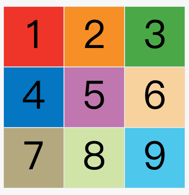

这个顺序由`grid-auto-flow`属性决定，默认值是`row`，即"先行后列"。也可以将它设成`column`，变成"先列后行"。

```css
grid-auto-flow: column;
```

[上面代码](https://jsbin.com/xutokec/edit?css,output)设置了`column`以后，放置顺序就变成了下图。

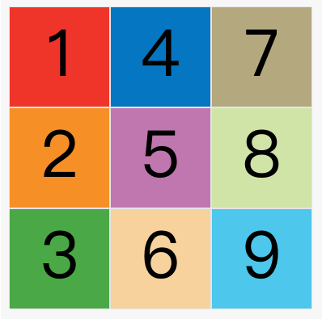

`grid-auto-flow`属性除了设置成`row`和`column`，还可以设成`row dense`和`column dense`。这两个值主要用于，某些项目指定位置以后，剩下的项目怎么自动放置。

[下面的例子](https://jsbin.com/wapejok/edit?css,output)让1号项目和2号项目各占据两个单元格，然后在默认的`grid-auto-flow: row`情况下，会产生下面这样的布局。

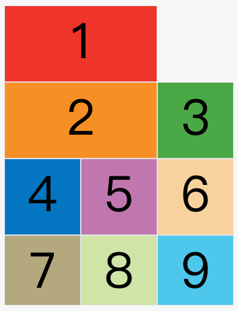

上图中，1号项目后面的位置是空的，这是因为3号项目默认跟着2号项目，所以会排在2号项目后面。

现在修改设置，设为`row dense`，表示"先行后列"，并且尽可能紧密填满，尽量不出现空格。

```css
grid-auto-flow: row dense;
```

[上面代码](https://jsbin.com/helewuy/edit?css,output)的效果如下。

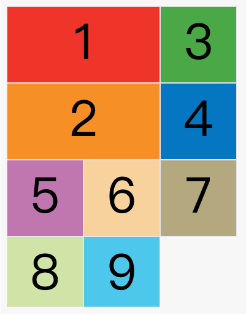

上图会先填满第一行，再填满第二行，所以3号项目就会紧跟在1号项目的后面。8号项目和9号项目就会排到第四行。

如果将设置改为`column dense`，表示"先列后行"，并且尽量填满空格。

```css
grid-auto-flow: column dense;
```

[上面代码](https://jsbin.com/pupoduc/1/edit?html,css,output)的效果如下。

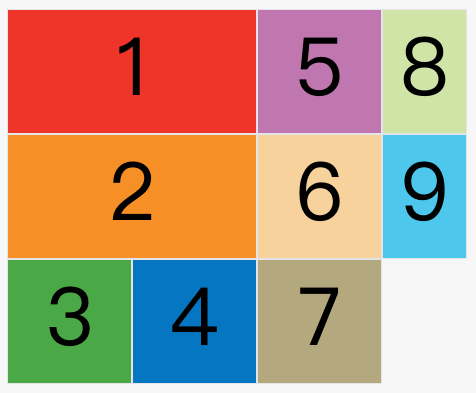

上图会先填满第一列，再填满第2列，所以3号项目在第一列，4号项目在第二列。8号项目和9号项目被挤到了第四列。


### justify-items

### align-items

### place-items

`justify-items`属性设置单元格内容的水平位置（左中右），`align-items`属性设置单元格内容的垂直位置（上中下）。

```css
.container {
  justify-items: start | end | center | stretch;
  align-items: start | end | center | stretch;
}
```

这两个属性的写法完全相同，都可以取下面这些值。

> - start：对齐单元格的起始边缘。
> - end：对齐单元格的结束边缘。
> - center：单元格内部居中。
> - stretch：拉伸，占满单元格的整个宽度（默认值）

```css
.container {
  justify-items: start;
}
```

[上面代码](https://jsbin.com/gijeqej/edit?css,output)表示，单元格的内容左对齐，效果如下图。

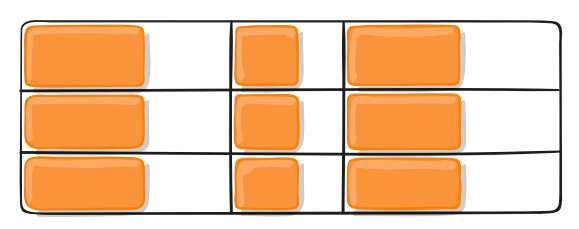

```css
.container {
  align-items: start;
}
```

[上面代码](https://jsbin.com/tecawur/edit?css,output)表示，单元格的内容头部对齐，效果如下图。

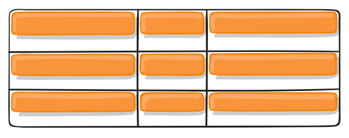

`place-items`属性是`align-items`属性和`justify-items`属性的合并简写形式。

 ```css
 place-items: <align-items <justify-items;
 ```

下面是一个例子。

 ```css
 place-items: start end;
 ```

如果省略第二个值，则浏览器认为与第一个值相等。


### justify-content

### align-content

### place-content

`justify-content`属性是整个内容区域在容器里面的水平位置（左中右），`align-content`属性是整个内容区域的垂直位置（上中下）。

```css
.container {
  justify-content: start | end | center | stretch | space-around | space-between | space-evenly;
  align-content: start | end | center | stretch | space-around | space-between | space-evenly;
}
```

这两个属性的写法完全相同，都可以取下面这些值。（下面的图都以`justify-content`属性为例，`align-content`属性的图完全一样，只是将水平方向改成垂直方向。）

- start - 对齐容器的起始边框。

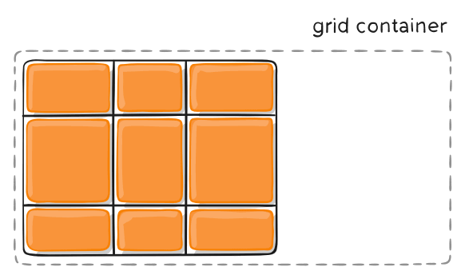

- end - 对齐容器的结束边框。

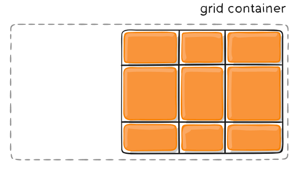

- center - 容器内部居中。

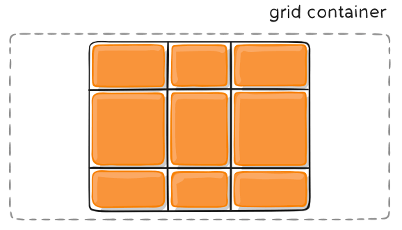

- stretch - 项目大小没有指定时，拉伸占据整个网格容器。

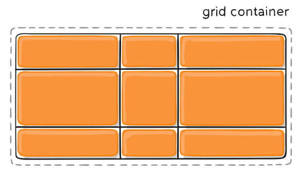

- space-around - 每个项目两侧的间隔相等。所以，项目之间的间隔比项目与容器边框的间隔大一倍。

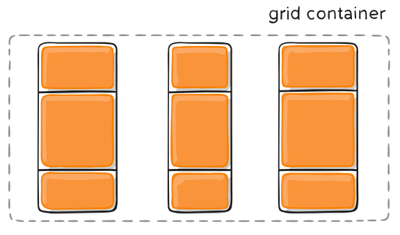

- space-between - 项目与项目的间隔相等，项目与容器边框之间没有间隔。

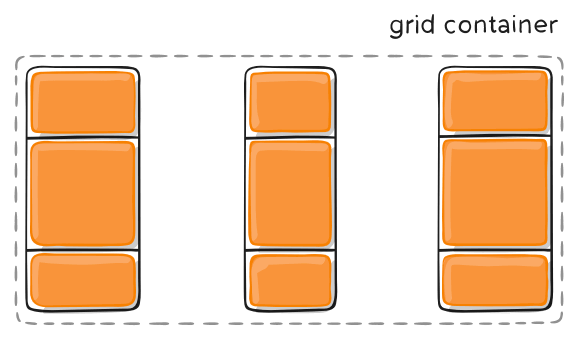

- space-evenly - 项目与项目的间隔相等，项目与容器边框之间也是同样长度的间隔。

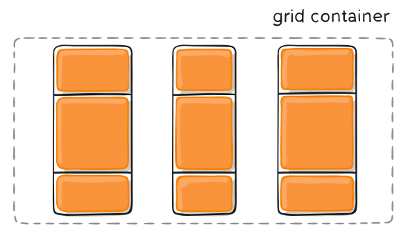

`place-content`属性是`align-content`属性和`justify-content`属性的合并简写形式。

```css
place-content: <align-content> <justify-content>
```

下面是一个例子。

```css
place-content: space-around space-evenly;
```

如果省略第二个值，浏览器就会假定第二个值等于第一个值。


### grid-auto-columns

### grid-auto-rows

有时候，一些项目的指定位置，在现有网格的外部。比如网格只有3列，但是某一个项目指定在第5行。这时，浏览器会自动生成多余的网格，以便放置项目。

`grid-auto-columns`属性和`grid-auto-rows`属性用来设置，浏览器自动创建的多余网格的列宽和行高。它们的写法与`grid-template-columns`和`grid-template-rows`完全相同。如果不指定这两个属性，浏览器完全根据单元格内容的大小，决定新增网格的列宽和行高。

[下面的例子](https://jsbin.com/sayuric/edit?css,output)里面，划分好的网格是3行 x 3列，但是，8号项目指定在第4行，9号项目指定在第5行。

```css
.container {
  display: grid;
  grid-template-columns: 100px 100px 100px;
  grid-template-rows: 100px 100px 100px;
  grid-auto-rows: 50px;
}
```

上面代码指定新增的行高统一为50px（原始的行高为100px）。

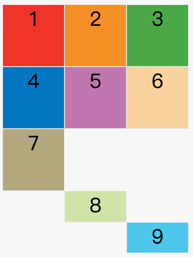

## 项目属性

### grid-column-start

### grid-column-end

### grid-row-start

###  grid-row-end

项目的位置是可以指定的，具体方法就是指定项目的四个边框，分别定位在哪根网格线。

- `grid-column-start`属性：左边框所在的垂直网格线
- `grid-column-end`属性：右边框所在的垂直网格线
- `grid-row-start`属性：上边框所在的水平网格线
- `grid-row-end`属性：下边框所在的水平网格线

```css
.item-1 {
  grid-column-start: 2;
  grid-column-end: 4;
}
```

[上面代码](https://jsbin.com/yukobuf/edit?css,output)指定，1号项目的左边框是第二根垂直网格线，右边框是第四根垂直网格线

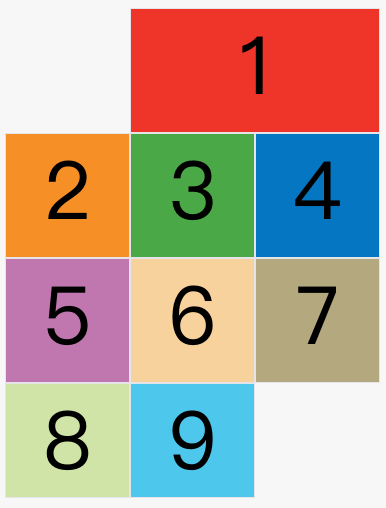

上图中，只指定了1号项目的左右边框，没有指定上下边框，所以会采用默认位置，即上边框是第一根水平网格线，下边框是第二根水平网格线。

除了1号项目以外，其他项目都没有指定位置，由浏览器自动布局，这时它们的位置由容器的`grid-auto-flow`属性决定，这个属性的默认值是`row`，因此会"先行后列"进行排列。读者可以把这个属性的值分别改成`column`、`row dense`和`column dense`，看看其他项目的位置发生了怎样的变化。

[下面的例子](https://jsbin.com/nagobey/edit?html,css,output)是指定四个边框位置的效果。

```css
.item-1 {
  grid-column-start: 1;
  grid-column-end: 3;
  grid-row-start: 2;
  grid-row-end: 4;
}
```

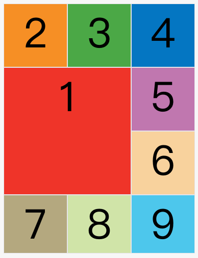

这四个属性的值，除了指定为第几个网格线，还可以指定为网格线的名字。

```css
.item-1 {
  grid-column-start: header-start;
  grid-column-end: header-end;
}
```

上面代码中，左边框和右边框的位置，都指定为网格线的名字。

这四个属性的值还可以使用`span`关键字，表示"跨越"，即左右边框（上下边框）之间跨越多少个网格。

```css
.item-1 {
  grid-column-start: span 2;
}
```

[上面代码](https://jsbin.com/hehumay/edit?html,css,output)表示，1号项目的左边框距离右边框跨越2个网格。

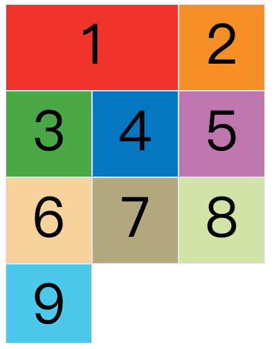

这与[下面的代码](https://jsbin.com/mujihib/edit?html,css,output)效果完全一样。

```css
.item-1 {
  grid-column-end: span 2;
}
```

使用这四个属性，如果产生了项目的重叠，则使用`z-index`属性指定项目的重叠顺序。


### grid-column

### grid-row

`grid-column`属性是`grid-column-start`和`grid-column-end`的合并简写形式，`grid-row`属性是`grid-row-start`属性和`grid-row-end`的合并简写形式。

```css
.item {
  grid-column: <start-line> / <end-line>;
  grid-row: <start-line> / <end-line>;
}
```

下面是一个例子。

```css
.item-1 {
  grid-column: 1 / 3;
  grid-row: 1 / 2;
}
/* 等同于 */
.item-1 {
  grid-column-start: 1;
  grid-column-end: 3;
  grid-row-start: 1;
  grid-row-end: 2;
}
```

上面代码中，项目`item-1`占据第一行，从第一根列线到第三根列线。

这两个属性之中，也可以使用`span`关键字，表示跨越多少个网格。

```css
.item-1 {
  background: #b03532;
  grid-column: 1 / 3;
  grid-row: 1 / 3;
}
/* 等同于 */
.item-1 {
  background: #b03532;
  grid-column: 1 / span 2;
  grid-row: 1 / span 2;
}
```

[上面代码](https://jsbin.com/volugow/edit?html,css,output)中，项目`item-1`占据的区域，包括第一行 + 第二行、第一列 + 第二列。

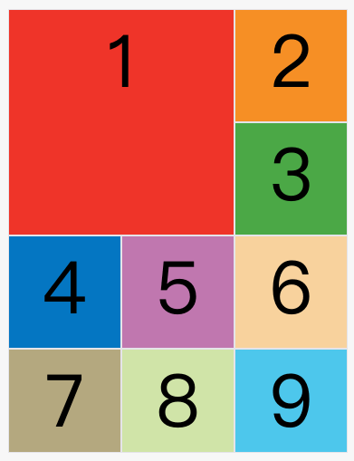

斜杠以及后面的部分可以省略，默认跨越一个网格。

```css
.item-1 {
  grid-column: 1;
  grid-row: 1;
}
```

上面代码中，项目`item-1`占据左上角第一个网格。


### grid-area

`grid-area`属性指定项目放在哪一个区域。

```css
.item-1 {
  grid-area: e;
}
```

[上面代码](https://jsbin.com/qokexob/edit?css,output)中，1号项目位于`e`区域，效果如下图。

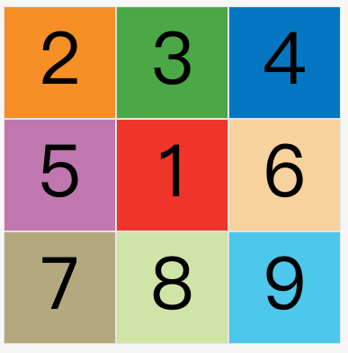

`grid-area`属性还可用作`grid-row-start`、`grid-column-start`、`grid-row-end`、`grid-column-end`的合并简写形式，直接指定项目的位置。

```css
.item {
  grid-area: <row-start> / <column-start> / <row-end> / <column-end>;
}
```

下面是一个[例子](https://jsbin.com/duyafez/edit?css,output)。

```css
.item-1 {
  grid-area: 1 / 1 / 3 / 3;
}
```

### justify-self

### align-self

### place-self

`justify-self`属性设置单元格内容的水平位置（左中右），跟`justify-items`属性的用法完全一致，但只作用于单个项目。

`align-self`属性设置单元格内容的垂直位置（上中下），跟`align-items`属性的用法完全一致，也是只作用于单个项目。

```css
.item {
  justify-self: start | end | center | stretch;
  align-self: start | end | center | stretch;
}
```

这两个属性都可以取下面四个值。

- start：对齐单元格的起始边缘。
- end：对齐单元格的结束边缘。
- center：单元格内部居中。
- stretch：拉伸，占满单元格的整个宽度（默认值）。

下面是`justify-self: start`的例子。

```css
.item-1  {
  justify-self: start;
}
```

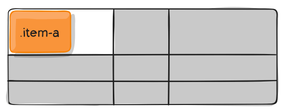

`place-self`属性是`align-self`属性和`justify-self`属性的合并简写形式。

```css
place-self: <align-self> <justify-self>;
```

下面是一个例子。

```css
place-self: center center;
```

如果省略第二个值，`place-self`属性会认为这两个值相等。


## 布局实例

### 水平垂直居中

目前 grid 布局是唯一一个一行 css 代码实现水平垂直居中布局的方法：[地址](http://js.jirengu.com/kigix/1/edit?html,css,output)


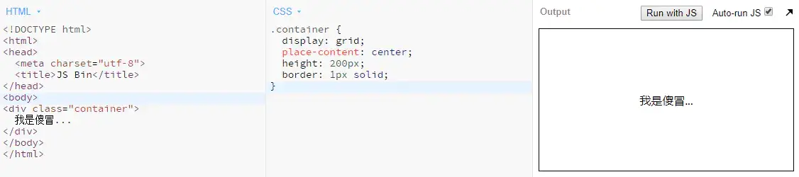


```html
<style>
.container{
  display: grid;
  place-content: center;
}
</style>
<div class="container">
  <div>asdf</div>
</div>
```


### 自适应两端对齐

这种效果难在实现最后一行左对齐的效果。如果使用 `flex` 布局或者 `text-align: justify` （参考[此处](https://juejin.im/post/6844903894313598989)）方法，则需要使用等列的空标签占位，而如果不确定总共有多少列的话则难以实现最后一行左对齐的效果。而 `grid` 布局则可完美实现两端对齐最后一行左对齐的效果。

项目宽度固定：[地址](http://js.jirengu.com/vigef/4/edit?html,css,output)


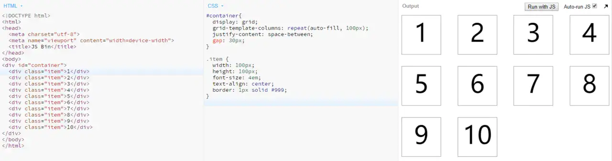


项目宽度不固定：[地址](http://js.jirengu.com/vujem/1/edit?html,css,output)


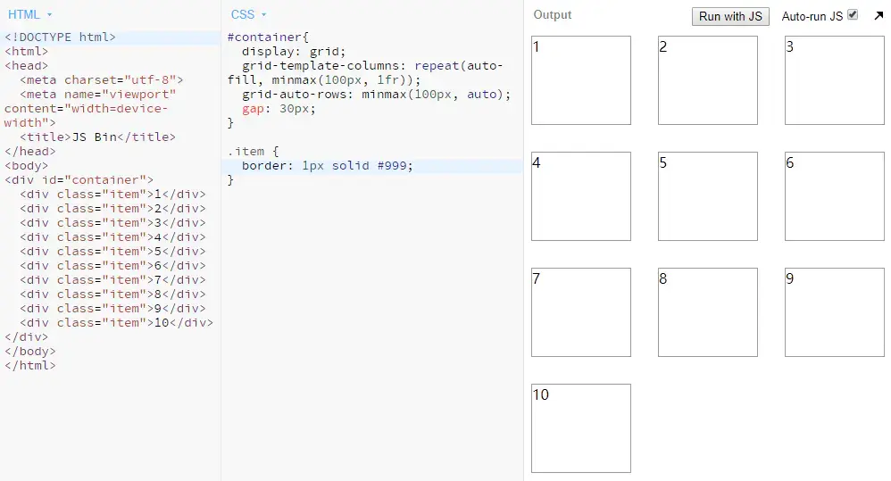

### 限定列宽的表格

第三列在宽度足够（即能前两列都大于100px）的情况下是前两列之和，最小是 `200px` ：[地址](http://js.jirengu.com/zineb/2/edit?html,css,output)


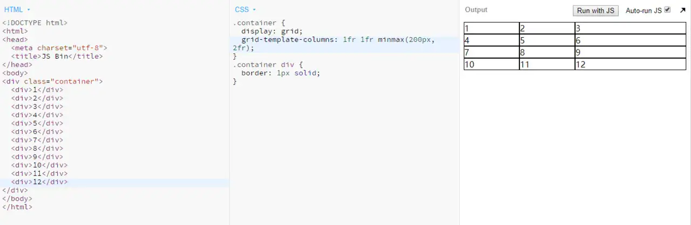


```css
.container {
  display: grid;
  grid-template-columns: 1fr 1fr minmax(200px, 2fr);
}
```

### 页眉页脚固定布局

页眉页脚固定的布局在管理端和移动端都常见，如下图所示： 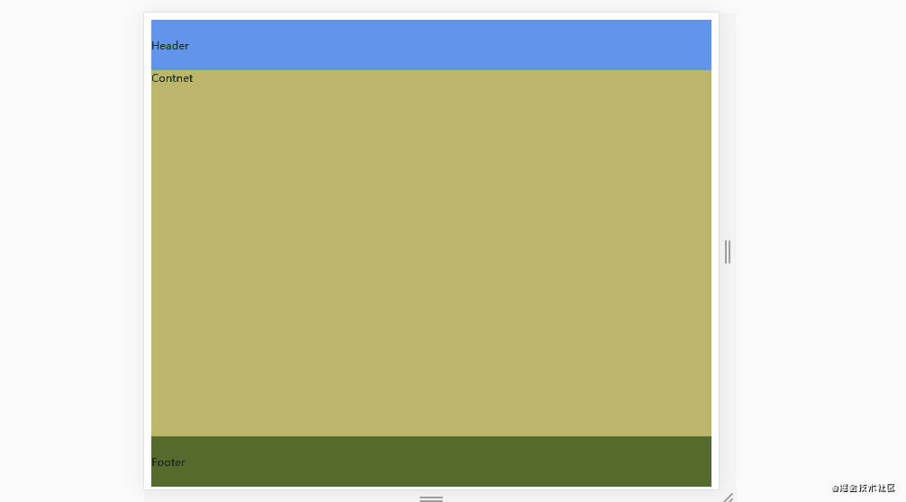 这种布局头部和底部固定，中间内容区域自适应高度，代码如下：

```css
display: grid;
grid-template-rows: auto 1fr auto;
```

代码的意思就是分成三行布局，第一行和第三行固定，剩下的中间填充满。
