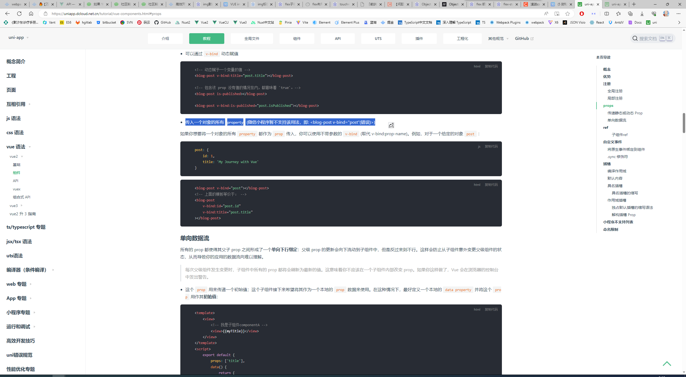
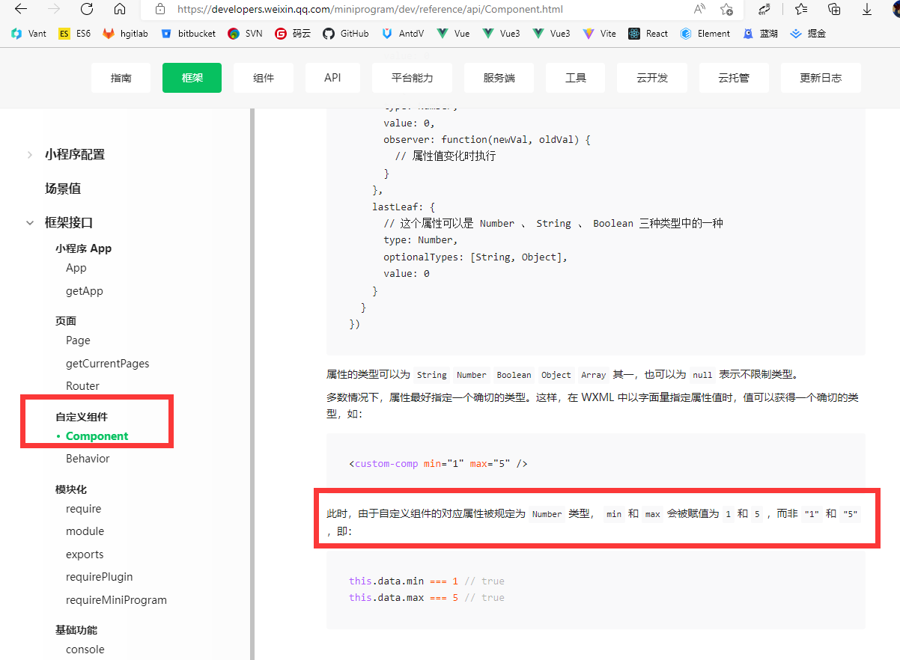
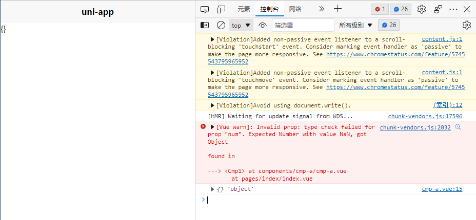
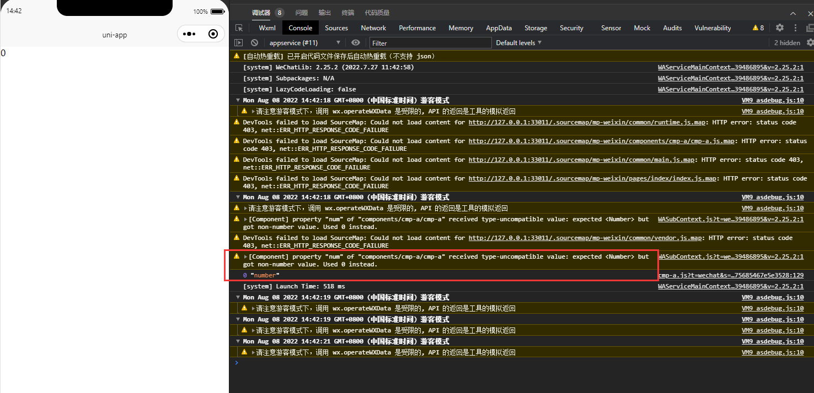

# uniapp

## v-bind传递一个对象的所有`property`

微信小程序不支持通过`v-bind="obj"`的形式传入一个对象的所有property



## 微信小程序组件属性类型转换行为

当使用自定义组件时，通常可以通过为`prop`指定类型，来对传入的值启动类型检查。

`uniapp`在编译为`H5`端时，如果传入的值和规定的类型不一致，会抛出警告。

而在编译为`微信小程序`端时，如果类型不一致，那么**所传入值的类型会被隐式转换**。

关于上述观点的文档依据如下：



代码调试结果如下：

```vue
<!-- pages/index/index.vue -->
<template>
    <view class="content">
        <cmp-a :num='{}'></cmp-a>
    </view>
</template>

<script>
export default {
    data() {
        return {
            title: 'Hello'
        }
    }
}
</script>

<!-- /components/cmp-a/cmp-a.vue -->
<template>
	<view>{{ num }}</view>
</template>

<script>
export default {
	name: 'cmp1',
	props: {
		num: {
			type: Number,
			default: '1'
		}
	},
	mounted() {
		console.log(this.num, typeof this.num);
	}
};
</script>

```

H5端：



微信小程序端：


