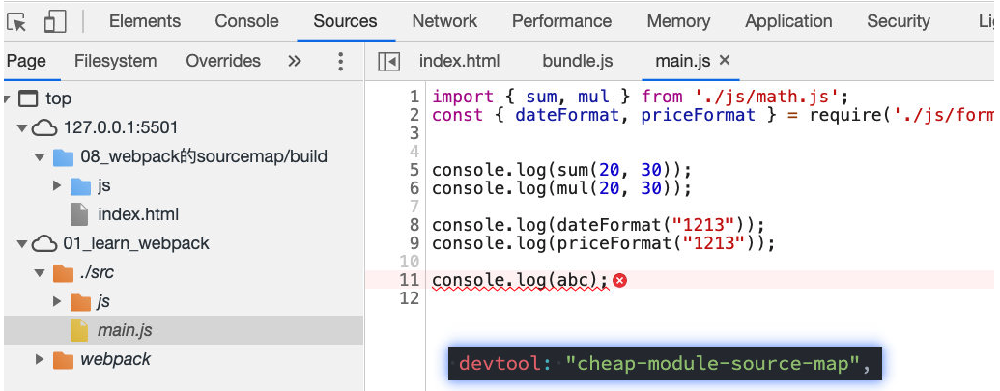
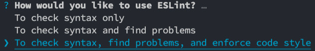

# Webpack5

```
<link rel="icon" href="<%= BASE_URL %>favicon.ico">
```

## 安装

需要安装`webpack` `webpack-cli`

执行webpack命令，会执行node_modules下的.bin目录下的webpack；
webpack在执行时是依赖webpack-cli的，如果没有安装就会报错；
而webpack-cli中代码执行时，才是真正利用webpack进行编译和打包的过程；
所以在安装webpack时，我们需要同时安装webpack-cli（第三方的脚手架事实上是没有使用webpack-cli的，而是类似于自己的vue-service-cli的东西）


```bash
npm install webpack webpack-cli –g # 全局安装
npm install webpack webpack-cli –D # 局部安装
```

某些JS语法在浏览器中会出现兼容性问题，比如：

1. 箭头函数

2. 在不未进行编译打包的情况下，在`script`标签中写js代码，或者使用src引入js文件时，默认不能使用`ES6module`形式，即不能使用`import`导入文件，但是我们可以再`script`标签上加上`type=module`属性来改变方式。

3. 此外，浏览器也不认识`CommonJS`的引入方式

因此我们需要通过某个工具对其进行打包，让其转换成浏览器可以直接识别的语法。

如果要局部安装webpack 需要使用npx

[webpack的使用及过程中遇到的问题和解决办法 - 简书 (jianshu.com)](https://www.jianshu.com/p/a3058f860836)

## Webpack配置文件

### 默认配置文件

在根目录下创建一个webpack.config.js文件，来作为webpack的配置文件：


### 指定配置文件

如果我们的配置文件并不是webpack.config.js的名字，可以通过--config 来指定对应的配置文件

```bash
webpack --config wk.config.js
```


> 在没有`webpack.config.js`配置文件的前提下，webpack是如何确定我们的入口的呢？
>
> 运行webpack时，webpack会查找当前目录下的src/index.js作为入口；如果当前项目中没有存在src/index.js文件，那么会报错。
>
> 也可以通过命令配置来指定入口和出口 `npx webpack --entry ./src/main.js --output-path ./build`
>
> 如果在`package.json`中配置了脚本则不需要`npx` ，直接`"xxx":"webpack --entry ./src/main.js --output-path ./build"`

## Webpack是如何打包的

+ webpack在处理应用程序时，它会根据命令或者配置文件找到入口文件
+ 从入口开始，会生成一个依赖关系图，这个依赖关系图会包含应用程序中所需的所有模块（比如.js文件、css文件、图片、字体等）
+ 然后遍历图结构，打包一个个模块（根据文件的不同使用不同的loader来解析）


## loader配置方式

**webpack 默认支持处理 JS 与 JSON 文件**

module.rules中允许我们配置多个loader（因为我们也会继续使用其他的loader，来完成其他文件的加载）

module.rules的配置如下：

rules属性对应的值是一个数组：[Rule]

数组中存放的是一个个的Rule，Rule是一个对象，对象中可以设置多个属性：

- test属性：用于对resource（资源）进行匹配的，通常会设置成正则表达式；
- use属性：对应的值时一个数组：[UseEntry]
  - UseEntry是一个对象，可以通过对象的属性来设置一些其他属性
    - loader：必须有一个loader属性，对应的值是一个字符串；
    - options：可选的属性，值是一个字符串或者对象，值会被传入到loader中；
    -  query：目前已经使用options来替代；
  - [UseEntry]也可以直接传递一个传递字符串（如：use: [ 'style-loader' ]）是loader 属性的简写方式（如：use: [ { loader: 'style-loader'} ]）；
- loader属性： Rule.use: [ { loader } ] 的简写。


## context

## mode

## css-loader

安装：

```bash
cnpm i css-loader -D
```

如何使用`css-loader`

+ 内联使用方式

  在引入的样式前加上使用的loader，并且使用!分割；

​		

+ 在`webpack.config.js`中配置css-loader

`css-loader`只是负责将`.css`文件进行解析，并不会将解析之后的`css`插入到页面中

如果我们希望再完成插入style的操作，那么我们还需要另外一个loader，就是`style-loader`

### importLoaders

类型：`Number` 默认：`0`

允许为 `@import` 样式规则、CSS 模块或者 ICSS 启用/禁用或设置在 CSS loader 之前应用的 loader 的数量，例如：`@import`/`composes`/`@value value from './values.css'` 等。

`importLoaders` 选项允许你配置在 `css-loader` 之前有多少 loader 应用于 `@import`ed 资源与 CSS 模块/ICSS 导入。

**webpack.config.js**

```js
module.exports = {
  module: {
    rules: [
      {
        test: /\.css$/i,
        use: [
          "style-loader",
          {
            loader: "css-loader",
            options: {
              importLoaders: 2,
              // 0 => no loaders (default);
              // 1 => postcss-loader;
              // 2 => postcss-loader, sass-loader
            },
          },
          "postcss-loader",
          "sass-loader",
        ],
      },
    ],
  },
};
```

## style-loader

把 CSS 插入到 DOM 中。

安装：

```bash
npm install style-loader -D
```

如何使用`style-loader`：

因为loader的执行顺序是从右向左（或者说从下到上，或者说从后到前的），所以我们需要将styleloader写到css-loader的前面；

```js
module.exports = {
  module: {
    rules: [
      {
        test: /\.css$/i,
        use: ["style-loader", "css-loader"],
      },
    ],
  },
};

```

截止到目前我们的css是通过页内样式的方式添加进来的。

## less-loader

webpack 将 Less 编译为 CSS 的 loader。

在开发中，我们可能会使用less、sass、stylus的预处理器来编写css样式，效率会更高

安装：（不仅要安装less-loader还要安装less）

```bash
npm install less less-loader -D
```

如何使用`less-loader`

```js
module.exports = {
  module: {
    rules: [
      {
        test: /\.less$/i,
        loader: [
          // compiles Less to CSS
          'style-loader',
          'css-loader',
          'less-loader',
        ],
      },
    ],
  },
};
```


## 浏览器兼容性

这里指的兼容性是针对不同的浏览器支持的特性：比如css特性、js语法，之间的兼容性

如何可以在css兼容性和js兼容性下共享我们配置的兼容性条件呢？

### Browserslist

使用方法

1. `package.json`中配置

   ```json
   {
     ...
     "browserslist": [
       "last 1 version",
       "> 1%",
       "maintained node versions",
       "not dead"
     ],
     ...
   }
   ```

2. `.browserslistrc`文件

   ```bash
   # Browsers that we support 
    
   last 1 version
   > 1%
   maintained node versions
   not dead
   ```

## postcss

PostCSS是一个通过JavaScript来转换样式的工具；这个工具可以帮助我们进行一些CSS的转换和适配，比如自动添加浏览器前缀、css样式的重置。

PostCSS本身功能很少，强的是PostCSS的插件（需要配置）

如何使用PostCSS：

+ 查找PostCSS在构建工具中的扩展，比如webpack中的postcss-loader
+ 选择可以添加你需要功能的PostCSS相关插件

### 单独使用postcss

需要额外安装`postcss-cli`

```bash
npm install postcss postcss-cli -D
```


因为我们需要添加前缀，所以要安装autoprefixer

```bash
npm install autoprefixer -D
```

直接使用使用postcss工具，并且制定使用autoprefixer

```bash
npx postcss --use autoprefixer -o end.css ./src/css/style.css
```


### postcss-loader

为了使用本 loader，你需要安装 `postcss-loader` 和 `postcss`

安装：

```bash
npm install postcss-loader -D
```


```js
module.exports = {
  module: {
    rules: [
      {
        test: /\.css$/i,
        use: [
          'style-loader',
          'css-loader',
          {
            loader: 'postcss-loader',
            options: {
              postcssOptions: {
                plugins: [
                  [
                    'postcss-preset-env',
                    {
                      // 其他选项
                    },
                  ],
                ],
              },
            },
          },
        ],
      },
    ],
  },
};
```

#### 使用postcss本身的配置文件

**postcss.config.js**

```js
module.exports = {
  plugins: [
    [
      'postcss-preset-env',
      {
        // 其他选项
      },
    ],
  ],
};
```

Loader 将会**自动**搜索配置文件。

```js
module.exports = {
  module: {
    rules: [
      {
        test: /\.css$/i,
        use: ['style-loader', 'css-loader', 'postcss-loader'],
      },
    ],
  },
};
```

### postcss-preset-env 插件

autoprefixer只能做前缀，无法将新特性转为旧特性（比如八位数十六进制为 rgba() 这类属性值）

+ 帮助我们将一些现代的CSS特性，转成大多数浏览器认识的CSS，并且会根据目标浏览器或者运行时环
  境添加所需的polyfill

+ 自动帮助我们添加autoprefixer（相当于已经内置了autoprefixer）

```bash
npm install postcss-preset-env -D
```

## file-loader

当css/js解析到图片资源时，不知道该如何处理某些文件，此时需要使用file-loader

file-loader的作用就是帮助我们处理import/require()方式引入的一个文件资源，并且会将它放到我们输出的
文件夹中

安装：

```bash
npm install file-loader -D
```


### 文件的名称规则

[ext]： 处理文件的扩展名；
[name]：处理文件的名称；
[hash]：文件的内容，使用MD4的散列函数处理，生成的一个128位的hash值（32个十六进制）；
[contentHash]：在file-loader中和[hash]结果是一致的（在webpack的一些其他地方不一样，后面会讲到）；
[hash:<length>]：截图hash的长度，默认32个字符太长了；
[path]：文件相对于webpack配置文件的路径；


## url-loader

默认情况下url-loader会将所有的图片文件转成base64编码

```bash
npm install url-loader -D
```


purl-loader有一个options属性limit，可以用于设置转换的限制


## asset module type

在webpack5之前，加载这些资源我们需要使用一些loader，比如raw-loader 、url-loader、file-loader；
在webpack5之后，我们可以直接使用资源模块类型（asset module type），来替代上面的这些loader；

资源模块类型(asset module type)，通过添加4 种新的模块类型，来替换所有这些loader：

+ asset/resource 发送一个单独的文件并导出URL。之前通过使用file-loader 实现；
+ asset/inline 导出一个资源的data URI。之前通过使用url-loader 实现；
+ asset/source 导出资源的源代码。之前通过使用raw-loader 实现；
+ asset 在导出一个data URI 和发送一个单独的文件之间自动选择。之前通过使用url-loader，并且配置资源
  体积限制实现；


如何可以自定义文件的输出路径和文件名

此处[ext]本身会自带`.`


### url-loader的limit效果

步骤一：将type修改为asset；
步骤二：添加一个parser属性，并且制定dataUrl的条件，添加maxSize属性；


## 加载字体文件


## Plugin

Loader是用于特定的模块类型进行转换

Plugin可以用于执行更加广泛的任务，比如打包优化、资源管理、环境变量注入等


## CleanWebpackPlugin

每次修改了一些配置，重新打包时，都需要手动删除dist文件夹

借助于一个插件来帮助我们完成，这个插件就是`CleanWebpackPlugin`

```bash
npm install clean-webpack-plugin -D
```


## HtmlWebpackPlugin

```bash
npm install html-webpack-plugin -D
```

在进行项目部署的时，必然也是需要有对应的入口文件index.html

默认情况dist下是没有打包出index.html的


作用：

+ 生成一个index.html
+ 在index.html中自动引入bundle.js

默认情况下是根据ejs的一个模板来生成的，在html-webpack-plugin的源码中，有一个default_index.ejs模块

### 自定义html模板


上面的代码中，会有一些类似这样的语法`<%= 变量%>`，这个是EJS模块填充数据的方式。

在配置HtmlWebpackPlugin时，我们可以添加如下配置：
template：指定我们要使用的模块所在的路径；
title：在进行htmlWebpackPlugin.options.title读取时，就会读到该信息；


但是，这个时候编译还是会报错，因为在我们的模块中还使用到一个BASE_URL的常量


这是因为在编译template模块时，有一个BASE_URL：

`<link rel="icon" href="<%= BASE_URL %>favicon.ico">`
但是我们并没有设置过这个常量值，所以会出现没有定义的错误；
 这个时候我们可以使用`DefinePlugin`插件；

## DefinePlugin

DefinePlugin允许在编译时创建配置的全局常量，是一个webpack内置的插件（不需要单独安装）


## CopyWebpackPlugin

在vue的打包过程中，如果我们将一些文件放到public的目录下，那么这个目录会被复制到dist文件夹中

这个复制的功能，我们可以使用CopyWebpackPlugin来完成；

```bash
npm install copy-webpack-plugin -D
```

复制的规则在patterns中设置

from：设置从哪一个源中开始复制；

to：复制到的位置，可以省略，会默认复制到打包的目录下；
globOptions：设置一些额外的选项，其中可以编写需要忽略的文件：
  .DS_Store：mac目录下回自动生成的一个文件；
  index.html：也不需要复制，因为我们已经通过HtmlWebpackPlugin完成了index.html的生成；

`**`指代`public`


## stats

'errors-only'不能屏蔽eslint warning

## mode配置

提供 `mode` 配置选项，告知 webpack 使用相应模式的内置优化。

string = 'production': 'none' | 'development' | 'production' 默认值production

只需在配置对象中提供 `mode` 选项：

```javascript
module.exports = {
  mode: 'development',
};
```


## webpack模块化

Webpack打包的代码，允许我们使用各种各样的模块化，但是最常用的是CommonJS、ES Module

它是如何帮助我们实现了代码中支持模块化呢？

CommonJS模块化实现原理；
ES Module实现原理；
CommonJS加载ES Module的原理；
ES Module加载CommonJS的原理；

这里不再给出代码，查看课堂代码的注释解析；

## source-map

如何可以使用source-map呢？两个步骤：
第一步：根据源文件，生成source-map文件，webpack在打包时，可以通过配置生成source-map；
第二步：在转换后的代码，最后添加一个注释，它指向sourcemap；

```js
//# sourceMappingURL=common.bundle.js.map
```

## devtool

此选项控制是否生成，以及如何生成 source map。

`string = 'eval'` `false` 字符串值或是false

false：不使用source-map，也就是没有任何和source-map相关的内容。
none：production模式下的默认值，不生成source-map。只能在production下设置
eval：development模式下的默认值，不生成source-map
但是它会在eval函数执行的代码中，添加`//# sourceURL=`；
它会被浏览器在执行时解析，并且在调试面板中生成对应的一些文件目录，方便我们调试代码

### source-map

生成一个独立的source-map文件，并且在bundle文件中有一个注释，指向source-map文件

bundle文件中有如下的注释：
开发工具会根据这个注释找到source-map文件，并且解析；
//# sourceMappingURL=bundle.js.map

### eval-source-map

eval-source-map：会生成sourcemap，但是source-map是以DataUrl添加到eval函数的后面

### inline-source-map

会生成sourcemap，但是source-map是以DataUrl添加到bundle文件的后面

### cheap-source-map

cheap-source-map：
会生成sourcemap，但是会更加高效一些（cheap低开销），因为它没有生成列映射（Column Mapping）
因为在开发中，我们只需要行信息通常就可以定位到错误了

### cheap-module-source-map

cheap-module-source-map：
会生成sourcemap，类似于cheap-source-map，但是对源自loader的sourcemap处理会更好。
这里有一个很模糊的概念：对源自loader的sourcemap处理会更好，官方也没有给出很好的解释
其实是如果loader对我们的源码进行了特殊的处理，比如babel；
如果我这里使用了babel-loader（注意：目前还没有讲babel）
可以先按照我的babel配置演练；


cheap-source-map和cheap-module-source-map的区别




### hidden-source-map

会生成sourcemap，但是不会对source-map文件进行引用

相当于删除了打包文件中对sourcemap的引用注释

// 被删除掉的
//# sourceMappingURL=bundle.js.map

如果我们手动添加进来，那么sourcemap就会生效了

### nosources-source-map

会生成sourcemap，但是生成的sourcemap只有错误信息的提示，会有错误行提示，但是不会生成源代码文件


点击错误提示，无法查看源码：


### 组合的规则

inline-|hidden-|eval：三个值时三选一；
nosources：可选值；
cheap可选值，并且可以跟随module的值；

`[inline-|hidden-|eval-][nosources-][cheap-[module-]]source-map`

那么在开发中，最佳的实践是什么呢？
开发阶段：推荐使用source-map或者cheap-module-source-map
这分别是vue和react使用的值，可以获取调试信息，方便快速开发；
测试阶段：推荐使用source-map或者cheap-module-source-map
测试阶段我们也希望在浏览器下看到正确的错误提示；
发布阶段：false、缺省值（不写）

## babel

Babel是一个工具链，主要用于旧浏览器或者缓解中将ECMAScript 2015+代码转换为向后兼容版本的
JavaScript；

包括：语法转换、源代码转换、Polyfill实现目标缓解缺少的功能等


如果我们希望在命令行尝试使用babel，需要安装如下库

@babel/core：babel的核心代码，必须安装；
@babel/cli：可以让我们在命令行使用babel

```bash
npm install @babel/cli @babel/core -D
```

使用babel来处理我们的源代码：
src：是源文件的目录；
--out-dir：指定要输出的文件夹dist；

```bash 
npx babel src --out-dir dist
```

### 转换箭头函数

```bash
npm install @babel/plugin-transform-arrow-functions -D
npx babel src --out-dir dist --plugins=@babel/plugin-transform-arrow-functions
```

### const 转成var

```bash
npm install @babel/plugin-transform-block-scoping -D
npx babel src --out-dir dist --plugins=@babel/plugin-transform-block-scoping
,@babel/plugin-transform-arrow-functions
```

### 预设preset

```bash
npm install @babel/preset-env -D
npx babel src --out-dir dist --presets=@babel/preset-env
```

### babel-loader

```bash
npm install babel-loader @babel/core
```


指定插件


### babel-preset插件

```bash
npm install @babel/preset-env
```

依赖于browserslist

设置目标浏览器targets


配置的targets属性会覆盖browserslist

### Stage-X


在babel7之前（比如babel6中），我们会经常看到这种设置方式：
它表达的含义是使用对应的babel-preset-stage-x 预设；
但是从babel7开始，已经不建议使用了，建议使用preset-env来设置；


### Babel的配置文件

像之前一样，我们可以将babel的配置信息放到一个独立的文件中，babel给我们提供了两种配置文件的编写：
babel.config.json（或者.js，.cjs，.mjs）文件；
.babelrc.json（或者.babelrc，.js，.cjs，.mjs）文件；

目前很多的项目都采用了**多包管理**的方式（babel本身、element-plus、umi等）单个仓库下存在package目录，下有各自独立的package.json

.babelrc.json：早期使用较多的配置方式，但是对于配置Monorepos项目是比较麻烦的

babel.config.json（babel7）：可以直接作用于Monorepos项目的子包，更加推荐


### polyfill

使用了一些语法特性（例如：Promise, Generator, Symbol等以及实例方法例如
Array.prototype.includes等）

但是某些浏览器压根不认识这些特性，必然会报错

babel7.4.0之前，可以使用@babel/polyfill的包，但是该包现在已经不推荐使用了

babel7.4.0之后，可以通过单独引入core-js和regenerator-runtime来完成polyfill的使用

```bash
npm install core-js regenerator-runtime --save
```


```js
// babel.config.js
module.exports = {
  presets: [
    ["@babel/preset-env", {
      // false: 不用任何的polyfill相关的代码
      // usage: 代码中需要哪些polyfill, 就引用相关的api  比如nodemodules里可能实现了部分polyfill,要在babel-loader配置里排除掉
      // entry: 手动在入口文件中导入 core-js/regenerator-runtime, 根据目标浏览器引入所有对应的polyfill
      useBuiltIns: "entry",
      corejs: 3
    }],
    ["@babel/preset-react"]
  ],
  // plugins: [
  //   ["@babel/plugin-transform-runtime", {
  //     corejs: 3
  //   }]
  // ]
}
```

### 配置babel.config.js

在babel.config.js文件中进行配置，给preset-env配置一些属性

useBuiltIns：设置以什么样的方式来使用polyfill；
corejs：设置corejs的版本，目前使用较多的是3.x的版本，比如我使用的是3.8.x的版本；
另外corejs可以设置是否对提议阶段的特性进行支持；
设置proposals属性为true即可；

### useBuiltIns属性设置

第三个值：entry
如果我们依赖的某一个库本身使用了某些polyfill的特性，但是因为我们使用的是usage，所以之后用户浏览器
可能会报错；
所以，如果你担心出现这种情况，可以使用entry；
并且需要在入口文件中添加`import 'core-js/stable'; import 'regenerator-runtime/runtime';
这样做会根据browserslist 目标导入所有的polyfill，但是对应的包也会变大；


### Plugin-transform-runtime

在前面我们使用的polyfill，默认情况是添加的所有特性都是全局的
如果我们正在编写一个工具库，这个工具库需要使用polyfill；
别人在使用我们工具时，工具库通过polyfill添加的特性，可能会污染它们的代码；
所以，当编写工具时，babel更推荐我们使用一个插件： @babel/plugin-transform-runtime来完成polyfill
的功能；

Plugin-transform-runtime和useBuiltIns疑似互斥?

```bash
npm install @babel/plugin-transform-runtime -D
```


## TypeScript的编译

```bash
npm install typescript -D
```

TypeScript的编译配置信息我们通常会编写一个tsconfig.json文件：

```bash
tsc --init
```


运行npx tsc来编译自己的ts代码

```bash
npx tsc
```

## ts-loader

依赖tsconfig.json

```bash
npm install ts-loader -D
```

配置ts-loader


tsloader不能兼容polyfill，即无法将ts中添加对应需要的polyfill

## 使用babel-loader编译ts

除了可以使用TypeScript Compiler来编译TypeScript之外，我们也可以使用Babel

Babel是有对TypeScript进行支持；
我们可以使用插件： @babel/tranform-typescript；
但是更推荐直接使用preset：@babel/preset-typescript

```bash
npm install @babel/preset-typescript -D
```


## ts-loader和babel-loader选择

使用ts-loader（TypeScript Compiler   tsc）
来直接编译TypeScript，那么只能将ts转换成js；
如果我们还希望在这个过程中添加对应的polyfill，那么ts-loader是无能为力的；
我们需要借助于babel来完成polyfill的填充功能；

使用babel-loader（Babel）
来直接编译TypeScript，也可以将ts转换成js，并且可以实现polyfill的功能；
但是babel-loader在编译的过程中，**不会对类型错误进行检测**；

## 编译TypeScript最佳实践

执行npm run type-check可以对ts代码的类型进行检测

--noEmit不输出目标js文件

执行npm run type-check-watch可以实时的检测类型错误


## ForkTsCheckerWebpackPlugin

过去支持eslint，现在移除了

[错误信息列表 · TypeScript中文网 · TypeScript——JavaScript的超集 (tslang.cn)](https://www.tslang.cn/docs/handbook/error.html)

https://github.com/TypeStrong/fork-ts-checker-webpack-plugin/issues/601

## ESLint

eslint-config-standard 需要eslint 7.32.0[【一听就懂】ESLint机制浅析_黑马老邹的博客-CSDN博客](https://blog.csdn.net/jameszou707/article/details/121749796?spm=1001.2014.3001.5502)

[Overview | TypeScript ESLint (typescript-eslint.io)](https://typescript-eslint.io/rules/)

[Eslint - 规则 | Rules - 开发者手册 - 云+社区 - 腾讯云 (tencent.com)](https://cloud.tencent.com/developer/chapter/12618)

[Introduction | eslint-plugin-vue (vuejs.org)](https://eslint.vuejs.org/)

[Enabling the `threads` option makes it so that the plugin doesn't emit errors unless in watch mode after the file was changed. · Issue #146 · webpack-contrib/eslint-webpack-plugin (github.com)](https://github.com/webpack-contrib/eslint-webpack-plugin/issues/146)

[Potential performance improvements · Issue #137 · webpack-contrib/eslint-webpack-plugin (github.com)](https://github.com/webpack-contrib/eslint-webpack-plugin/issues/137)

[Documentation - ESLint - Pluggable JavaScript linter](https://eslint.org/docs/user-guide/formatters/)

[List of available rules - ESLint中文文档 (bootcss.com)](https://eslint.bootcss.com/docs/rules/)

https://eslint.vuejs.org/rules/

'errors-only'不能屏蔽eslint warn 

eslintignore 屏蔽build webpack.config.js

如果webpack中eslint配置不生效，可能需要删除node_modules重新装

```js
    "eslint": "^7.32.0",
    "eslint-config-standard": "^16.0.3",
    "eslint-plugin-import": "^2.25.4",
    "eslint-plugin-node": "^11.1.0",
    "eslint-plugin-promise": "^5.2.0",
```

eslint8和standard的版本有冲突，需要手动降到eslint7  （全是运气）


```bash
npm install eslint -D
```

创建ESLint的配置文件

```bash
npx eslint --init
```



执行检测命令 依赖于.eslintrc.js

```bash
npx eslint ./src/main.js
```

默认创建的环境如下：
env：运行的环境，比如是浏览器，并且我们会使用es2021（对应的ecmaVersion是12）的语法；

extends：可以扩展当前的配置，让其继承自其他的配置信息，可以跟字符串或者数组（多个）；

parserOptions：这里可以指定ESMAScript的版本、sourceType的类型

parser：默认情况下是espree（也是一个JS Parser，用于ESLint），但是因为我们需要编译TypeScript，所
以需要指定对应的解释器；

plugins：指定我们用到的插件；

rules：自定义的一些规则；

### 通过配置规则：

格式是： 配置的规则名称：对应的值值可以是数字、字符串、数组：
字符串对应有三个值： off、warn、error；
数字对应有三个值： 0、1、2（分别对应上面的值）;
数组我们可以告知对应的提示以及希望获取到的值：比如['error', 'double']

### ESLint-Loader

```bash
npm install eslint-loader -D
```


## eslintWebpackPlugin

未来会移除threads exclude

[Futute + Perfomance · Issue #143 · webpack-contrib/eslint-webpack-plugin (github.com)](https://github.com/webpack-contrib/eslint-webpack-plugin/issues/143)

[Potential performance improvements · Issue #137 · webpack-contrib/eslint-webpack-plugin (github.com)](https://github.com/webpack-contrib/eslint-webpack-plugin/issues/137)

[Enabling the `threads` option makes it so that the plugin doesn't emit errors unless in watch mode after the file was changed. · Issue #146 · webpack-contrib/eslint-webpack-plugin (github.com)](https://github.com/webpack-contrib/eslint-webpack-plugin/issues/146)

## 加载Vue文件

```bash
npm install vue-loader -D
npm install vue-template-compiler -D
```


## Webpack watch

webpack给我们提供了watch模式

在该模式下，webpack依赖图中的所有文件，只要有一个发生了更新，那么代码将被重新编译

两种方式：

方式一：在导出的配置中，添加watch: true；
方式二：在启动webpack的命令中，添加--watch的标识


## webpack-dev-server

```bash
npm install --save-dev webpack-dev-server
```

修改配置文件，告知dev server，从什么位置查找文件


npm命令


### overlay

```js
module.exports = {
  //...
  devServer: {
    client: {
      overlay: {
        errors: true,
        warnings: false,
      },
    },
  },
};
```

疑似用的last-modify监控文件改动?

未掌握防抖方案

## HMR

Hot Module Replacement 模块热替换

开启HMR


你会发现，当我们修改了某一个模块的代码时，依然是刷新的整个页面

这是因为我们需要去指定哪些模块发生更新时，进行HMR


在开发其他项目时，我们是否需要经常手动去写入module.hot.accpet相关的API呢？

比如vue开发中，我们使用vue-loader，此loader支持vue组件的HMR，提供开箱即用的体验；

比如react开发中，有React Hot Loader，实时调整react组件（目前React官方已经弃用了，改成使用reactrefresh）；

### React的HMR

```BASH
npm install -D @pmmmwh/react-refresh-webpack-plugin react-refresh
```


### Vue的HMR

Vue的加载我们需要使用vue-loader，而vue-loader加载的组件默认会帮助我们进行HMR的处理。

```BASH
npm install vue-loader vue-template-compiler -D
```


## output的publicPath

output中的`path`的作用是告知webpack之后的输出目录，比如静态资源的js、css等输出到哪里，常见的会设置为dist、build文件夹等

output中还有一个`publicPath`属性，该属性是指定index.html文件打包引用的一个基本路径

它的默认值是一个空字符串，所以我们打包后引入js文件时，路径是bundle.js

在开发中，我们也将其设置为/ ，路径是/bundle.js，那么浏览器会根据所在的域名+路径去请求对应的资源；
如果我们希望在本地直接打开打包完的html文件来运行，会将其设置为./，路径时./bundle.js，可以根据相对路径去查找资源；

## devServer的publicPath

devServer中也有一个publicPath的属性，该属性是指定本地服务所在的文件夹

它的默认值是/，也就是我们直接访问端口即可访问其中的资源http://localhost:8080

如果我们将其设置为了/abc，那么我们需要通过http://localhost:8080/abc才能访问到对应的打包后的资源

并且这个时候，我们其中的bundle.js通过http://localhost:8080/bundle.js也是无法访问的

所以必须将output.publicPath也设置为/abc

官方其实有提到，建议devServer.publicPath 与output.publicPath相同

## devServer的contentBase

devServer中contentBase对于我们直接访问打包后的资源其实并没有太大的作用，它的主要作用是如果我们打包
后的资源，又依赖于其他的一些资源，那么就需要指定从哪里来查找这个内容

比如在index.html中，我们需要依赖一个abc.js 文件，这个文件我们存放在public文件中

在index.html中，我们应该如何去引入这个文件呢？

比如代码是这样的：`<script src="./public/abc.js"></script>`；

但是这样打包后浏览器是无法通过相对路径去找到这个文件夹的

所以代码是这样的：`<script src="/abc.js"></script>`;

但是我们如何让它去查找到这个文件的存在呢？ 设置contentBase即可；

当然在devServer中还有一个可以监听contentBase中文件发生变化后重新编译的一个属性：watchContentBas

## devServer的hotOnly、host配置

hotOnly是当代码编译失败时，是否刷新整个页面，默认情况下当代码编译失败修复后，我们会重新刷新整个页面，如果不希望重新刷新整个页面，可以设置hotOnly为true

host设置主机地址，默认值是localhost，如果希望其他地方也可以访问，可以设置为0.0.0.0

localhost 和0.0.0.0 的区别

localhost：本质上是一个域名，通常情况下会被解析成127.0.0.1;
127.0.0.1：回环地址(Loop Back Address)，表达的意思其实是我们主机自己发出去的包，直接被自己接收;
正常的数据库包经常应用层- 传输层- 网络层- 数据链路层- 物理层;
而回环地址，是在网络层直接就被获取到了，是不会经常数据链路层和物理层的;
比如我们监听127.0.0.1时，在同一个网段下的主机中，通过ip地址是不能访问的;
0.0.0.0：监听IPV4上所有的地址，再根据端口找到不同的应用程序;
比如我们监听0.0.0.0时，在同一个网段下的主机中，通过ip地址是可以访问的;

## devServer的port、open、compress

port设置监听的端口，默认情况下是8080

open是否打开浏览器

- 默认值是false，设置为true会打开浏览器；
- 也可以设置为类似于Google Chrome等值；

compress是否为静态文件开启gzip compression 默认值是false，可以设置为true

## devServer的Proxy代理

目的设置代理来解决跨域访问的问题

target：表示的是代理到的目标地址，比如/api-hy/moment会被代理到http://localhost:8888/apihy/moment

pathRewrite：默认情况下，我们的/api-hy 也会被写入到URL中，如果希望删除，可以使用pathRewrite

secure：默认情况下不接收转发到https的服务器上，如果希望支持，可以设置为false

changeOrigin：它表示是否更新代理后请求的headers中host地址

```js
  proxy: {
      // "/why": "http://localhost:8888"
      "/why": {
        target: "http://localhost:8888",
        pathRewrite: {
          "^/why": "" // 一定要带^
        },
        secure: false,
        changeOrigin: true
      }
    },
```

## devServer的changeOrigin

真实的请求，其实是需要通过http://localhost:8888来请求的

但是因为使用了代码，默认情况下它的值时http://localhost:8000

如果我们需要修改，那么可以将changeOrigin设置为true即可

## devServer.headers

不能改变异步请求的headers

```javascript
module.exports = {
  //...
  devServer: {
    headers: {
      'X-Custom-Foo': 'bar',
    },
  },
};
```

```javascript
module.exports = {
  //...
  devServer: {
    headers: [
      {
        key: 'X-Custom',
        value: 'foo',
      },
      {
        key: 'Y-Custom',
        value: 'bar',
      },
    ],
  },
};
```

## 为所有响应添加 headers：devServer的historyApiFallback

historyApiFallback是开发中一个非常常见的属性，它主要的作用是解决SPA页面在路由跳转之后，进行页面刷新
时，返回404的错误。

boolean值：默认是false
如果设置为true，那么在刷新时，返回404错误时，会自动返回index.html 的内容；
object类型的值，可以配置rewrites属性：
可以配置from来匹配路径，决定要跳转到哪一个页面；

```js
historyApiFallback: {
   rewrites: [
     {from: /abc/, to: "/index.html"}
   ]
}
```

## resolve模块解析

文件还是文件夹

如果是一个文件：
如果文件具有扩展名，则直接打包文件；
否则，将使用resolve.extensions选项作为文件扩展名尝试按顺序解析这些后缀名；

如果是一个文件夹：
会在文件夹中根据resolve.mainFiles配置选项中指定的文件顺序查找；
resolve.mainFiles的默认值是['index']；
再根据resolve.extensions来解析扩展名；

解析目录时要使用的文件名

```js
module.exports = {
  //...
  resolve: {
    mainFiles: ['index'],
  },
}
```

### extensions和alias配置

extensions是解析到文件时自动添加扩展名：
默认值是['.wasm', '.mjs', '.js', '.json']；
所以如果我们代码中想要添加加载.vue 或者jsx 或者ts 等文件时，我们必须自己写上扩展名；

另一个非常好用的功能是配置别名alias：
特别是当我们项目的目录结构比较深的时候，或者一个文件的路径可能需要../../../这种路径片段；
我们可以给某些常见的路径起一个别名；


## cache

生产模式禁用

## 如何区分开发环境

方案一：编写两个不同的配置文件，开发和生成时，分别加载不同的配置文件即可；
方式二：使用相同的一个入口配置文件，通过设置参数来区分它们；


```js
// env来自脚本命令 webpack --config ./config/webpack.common.js --env production
module.exports = function(env) {
  const isProduction = env.production;
  process.env.NODE_ENV = isProduction ? "production": "development";

  const config = isProduction ? prodConfig : devConfig;
  const mergeConfig = merge(commonConfig, config);

  return mergeConfig;
};

```

## 入口文件解析

之前编写入口文件的规则是这样的：./src/index.js，但是如果我们的配置文件所在的位置变成了config 目录，
我们是否应该变成../src/index.js呢？

如果我们这样编写，会发现是报错的，依然要写成./src/index.js；

这是因为入口文件其实是和另一个属性时有关的context；

context的作用是用于解析入口（entry point）和加载器（loader）：

官方说法：默认是当前路径（但是经过我测试，默认应该是webpack的启动目录）

另外推荐在配置中传入一个值；


## 配置文件分离

```json
"scripts": {
	"build": "webpack --config ./config/webpack.prod.js",
	"serve": "webpack serve --config ./config/webpack.dev.js",
	"build2": "webpack --config ./config/webpack.common.js --env production",
	"serve2": "webpack serve --config ./config/webpack.common.js --env development"
},
```

+ babel.config.js

+ config
  + path.js
  + webpack.common.js
  + webpack.dev.js
  + webpack.prod.js

```js
//babel.config.js
const presets = [
  ["@babel/preset-env"],
  ["@babel/preset-react"],
];
const plugins = [];
const isProduction = process.env.NODE_ENV === "production";

// React HMR -> 模块的热替换 必然是在开发时才有效果
if (!isProduction) {
  plugins.push(["react-refresh/babel"]);
} else {

}
module.exports = {
  presets,
  plugins
}
```

```js
//	path.js
const path = require('path');

// node中的api
const appDir = process.cwd();
const resolveApp = (relativePath) => path.resolve(appDir, relativePath);

module.exports = resolveApp;
```

```js
// webpack.common.js
const resolveApp = require("./paths");
const HtmlWebpackPlugin = require("html-webpack-plugin");
const VueLoaderPlugin = require("vue-loader/lib/plugin");

const { merge } = require("webpack-merge");

const prodConfig = require("./webpack.prod");
const devConfig = require("./webpack.dev");

const commonConfig = {
  entry: "./src/index.js",
  output: {
    filename: "bundle.js",
    path: resolveApp("./build"),
  },
  resolve: {
    extensions: [".wasm", ".mjs", ".js", ".json", ".jsx", ".ts", ".vue"],
    alias: {
      "@": resolveApp("./src"),
      pages: resolveApp("./src/pages"),
    },
  },
  module: {
    rules: [
      {
        test: /\.jsx?$/i,
        use: "babel-loader",
      },
      {
        test: /\.vue$/i,
        use: "vue-loader",
      },
      {
        test: /\.css/i,
        use: ["style-loader", "css-loader"],
      },
    ],
  },
  plugins: [
    new HtmlWebpackPlugin({
      template: "./index.html",
    }),
    new VueLoaderPlugin(),
  ]
};

// 来自脚本命令
module.exports = function(env) {
  const isProduction = env.production;
  process.env.NODE_ENV = isProduction ? "production": "development";

  const config = isProduction ? prodConfig : devConfig;
  const mergeConfig = merge(commonConfig, config);

  return mergeConfig;
};
```

```js
// webpack.dev.js
const resolveApp = require('./paths');
const ReactRefreshWebpackPlugin = require('@pmmmwh/react-refresh-webpack-plugin');

const isProduction = false;

console.log("加载devConfig配置文件");

module.exports = {
  mode: "development",
  devServer: {
    hot: true,
    hotOnly: true,
    compress: true,
    contentBase: resolveApp("./why"),
    watchContentBase: true,
    proxy: {
      "/why": {
        target: "http://localhost:8888",
        pathRewrite: {
          "^/why": ""
        },
        secure: false,
        changeOrigin: true
      }
    },
    historyApiFallback: {
      rewrites: [
        {from: /abc/, to: "/index.html"}
      ]
    }
  },
  plugins: [
    // 开发环境
    new ReactRefreshWebpackPlugin(),
  ]
}
```

```js
// webpack.prod.js
const { CleanWebpackPlugin } = require('clean-webpack-plugin');
const isProduction = true;

module.exports = {
  mode: "production",
  plugins: [
    // 生成环境
    new CleanWebpackPlugin({}),
  ]
}
```

## 代码分离

Webpack中常用的代码分离有三种

入口起点：使用entry配置手动分离代码；
防止重复：使用Entry Dependencies或者SplitChunksPlugin去重和分离代码；
动态导入：通过模块的内联函数调用来分离代码；

### 多入口起点

入口起点的含义非常简单，就是配置多入口

比如配置一个index.js和main.js的入口

他们分别有自己的代码逻辑


[name]指的是 index和main键名

### Entry Dependencies(入口依赖)

index.js和main.js都依赖两个库：lodash、dayjs

如果我们单纯的进行入口分离，那么打包后的两个bunlde都有会有一份lodash和dayjs

事实上我们可以对他们进行共享


```js
  entry: {
    main: "./src/main.js",
    index: "./src/index.js"
    // main: { import: "./src/main.js", dependOn: "shared" },
    // index: { import: "./src/index.js", dependOn: "shared" },
    // lodash: "lodash",
    // dayjs: "dayjs"
    // shared: ["lodash", "dayjs"]
  },
```

### SplitChunks

分析：`webpack` 默认配置下会把所有的依赖和插件都打包到 `vendors.js` 中，有些可能是 `app.js` 。所以，对于大量引入第三方依赖的项目，这个文件会非常的大。而对于在特定页面中才会使用的插件也会造成性能浪费。这时拆分和异步就显得尤为重要了。

SplitChunksPlugin插件该插件webpack已经默认安装和集成，所以我们并不需要单独安装和直接使用该插件

Webpack提供了SplitChunksPlugin默认的配置，我们也可以手动来修改它的配置

比如默认配置中，chunks仅仅针对于异步（async）请求，我们可以设置为initial或者all

minSize越小，入口bundle越小，但是会有一个极限最小体积，chunk越多会导致http加载时间比代码执行时间长，所以minSize的值需要多考究考究


### 动态导入(dynamic import)

webpack提供了两种实现动态导入的方式：
第一种，使用ECMAScript中的import() 语法来完成，也是目前推荐的方式；
第二种，使用webpack遗留的require.ensure，目前已经不推荐使用

比如我们有一个模块bar.js：
该模块我们希望在代码运行过程中来加载它（比如判断一个条件成立时加载）；
因为我们并不确定这个模块中的代码一定会用到，所以最好拆分成一个独立的js文件；
这样可以保证不用到该内容时，浏览器不需要加载和处理该文件的js代码；
这个时候我们就可以使用动态导入；

#### 动态导入的文件命名

因为动态导入通常是一定会打包成独立的文件的，所以并不会再cacheGroups中进行配置

那么它的命名我们通常会在output中，通过chunkFilename 属性来命名


默认情况下我们获取到的[name] 是和id的名称保持一致的

如果我们希望修改name的值，可以通过magic comments（魔法注释）的方式


#### 代码的懒加载

动态import使用最多的一个场景是懒加载（比如路由懒加载）：
封装一个component.js，返回一个component对象；
我们可以在一个按钮点击时，加载这个对象；


## optimization.chunkIds配置

## optimization. moduleIds

```
boolean = false` `string: 'natural' | 'named' | 'size' | 'total-size' | 'deterministic'
```

不同`mode`下，chunkIds的默认值是不同的（需要打包论证是依赖于false还是依赖于mode）


| 选项值            | 描述                                                         |
| :---------------- | :----------------------------------------------------------- |
| `'natural'`       | 按使用顺序的数字 id。                                        |
| `'named'`         | 对调试更友好的可读的 id。                                    |
| `'deterministic'` | 在不同的编译中不变的短数字 id。有益于长期缓存。在生产模式中会默认开启。 |
| `'size'`          | 专注于让初始下载包大小更小的数字 id。                        |
| `'total-size'`    | 专注于让总下载包大小更小的数字 id。                          |

开发中使用`named`，生产使用`deterministic`

配置`moduleIds`明显改善二次构建速度（原因未论证）（moduleIds的默认值疑似和chunkIds不一致？）

使用named值会不会导致热更新不及时的问题？（未论证）

## optimization. runtimeChunk

配置runtime相关的代码是否抽取到一个单独的chunk中：
runtime相关的代码指的是在运行环境中，对模块进行解析、加载、模块信息相关的代码；
比如我们的component、bar两个通过import函数相关的代码加载，就是通过runtime代码完成的；
抽离出来后，有利于浏览器缓存的策略：
比如我们修改了业务代码（main），那么runtime和component、bar的chunk是不需要重新加载的；
比如我们修改了component、bar的代码，那么main中的代码是不需要重新加载的；
设置的值：
true/multiple：针对每个入口打包一个runtime文件；
single：打包一个runtime文件；
对象：name属性决定runtimeChunk的名称；


如果当前runtimechunk的包体积过小，可以考虑直接写入到`index.html`中具体参考`InlineChunkHtmlPlugin`，`html-webpack-inline-source-plugin`，`react-dev-utils/InlineChunkHtmlPlugin`插件


## optimization.minimizer

```js
  optimization: {
    chunkIds: "named",
    moduleIds: "named",
    usedExports: true, // 树摇
    splitChunks: {
      chunks: "all",
      minSize: 1024 * 20,
      maxSize: 1024 * 500,
      minChunks: 2,
    },
    runtimeChunk: {
      name: "runtime",
    },
    minimize: true, // 不设置true下面的minimizer疑似不生效
    minimizer: [
      new TerserPlugin({
        parallel: true,
        terserOptions: {
          compress: {
            drop_console: true, // 删除console.log
          },
        },
      }),
      new CssMinimizerPlugin({
        minimizerOptions: {
          preset: [
            "default",
            {
              discardComments: { removeAll: true },
            },
          ],
        },
      }),
    ],
  },
```


## Prefetch和Preload

上述异步加载都是使用时才加载，也可以做成提前加载的形式

在声明import 时，使用下面这些内置指令，来告知浏览器：

prefetch(预获取)：将来某些导航下可能需要的资源
preload(预加载)：当前导航下可能需要资源


与prefetch 指令相比，preload 指令有许多不同之处：

preload chunk 会在父chunk 加载时，以并行方式开始加载。prefetch chunk 会在父chunk 加载结束后开
始加载。
preload chunk 具有中等优先级，并立即下载。prefetch chunk 在浏览器闲置时下载。
preload chunk 会在父chunk 中立即请求，用于当下时刻。prefetch chunk 会用于未来的某个时刻

## CDN优化

第一步，我们可以通过webpack配置，来排除一些库的打包：
第二步，在html模块中，加入CDN服务器地址：


```js
  <!-- ejs中的if判断 -->
  <% if (process.env.NODE_ENV === 'production') { %> 
  <script src="https://unpkg.com/dayjs@1.8.21/dayjs.min.js"></script>
  <script src="https://cdn.jsdelivr.net/npm/lodash@4.17.21/lodash.min.js"></script>
  <% } %> 
```

左边是包名，右边是使用的变量名

## shimming

依赖一个第三方的库，这个第三方的库本身依赖lodash，但是默认没有对lodash进行导入（认
为全局存在lodash），那么我们就可以通过ProvidePlugin来实现shimming的效果

目前我们的lodash、dayjs都使用了CDN进行引入，所以相当于在全局是可以使用_和dayjs的

假如一个文件中我们使用了axios，但是没有对它进行引入，那么下面的代码是会报错的


我们可以通过使用ProvidePlugin来实现shimming的效果

ProvidePlugin能够帮助我们在每个模块中，通过一个变量来获取一个package；
如果webpack看到这个模块，它将在最终的bundle中引入这个模块；
另外ProvidePlugin是webpack默认的一个插件，所以不需要专门导入


数组表示从前面字符串包中访问对应的键

## MiniCssExtractPlugin

将css提取到一个独立的css文件中

```bash
npm install mini-css-extract-plugin -D
```


## Hash、ContentHash、ChunkHash

```js
    output: {
      path: resolveApp("./build"),
      filename: "js/[name].[chunkhash:6].bundle.js",
      chunkFilename: "js/[name].[contenthash:6].chunk.js",
      publicPath: ""
    },
```

hash值的生成和整个项目有关系：
比如我们现在有两个入口index.js和main.js；
它们分别会输出到不同的bundle文件中，并且在文件名称中我们有使用hash；
这个时候，如果修改了index.js文件中的内容，那么hash会发生变化；
那就意味着两个文件的名称都会发生变化；

chunkhash可以有效的解决上面的问题，它会根据不同的入口进行借来解析来生成hash值：
比如我们修改了index.js，那么main.js的chunkhash是不会发生改变的；

contenthash表示生成的文件hash名称，只和内容有关系：
比如我们的index.js，引入了一个style.css，style.css有被抽取到一个独立的css文件中；
这个css文件在命名时，如果我们使用的是chunkhash；
那么当index.js文件的内容发生变化时，css文件的命名也会发生变化；
这个时候我们可以使用contenthash；

推荐 `production` 环境的构建将 CSS 从你的 bundle 中分离出来，这样可以使用 CSS/JS 文件的并行加载。 这可以通过使用 `mini-css-extract-plugin` 来实现，因为它可以创建单独的 CSS 文件。 对于 `development` 模式（包括 `webpack-dev-server`），你可以使用 [style-loader](https://webpack.docschina.org/loaders/style-loader/)，因为它可以使用多个 标签将 CSS 插入到 DOM 中，并且反应会更快。

> i 不要同时使用 `style-loader` 与 `mini-css-extract-plugin`。

## Terser

压缩、丑化我们的代码，让我们的bundle变得更小

```bash
npm install terser
```

```js
  optimization: {
    minimize: false,
    minimizer: [
      new TerserPlugin({
        parallel: true,
        extractComments: false,
        terserOptions: {
          compress: {
            arguments: false,
            dead_code: true
          },
          mangle: true,
          toplevel: true,
          keep_classnames: true,
          keep_fnames: true
        }
      })
    ]
  },
```

真实开发中，我们不需要手动的通过terser来处理我们的代码，我们可以直接通过webpack来处理：
在webpack中有一个minimizer属性，在production模式下，默认就是使用TerserPlugin来处理我们的代码的；
如果我们对默认的配置不满意，也可以自己来创建TerserPlugin的实例，并且覆盖相关的配置；
首先，我们需要打开minimize，让其对我们的代码进行压缩（默认production模式下已经打开了）
其次，我们可以在minimizer创建一个TerserPlugin：
extractComments：默认值为true，表示会将注释抽取到一个单独的文件中；
在开发中，我们不希望保留这个注释时，可以设置为false；
parallel：使用多进程并发运行提高构建的速度，默认值是true，并发运行的默认数量： os.cpus().length - 1；
我们也可以设置自己的个数，但是使用默认值即可；
terserOptions：设置我们的terser相关的配置
compress：设置压缩相关的选项；
mangle：设置丑化相关的选项，可以直接设置为true；
toplevel：底层变量是否进行转换；
keep_classnames：保留类的名称；
keep_fnames：保留函数的名称；

## CSS的压缩

CSS压缩通常是去除无用的空格等，因为很难去修改选择器、属性的名称、值等

```bash
npm install css-minimizer-webpack-plugin -D
```

在optimization.minimizer中配置


```js
module.exports = {
  optimization: {
    minimize: true,
    minimizer: [
      new CssMinimizerPlugin({
        minimizerOptions: {
          preset: [
            "default",
            {
              discardComments: { removeAll: true },
            },
          ],
        },
      }),
    ],
  },
}
```

## Scope Hoisting

功能是对作用域进行提升，并且让webpack打包后的代码更小、运行更快

默认情况下webpack打包会有很多的函数作用域，包括一些（比如最外层的）IIFE

无论是从最开始的代码运行，还是加载一个模块，都需要执行一系列的函数；
Scope Hoisting可以将函数合并到一个模块中来运行；

使用Scope Hoisting非常的简单，webpack已经内置了对应的模块：
在production模式下，默认这个模块就会启用；
在development模式下，我们需要自己来打开该模块；


## Tree Shaking

### JS树摇

webpack实现Tree Shaking采用了两种不同的方案

usedExports：通过标记某些函数是否被使用，之后通过Terser来进行优化的；
sideEffects：跳过整个模块/文件，直接查看该文件是否有副作用

在optimization中配置usedExports为true，来帮助Terser进行优化；
在package.json中配置sideEffects，直接对模块进行优化；

#### usedExports

设置usedExports为true和false对比打包后的代码：
在usedExports设置为true时，会有一段注释：unused harmony export mul；
这段注释的意义是什么呢？告知Terser在优化时，可以删除掉这段代码；

这个时候，我们讲minimize设置true：
usedExports设置为false时，mul函数没有被移除掉；
usedExports设置为true时，mul函数有被移除掉；

所以，usedExports实现Tree Shaking是结合Terser来完成的

```js
  optimization: {
    // usedExports: 目的是标注出来哪些函数是没有被使用 unused
    usedExports: true, // production
    minimize: true,
    minimizer: [
      // 由Terser将未使用的函数, 从我们的代码中删除
      new TerserPlugin({
        parallel: true,
        extractComments: false,
        terserOptions: {
          compress: {
            arguments: false,
            dead_code: true
          },
          mangle: true,
          toplevel: true,
          keep_classnames: true,
          keep_fnames: true
        }
      })
    ]
  },
```


#### sideEffects

sideEffects用于告知webpack compiler哪些模块是有副作用不能被删除的：
副作用的意思是这里面的代码有执行一些特殊的任务，不能仅仅通过export来判断这段代码的意义；
副作用的问题，在讲React的纯函数时是有讲过的；
在package.json中设置sideEffects的值：
如果我们将sideEffects设置为false，就是告知webpack可以安全的删除未用到的exports；
如果有一些我们希望保留，可以设置为数组；
比如我们有一个format.js、style.css文件：
该文件在导入时没有使用任何的变量来接受；
那么打包后的文件，不会保留format.js、style.css相关的任何代码


### CSS树摇

[Vue | PurgeCSS](https://purgecss.com/guides/vue.html#use-the-vue-cli-plugin)

[对vue项目进行CSS Tree-Shaking优化的不完全指南 - 掘金 (juejin.cn)](https://juejin.cn/post/6844904077814398983)

[Add `whitelistPatternsGreedy` option by benface · Pull Request #424 · FullHuman/purgecss (github.com)](https://github.com/FullHuman/purgecss/pull/424)

[CSS Modules classes removed in .vue file · Issue #52 · FullHuman/purgecss (github.com)](https://github.com/FullHuman/purgecss/issues/52)

[purgecss-webpack-plugin 1.6 -> 2.1.2 ignores styles in vue SFCs · Issue #361 · FullHuman/purgecss (github.com)](https://github.com/FullHuman/purgecss/issues/361)

[CSS attribute selectors are removed even when whitelisted · Issue #277 · FullHuman/purgecss (github.com)](https://github.com/FullHuman/purgecss/issues/277)

[Vue - `purgecss` doesn't recognize the `::v-deep` · Issue #362 · FullHuman/purgecss (github.com)](https://github.com/FullHuman/purgecss/issues/362)

```bash
npm install purgecss-webpack-plugin -D
```

paths：表示要检测哪些目录下的内容需要被分析，这里我们可以使用glob

默认情况下，Purgecss会将我们的html标签的样式移除掉，如果我们希望保留，可以添加一个safelist的属性


purgecss也可以对less文件进行处理（所以它是对打包后的css进行tree shaking操作）；

purify-css

## HTTP压缩

HTTP压缩是一种内置在服务器和客户端之间的，以改进传输速度和带宽利用率的方式

HTTP压缩的流程

第一步：HTTP数据在服务器发送前就已经被压缩了；（可以在webpack中完成）

第二步：兼容的浏览器在向服务器发送请求时，会告知服务器自己支持哪些压缩格式


第三步：服务器在浏览器支持的压缩格式下，直接返回对应的压缩后的文件，并且在响应头中告知浏览器；


### Webpack对文件压缩

```bash
npm install compression-webpack-plugin -D
```


## HTML文件中代码的压缩


HtmlWebpackPlugin插件来生成HTML的模板，事实上它还有一些其他的配置

inject：设置打包的资源插入的位置
	true、false 、body、head
cache：设置为true，只有当文件改变时，才会生成新的文件（默认值也是true）
minify：默认会使用一个插件html-minifier-terser  生产环境默认启动，见文档  不会合并的


## InlineChunkHtmlPlugin

```
将代码内联到html中
script-ext-html-webpack-plugin 不支持webpack5
html-webpack-inline-source-plugin 官网文档推荐另一个
```


另外有一个插件，可以辅助将一些chunk出来的模块，内联到html中：
比如runtime的代码，代码量不大，但是是必须加载的；
那么我们可以直接内联到html中；
这个插件是在react-dev-utils中实现的，所以我们可以安装一下它：

```bash
npm install react-dev-utils -D
```

在production的plugins中进行配置：


## 封装Library

webpack可以帮助我们打包自己的库文件，比如我们需要打包一个coderwhy_utils的一个库


## Vue脚手架分析


## webpack()

## webpack-bundle-analyzer

webpack-bundle-analyzer报错可能是因为devServer的文件在内存里


## [`DefinePlugin`](https://webpack.docschina.org/plugins/define-plugin)

## Stylelint

## QA

如果具名插槽的内容为undefined，可能是vue版本的问题建议下降到2.5版本

如果eslint不报错，重启/删除node_modules后重试，eslintwebpackplugin概率性出现缓存的问题，

多线程 

happypack thread-loader