# 基于用户体验的性能指标

### RAIL性能模型

*RAIL* 是 `Response`、`Animation`、`Idle`、`Load`的首字母组成和。由 *Google Chrome*团队于 2015年提出的性能模型。

理念：以用户为中心，最终目标不是让您的网站在 **任何** 特定的设备上都能运行很快，而是使用户 **满意**。

1. 响应（Response）：应该尽可能快速的响应用于，应该在 **100ms** 以内响应用户输入。注，并非要响应结果，而是能在这个时间内给予用户 **反馈** 。
2. 动画（Animation）：在展示动画的时候，每一帧应该以 **16ms** 以内 **【最好10ms）** 进行渲染，这样可以保持动画效果的一致性，并且避免卡顿。
3. 空闲（Idle）：当使用 **Javascript主线程** 的时候，应该把任务划分到执行时间小于 **50ms** 的片段中去，这样可以释放线程以进行用户交互。
4. 加载（Load）：首次加载应该在小于 **5s** 的时间加载完成你的网站，并可以进行用户交互。

在移动端等慢速网络环境下，加载 **5s** 是一个更现实的目标。在高速网络环境下如（PC）在 **1s** 以内完成加载。

#### RAIL性能指标

[基于用户体验的性能指标](https://web.dev/metrics)是Chrome在web.dev提出的。

## First Contentful Paint (FCP)
FCP（First Contentful Paint）⾸次内容绘制，浏览器 **⾸次绘制来⾃ DOM 的内容** 的时间，内容必须是⽂ 本、图⽚（包含背景图）、⾮⽩⾊的 canvas 或 SVG，也包括带有正在加载中的 Web 字体的⽂本。


在上方的加载时间轴中，FCP 发生在第二帧，因为那是首批文本和图像元素在屏幕上完成渲染的时间点。

您会注意到，虽然部分内容已完成渲染，但并非所有内容都已经完成渲染。这是首次内容绘制 (FCP) 与**Largest Contentful Paint 最大内容绘制 (LCP)**（旨在测量页面的主要内容何时完成加载）之间的重要区别。

### 速度指标

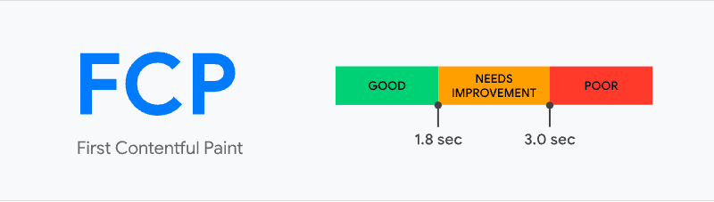


| FCP 时间（以秒为单位） | 颜色编码     | FCP分数（HTTP 存档百分位数） |
| ---------------------- | ------------ | ---------------------------- |
| 0-2                    | 绿色（快速） | 75-100                       |
| 2-4                    | 橙色（中等） | 50-74                        |
| 超过4                  | 红色（慢）   | 0-49                         |

### 优化方案
* https://web.dev/fcp/#how-to-improve-fcp

## Largest Contentful Paint (LCP)
LCP（Largest Contentful Paint）最⼤内容绘制，**可视区域中最⼤的内容元素**呈现到屏幕上的时间，⽤以估算⻚⾯的主要内容对⽤户可⻅时间。

LCP 考虑的元素： 

* `` 元素 
* 内嵌在 `<svg>` 元素内的 `<image>` 元素 
* `<video>` 元素（封⾯图） 
* 通过 `url()` 函数（而非使用**CSS 渐变**）加载的滴啊有背景图像的元素 
* 包含⽂本节点或其他内联级⽂本元素⼦级的**块级**元素 

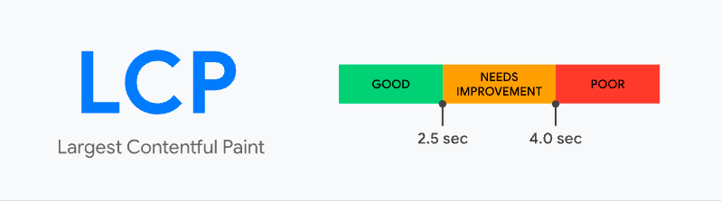

为了提供良好的⽤户体验，⽹站应⼒争使⽤ 2.5 秒或更短的“最⼤内容绘画” 。为确保你达到⼤多数⽤户的这⼀⽬标，衡量移动设备和台式机设备的⻚⾯加载量的第75个百分位数是⼀个很好的衡量标准。

以下示例展示了一些热门网站上出现最大内容绘制的时间点：

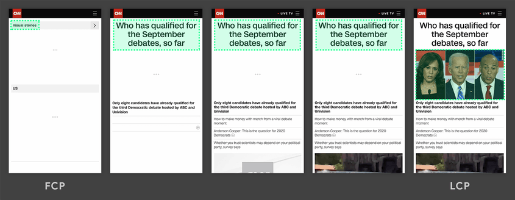
在上方的两个时间轴中，最大元素随内容加载而变化。在第一个示例中，新内容被添加进 DOM，并因此使最大元素发生了改变。在第二个示例中，由于布局的改变，先前的最大内容从可视区域中被移除。

虽然延迟加载的内容通常比页面上已有的内容更大，但实际情况并非一定如此。接下来的两个示例显示了在页面完全加载之前出现的最大内容绘制。


在第一个示例中，Instagram 标志加载得相对较早，即使其他内容随后陆续显示，但标志始终是最大元素。在 Google 搜索结果页面示例中，最大元素是一段文本，这段文本在所有图像或标志完成加载之前就显示了出来。由于所有单个图像都小于这段文字，因此这段文字在整个加载过程中始终是最大元素。

> 在 Instagram 时间轴的第一帧中，您可能注意到了相机标志的周围没有用绿框框出。这是因为该标志是一个 `<svg>` 元素，而 `<svg>` 元素目前不被视为 LCP 候选对象。首个 LCP 候选对象是第二帧中的文本。

### 速度指标


LCP 时间（以秒为单位）|颜色编码
---|---|---
0-2.5 | 绿色（快速） 
2.5-4 | 橙色（中等） 
超过4 | 红色（慢） 

### 优化方案
* https://web.dev/optimize-lcp/


## First Input Delay (FID)
FID（First Input Delay）⾸次输⼊延迟，从⽤户第⼀次与⻚⾯交互（例如单击链接、点击按钮等）到浏览 器实际能够响应该交互的时间。 

输⼊延迟是因为浏览器的主线程正忙于做其他事情，所以不能响应⽤户。发⽣这种情况的⼀个常⻅原因是浏览器正忙于解析和执⾏应⽤程序加载的⼤量计算的 JavaScript。 

第⼀次输⼊延迟通常发⽣在第⼀次内容绘制（FCP）和 Time To Interactive 可持续交互时间（TTI）之间，因为⻚⾯已经呈现了⼀些内容，但还不能可靠地交互。

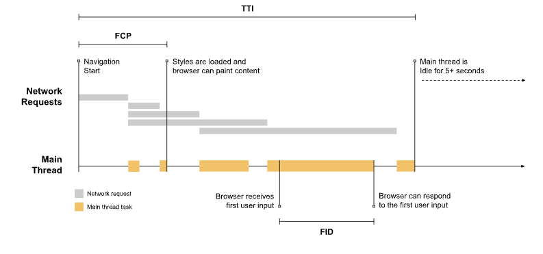

因为输入发生在浏览器正在运行任务的过程中，所以浏览器必须等到任务完成后才能对输入作出响应。浏览器必须等待的这段时间就是这位用户在该页面上体验到的 FID 值。

> 在这个示例中，用户恰好在主线程刚进入最繁忙的时段时与页面进行了交互。如果用户稍微提早一点（在空闲期间）与页面进行交互，那么浏览器就会立即响应。输入延迟上的这种差异强调了在报告指标时查看 FID 值分布的重要性。

如果交互没有事件侦听器怎么办？ 

FID 测量接收到输入事件的时间点与主线程下一次空闲的时间点之间的差值。这就意味着**即使在尚未注册事件侦听器的情况下，** FID 也会得到测量。这是因为许多用户交互的执行并不需要事件侦听器，但一定需要主线程处于空闲期。

例如，在对用户交互进行响应前，以下所有 HTML 元素都需要等待主线程上正在进行的任务完成运行：

* 文本字段、复选框和单选按钮 (`<input> 、 <textarea>`)
* 下拉选择列表（`<select>`）
* 链接 (`<a>`)

### 速度指标
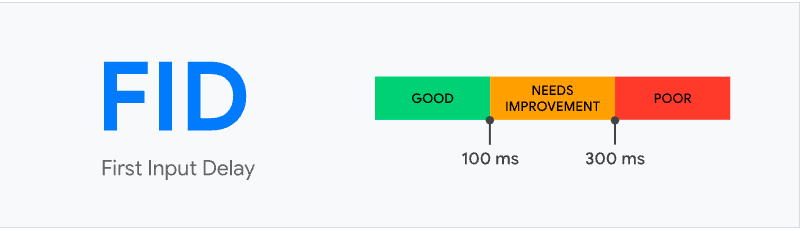

### 优化方案
* https://web.dev/fid/#how-to-improve-fid 
* https://web.dev/optimize-fid/

## Time to Interactive (TTI)
TTI (Time to Interactive) 可交互时间指标，测量页面从开始加载到主要子资源完成渲染，并能够快速、可靠地响应用户输入所需的时间。

表示⽹⻚第⼀次 **完全达到可交互状态** 的时间点，浏览器已经可以持续性的响应⽤户的输⼊。**完全达到可交互状态**的时间点是在最后⼀个⻓任务（Long Task）完成的时间, 并且在随后的 5 秒内⽹络和主线程是空闲的。 从定义上来看，中⽂名称叫**可持续交互时间**或**可流畅交互时间**更合适。

> 长任务是需要 50 毫秒以上才能完成的任务

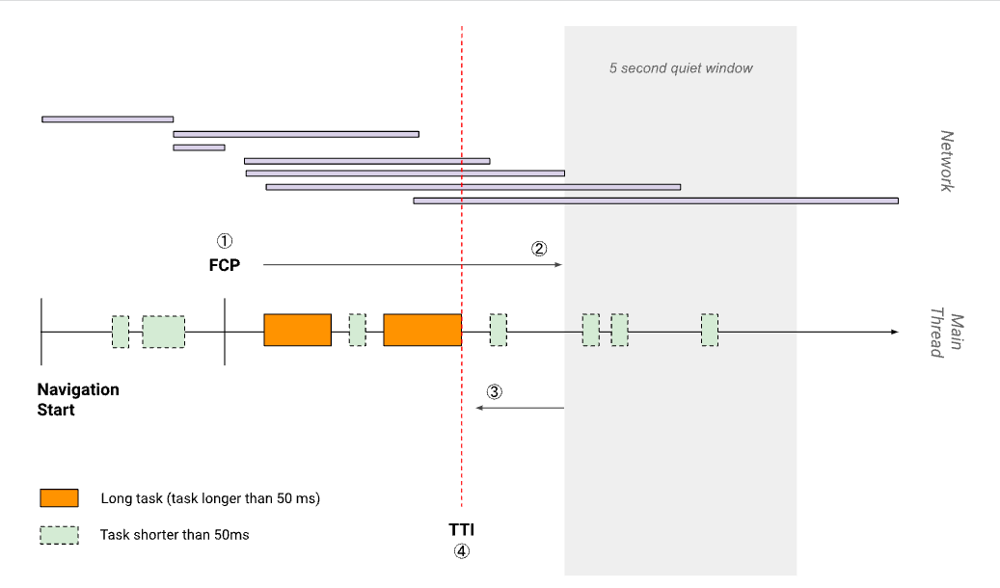

### 速度指标

TTI 指标（以秒为单位）|颜色编码
---|---|---
0-3.8 | 绿色（快速） 
3.9-7.3 | 橙色（中等） 
超过7.3 | 红色（慢）

### 优化方案
* https://web.dev/tti/#how-to-improve-tti

## Total Blocking Time (TBT)
TBT (Total Blocking Time) 总阻塞时间指标，测量 FCP (First Contentful Paint) 首次内容绘制与 TTI (Time to Interactive) 可持续交互时间之间的总时间，这期间，主线程被阻塞的时间过长，无法做出输入响应。

每当出现长任务（在主线程上运行超过 50 毫秒的任务）时，主线程都被视作"阻塞状态"。我们说主线程处于"阻塞状态"是因为浏览器无法中断正在进行的任务。因此，如果用户在某个长任务运行期间与页面进行交互，那么浏览器必须等到任务完成后才能作出响应。

如果任务时长足够长（例如超过 50 毫秒），那么用户很可能会注意到延迟，并认为页面缓慢或卡顿。

某个给定长任务的阻塞时间是该任务持续时间超过 50 毫秒的部分。一个页面的总阻塞时间是在 FCP 和 TTI 之间发生的每个长任务的阻塞时间总和。

例如，请看以下这张页面加载期间浏览器主线程的图表：

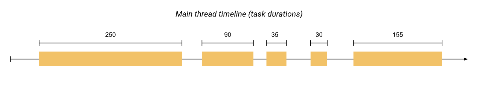

上方的时间轴上有五个任务，其中三个是长任务，因为这些任务的持续时间超过 50 毫秒。下图显示了各个长任务的阻塞时间：


因此，虽然在主线程上运行任务的总时间为 560 毫秒，但其中只有 345 毫秒被视为阻塞时间。

TBT 与 TTI 有什么关系？ 
TBT 是 TTI 的一个出色的配套指标，因为 TBT 有助于量化在页面交互性变为可靠前，不可交互程度的严重性。

TTI 会在主线程至少有五秒钟没有长任务时，认为页面具备"可靠交互性"。也就是说，分布在 10 秒钟里的三个 51 毫秒长的任务与单个 10 秒长的任务对 TTI 的影响是相同的，但对于试图与页面进行交互的用户来说，这两种情况给人的感觉是截然不同的。

在第一种情况下，三个 51 毫秒的任务的 TBT 为3 毫秒。而单个 10 秒长的任务的 TBT 为9950 毫秒。第二种情况下较大的 TBT 值对较差的体验进行了量化。

### 速度指标

TBT 时间（以毫秒为单位）|颜色编码
---|---|---
0-300 | 绿色（快速） 
300-600 | 橙色（中等） 
超过600 | 红色（慢）

### 优化方案
* https://web.dev/tbt/#how-to-improve-tbt

## Cumulative Layout Shift (CLS)
Cumulative[ˈkjuːmjəleɪtɪv] Layout Shift（CLS）累计布局偏移，CLS 测量整个页面生命周期内发生的所有意外布局偏移中最大一连串的布局偏移分数，它测量视觉稳定性的一个以用户为中心的重要指标，因为该项指标有助于量化用户经历意外布局偏移的频率，较低的 CLS 有助于确保一个页面是令人愉悦的。[ˈkjuːmjəleɪtɪv]

每当一个可见元素的位置从一个已渲染帧变更到下一个已渲染帧时，就发生了布局偏移 。

一连串的布局偏移，也叫会话窗口，是指一个或多个快速连续发生的单次布局偏移，每次偏移相隔的时间少于 1 秒，且整个窗口的最大持续时长为 5 秒。

最大的一连串是指窗口内所有布局偏移累计分数最大的会话窗口。

你是否曾经历过在网上阅读一篇文章，结果页面上的某些内容突然发生改变？文本在毫无预警的情况下移位，导致你找不到先前阅读的位置。或者更糟糕的情况：你正要点击一个链接或一个按钮，但在手指落下的瞬间，该链接移位了，结果你点到了别的东西！

举一个 CLS 实际影响用户体验的例子：如下图所示，用户想点取消按钮，结果页面突然发生了布局变化，确认按钮出现在了之前取消的位置…

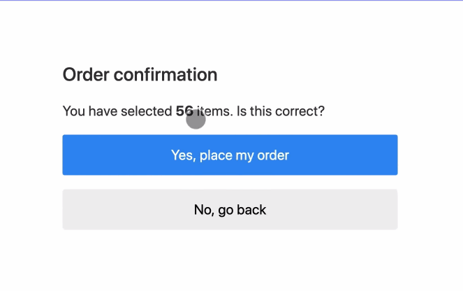

大多数情况下，这些体验只是令人恼火，但在某些情况下，却可能带来真正的破坏。

页面内容的意外移动通常是由于异步加载资源，或者动态添加 DOM 元素到页面现有内容的上方。罪魁祸首可能是未知尺寸的图像或视频、实际渲染后比后备字体更大或更小的字体，或者是动态调整自身大小的第三方广告或小组件。

### 速度指标

CLS 时间（以毫秒为单位）|颜色编码
---|---|---
0-0.1 | 绿色（快速） 
0.1-0.25 | 橙色（中等） 
超过0.25 | 红色（慢）

### 优化方案
* https://web.dev/cls/#how-to-improve-cls 
* https://web.dev/optimize-cls/

## Speed Index
Speed Index（速度指数）是⼀个表示⻚⾯可视区域中内容的填充速度的指标，可以通过计算⻚⾯可⻅区域内容显示的平均时间来衡量。

### 测量方式
首先在浏览器中捕获页面加载的视频，然后对每 100 毫秒间隔的页面截图计算页面填充的百分比，可以得到这样一个曲线（纵轴是页面可视区域内容填充完成度，横轴是时间）。

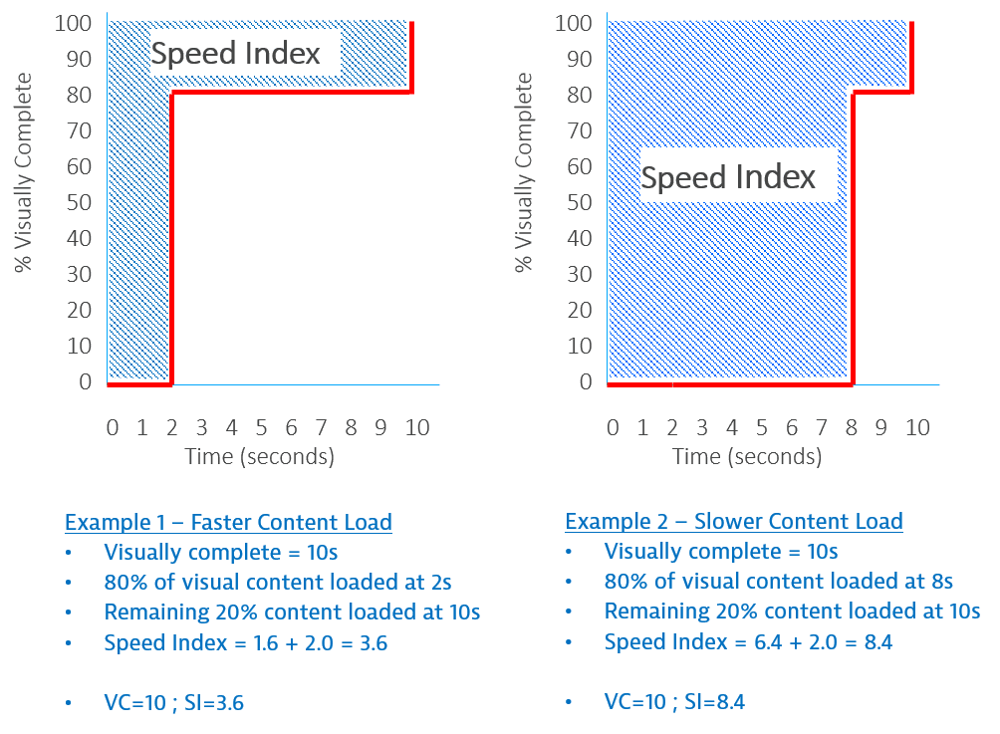

图中的 Example 1 和 Example 2 都是在 10s 时页面填充完成，但 Example 1 在 2s 是就已经填充了 80% 的内容，而 Example 2 在 8s 时才填充 80%。

图中阴影部分的面积（即时间-内容填充百分比曲线以上部分）的大小即可表示可视区域内页面内容的填充速度，面积越小，填充速度越快。

如果用时间来衡量，可以这样计算，以此来表示页面可见区域内容显示的平均时间。

```
Example 1：Speed Index = (80% * 2) + （20% * 10）= 3.6
Example 2：Speed Index = (80% * 8) + （20% * 10）= 8.4
```

### 速度指标

| 速度指数（以秒为单位） | 颜色编码     | 速度指数得分 |
| ---------------------- | ------------ | ------------ |
| 0-4.3                  | 绿色（快速） | 75-100       |
| 4.4-5.8                | 橙色（中等） | 50-74        |
| 超过5.8                | 红色（慢）   | 0-49         |

### 优化方案
* https://web.dev/speed-index/#how-to-improve-your-speed-index-score

## Web Vitals

Google 开发了很多实用指标和工具，帮助衡量用户体验和质量，从而发掘优化点。 Web Vitals 计划降低了学习成本，为网站体验提供了一组统一的质量衡量指标 - Core Web Vitals，其中包括加载体验、交互性和页面内容的视觉稳定性。

有很多方法可以优化网站的用户体验。如果可以预先了解最佳的优化衡量方案，可以大大节省时间和成本。

Google 在 2020 年 5 月 5 日提出新的用户体验量化方式 Web Vitals 来衡量网站的用户体验，并将这些衡量结果用作排名算法的一部分。

### Core Web Vitals 与 Web Vitals

Core Web Vitals 是应用于所有 Web 页面的 Web Vitals 的子集，是其最重要的核心。

- 加载性能（LCP）- 显示最大内容元素所需时间
- 交互性（FID）- 首次输入延迟时间
- 视觉稳定性（CLS）- 累积布局配置偏移

### 测试 Web Vitals

性能测试工具，比如 Lighthouse

实用 web-vitals 库

实用浏览器插件 Web Vitals

### 参考链接

https://web.dev/vitals

## 性能测试

### Lighthouse 工具

1. 在 `Chrome DevTools`中使用
2. 使用`Chrome`扩展
3. 使用 `Node CLI`命令行。
4. 使用`Node`包
5. ...

[指标与分数的比例](https://googlechrome.github.io/lighthouse/scorecalc/)

### WebPageTest 工具

更强大的在线测试工具，[在线网址](https://www.webpagetest.org/)

### Chrome DevTools 测试工具


从 “从浏览器输入URL到页面渲染” 这个经典面试题从前端发关注点切入，整个过程可以分为以下阶段：

1）浏览器接收到 URL，到网络请求线程的开启。

2）一个完整的 HTTP 请求并的发出。

3）服务器接收到请求并转到具体的处理后台。

4）前后台之间的 HTTP 交互和涉及的缓存机制。

5）浏览器接收到数据包后的关键渲染路径。

6）JS 引擎的解析过程。

## 网络请求线程开启

### 进程与线程

进程和线程的区别：

1. 只要某个线程执行出错，整个进程崩溃。
2. 进程之间相互隔离，保证其运行稳定性。同时提供 [IPC机制](https://en.wikipedia.org/wiki/Inter-process_communication) 进行进程间通讯。
3. 进程所占用资源会在进程结束后由操作系统回收。即使某个进程下的线程产生了内存泄漏，也会随之结束而被回收。
4. 线程之间可以共享 **所属进程** 的资源。

### 单进程浏览器

单进程浏览器架构图：

[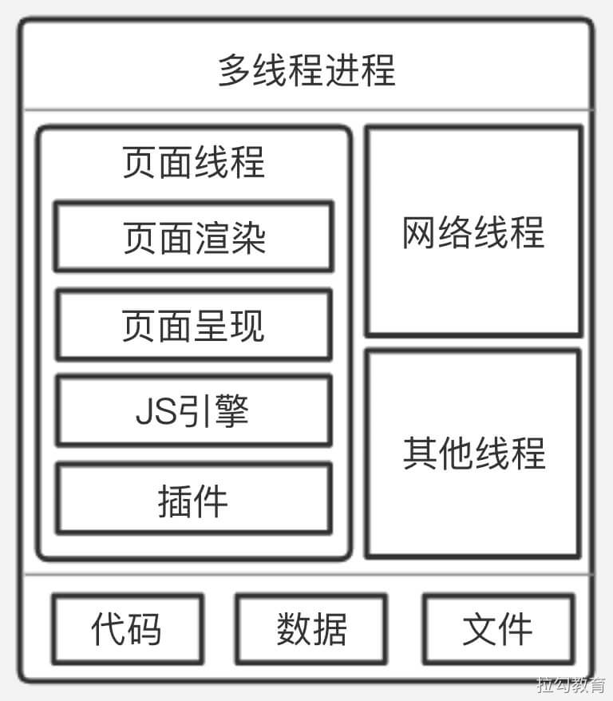](https://github.com/YuLinXi/Typora-sync/blob/85b4e1bd39f8d89d9622123da53ca102b8c2ef21/前端/课程笔记/拉钩-大前端训练营/Part 7 商业技术解决方案/assets/2.jpg)

单进程存在的隐患：

1）流畅性较差

2）安全性较差

3）稳定性较差

### 多进程浏览器

Chrome2008年推出多进程浏览器

多进程浏览器架构图：

[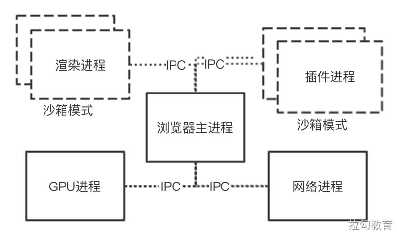](https://github.com/YuLinXi/Typora-sync/blob/85b4e1bd39f8d89d9622123da53ca102b8c2ef21/前端/课程笔记/拉钩-大前端训练营/Part 7 商业技术解决方案/assets/3.jpg)

多浏览器进程：

1. 浏览器主进程：一个浏览器只有一个主进程。负责如菜单栏、文件访问、前进后退等以及子进程管理等。

2. GPU进程：用于负责实现3D CSS绘制效果。并将GPU加速应用到Video、Canvas等标签渲染上。

3. 插件进程：主进程为每个使用的浏览器插件开辟新的进程，其以沙箱形式运行插件。

4. 网络进程：负责页面的网络资源加载，之前属于浏览器主进程的一个模块，最近才独立出来。

5. 渲染进程：也称为浏览器 **内核** ，其默认会为 **每个标签窗口页开辟一个独立的进程**，负责将HTML、CSS、和JavaScript等资源转为可交互的页面。其包含多个子线程：

   1. JS引擎线程
   2. GUI渲染线程
   3. 事件触发线程
   4. 定时触发器线程
   5. 异步HTTP请求线程
   6. ...

   渲染进程也被放入沙箱中

## 建立 HTTP

### DNS 解析

域名解析流程图：

[](https://github.com/YuLinXi/Typora-sync/blob/85b4e1bd39f8d89d9622123da53ca102b8c2ef21/前端/课程笔记/拉钩-大前端训练营/Part 7 商业技术解决方案/assets/4.jpg)

### 网络模型

通过DNS解析获取到目标服务器IP后，就可以建立网络连接了。

网络通信架构图：

[](https://github.com/YuLinXi/Typora-sync/blob/85b4e1bd39f8d89d9622123da53ca102b8c2ef21/前端/课程笔记/拉钩-大前端训练营/Part 7 商业技术解决方案/assets/5.jpg)

### TPC 连接

通过传输层建立端到端的连接，因此常见有TCP和UDP协议

建立连接3次握手图：

[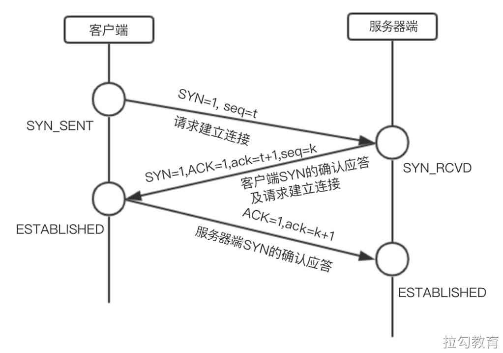](https://github.com/YuLinXi/Typora-sync/blob/85b4e1bd39f8d89d9622123da53ca102b8c2ef21/前端/课程笔记/拉钩-大前端训练营/Part 7 商业技术解决方案/assets/7.jpg)

断开连接4次挥手图：

[](https://github.com/YuLinXi/Typora-sync/blob/85b4e1bd39f8d89d9622123da53ca102b8c2ef21/前端/课程笔记/拉钩-大前端训练营/Part 7 商业技术解决方案/assets/6.jpg)

#### QA：为什么三次握手建立的TCP客户端最后还要发送一次确认呢？

> 主要防止已经失效的连接请求报文突然又传送到了服务器，从而产生错误。

> 如果使用的是两次握手建立连接，假设有这样一种场景，客户端发送了第一个请求连接并且没有丢失，只是因为在网络节点中滞留的时间太长了，由于 TCP 的客户端迟迟没有收到确认报文，以为服务器没有收到，此时重新向服务器发送这条报文，此后客户端和服务器经过两次握手完成连接，传输数据，然后关闭连接。此时此前滞留的那一次请求连接，网络通畅了到达了服务器，这个报文本该是失效的，但是，两次握手的机制将会让客户端和服务器再次建立连接，这将导致不必要的错误和资源的浪费。

> 如果采用的是三次握手，就算是那一次失效的报文传送过来了，服务端接受到了那条失效报文并且回复了确认报文，但是客户端不会再次发出确认。由于服务器收不到确认，就知道客户端并没有请求连接。

#### QA：为什么建立连接是三次握手，关闭连接确是四次挥手呢？

> 建立连接的时候， 服务器在LISTEN状态下，收到建立连接请求的SYN报文后，把ACK和SYN放在一个报文里发送给客户端。
>
> 而关闭连接时，服务器收到对方的FIN报文时，仅仅表示对方不再发送数据了但是还能接收数据，而自己也未必全部数据都发送给对方了，所以己方可以立即关闭，也可以发送一些数据给对方后，再发送FIN报文给对方来表示同意现在关闭连接，因此，己方ACK和FIN一般都会分开发送，从而导致多了一次。

#### QA：如果已经建立了连接，但是客户端突然出现故障了怎么办？

> TCP 还设有一个保活计时器，显然，客户端如果出现故障，服务器不能一直等下去，白白浪费资源。服务器每收到一次客户端的请求后都会重新复位这个计时器，时间通常是设置为2小时，若两小时还没有收到客户端的任何数据，服务器就会发送一个探测报文段，以后每隔75秒发送一次。若一连发送10个探测报文仍然没反应，服务器就认为客户端出了故障，接着就关闭连接。

## 前后端交互

### 反向代理服务器

通常大型网站单一服务器资源难以满足期望。一般采用的方式将多个应用服务器组成的集群由反向代理服务器提供给客户端使用。

反向代理服务器的作用如图：

[](https://github.com/YuLinXi/Typora-sync/blob/85b4e1bd39f8d89d9622123da53ca102b8c2ef21/前端/课程笔记/拉钩-大前端训练营/Part 7 商业技术解决方案/assets/8.jpg)

反向代理服务器作用：

1. 负载均衡
2. 安全防火墙
3. 加密及SSL加速
4. 数据压缩
5. 解决跨域
6. 对静态资源缓存

### 后端处理流程

后端通过请求与资源进行业务逻辑的处理后返回。

### HTTP相关协议特性

HTTP是建立在传输层TCP协议之上的应用层协议

长连接：客服务与服务端建立TCP连接后，可以连续发送多个数据包，但需要双方发送心跳检查包来维持连接。

短连接：发送并受到响应后则断开连接。

> 在HTTP1.0时，默认使用短连接。

> 在 HTTP 1.1 时，默认使用长连接，在此情况下，当一个网页的打开操作完成时，其中所建立用于传输 HTTP 的 TCP 连接并不会断开关闭，客户端后续的请求操作便会继续使用这个已经建立的连接。
>
> 如果我们对浏览器的开发者工具留心，在查看请求头时会发现一行 Connection: keep-alive 。
>
> 长连接并非永久保持，它有一个持续时间，可在服务器中进行配置。

> 而在 HTTP 2.0 到来之前，每一个资源的请求都需要开启一个 TCP 连接，由于 TCP 本身有并发数的限制，这样的结果就是，当请求的资源变多时，速度性能就会明显下降。为此，经常会采用的优化策略包括，将静态资源的请求进行多域名拆分，对于小图标或图片使用雪碧图等。

> 在 HTTP 2.0 之后，便可以在一个 TCP 连接上请求多个资源，分割成更小的帧请求，其速度性能便会明显上升，所以之前针对 HTTP 1.1 限制的优化方案也就不再需要了。

#### HTTP2.0新特性

1. 多路复用：一个连接可请求多个资源。
2. 二进制分帧：在应用层和传输层之间，新加入了一个二进制分帧层，以实现低延迟和高吞吐量。
3. 服务器端推送：以往是一个请求带来一个响应，现在服务器可以向客户端的一个请求发出多个响应，这样便可以实现服务器端主动向客户端推送的功能。
4. 设置请求优先级：服务器会根据请求所设置的优先级，来决定需要多少资源处理该请求。
5. HTTP头部压缩：减少报文传输体积。

### 浏览器缓存

缓存策略：强缓存 和 协商缓存。

浏览器使用策略优先级：强缓存 > 协商缓存。如果有强缓存则直接使用，若不生效再进行协商缓存。

协商缓存触发逻辑图：

[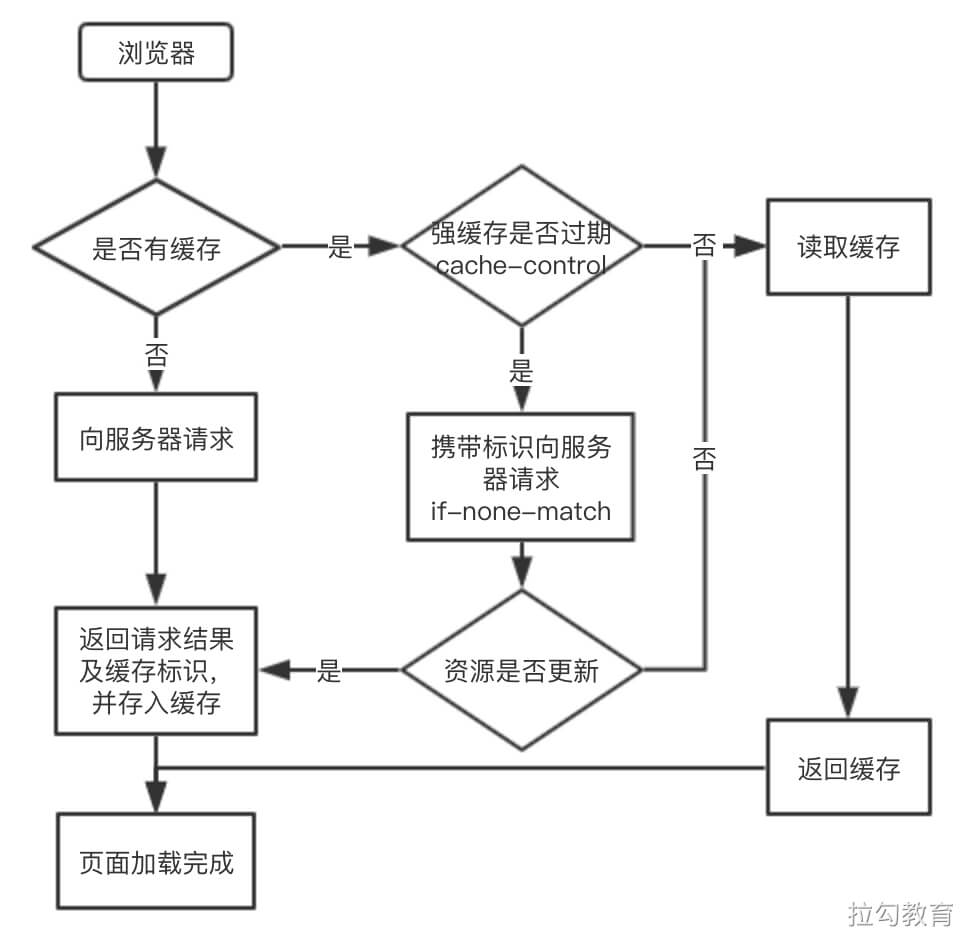](https://github.com/YuLinXi/Typora-sync/blob/85b4e1bd39f8d89d9622123da53ca102b8c2ef21/前端/课程笔记/拉钩-大前端训练营/Part 7 商业技术解决方案/assets/9.jpg)

## 关键渲染路径（CRP）

### 构建对象模型

首先浏览器会通过解析 HTML 和 CSS 文件，来构建 **DOM（文档对象模型）** 和 **CSSOM（层叠样式表对象模型）** 。

> 浏览器接收读取到的 HTML 文件，其实是文件根据指定编码（UTF-8）的原始字节，形如 3C 62 6F 79 3E 65 6C 6F 2C 20 73 70…。首先需要将字节转换成字符，即原本的代码字符串，接着再将字符串转化为 W3C 标准规定的令牌结构，所谓令牌就是 HTML 中不同标签代表不同含义的一组规则结构。然后经过词法分析将令牌转化成定义了属性和规则值的对象，最后将这些标签节点根据 HTML 表示的父子关系，连接成树形结构，如下图所示。


### 构建CSSOM

CSSOM负责各元素经过渲染后的外观呈现。其与`HTML`文件解析的过程类似。

最后构建好的CSSOM树如图：

[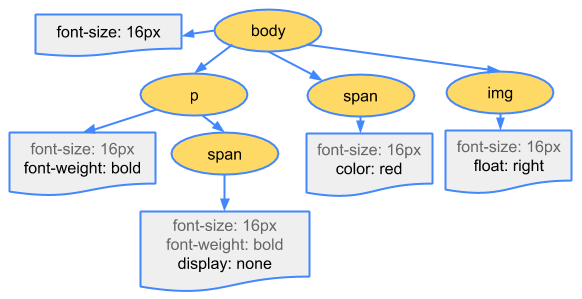](https://github.com/YuLinXi/Typora-sync/blob/85b4e1bd39f8d89d9622123da53ca102b8c2ef21/前端/课程笔记/拉钩-大前端训练营/Part 7 商业技术解决方案/assets/11.png)

### 渲染绘制

当完成DOM和CSSOM构建后，所得到的是描述最终渲染页面的两个对象。

接下来就是将这两个对象模型合并成渲染树，渲染树中只包含 **可见的节点**，该合并而成的渲染树对象如下：


#### 渲染绘制的步骤

1. 从所生成 DOM 树的根节点开始向下遍历每个子节点，忽略所有不可见的节点（脚本标记不可见、CSS 隐藏不可见），因为不可见的节点不会出现在渲染树中。
2. 在 CSSOM 中为每个可见的子节点找到对应的规则并应用。
3. 布局阶段，根据所得到的渲染树，计算它们在设备视图中的具体位置和大小，这一步输出的是一个“盒模型”。
4. 绘制阶段，将每个节点的具体绘制方式转化为屏幕上的实际像素。