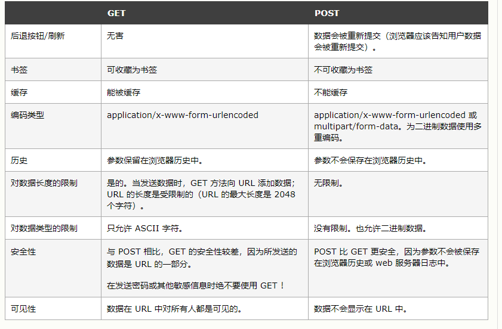
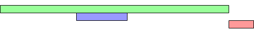
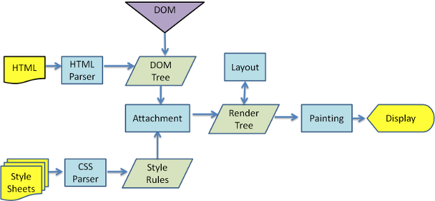
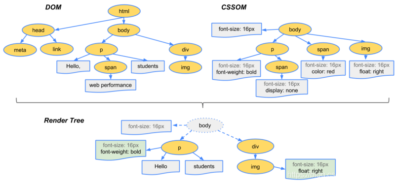
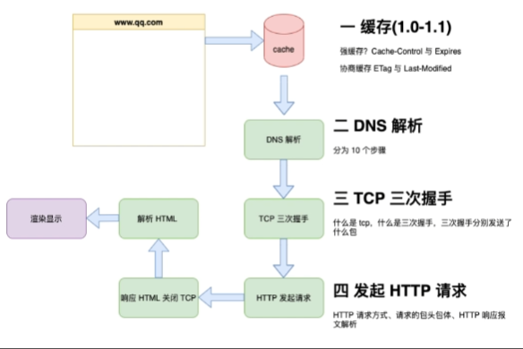

## ES6使用require引入图片

静态路径引入

```js
var imgUrl = require('../images/001.png');
```

不能使用动态路径引入图片，会报错

```js
var ImgSrc = "../images/001.png";
var img = require(ImgSrc)
```

因为require是打包工具所需要的标识，你写成运行时通过变量定义，是无法获取到，没办法打包。

require()写入的必须是path

```js
 1. var imgSrc = "001.png";
require("../../asset/images/" + imgSrc);
 2. var imgName = "001";
require(`../../asset/images/${imgName}.png`);
```

## forin的循环顺序

不一定根据定义时的顺数输出，所有浏览器的最新版本现在都按chrome执行，先把当中的非负整数键提出来，排序好输出，然后将剩下的定义时的顺序输出。

## forin和forof

`for...in`循环用于遍历对象的可枚举属性键名。会遍历对象继承的属性

`for...of`循环用于遍历可迭代对象的值，而不是键名。

## tabIndex

**tabindex**指示其元素是否可以聚焦，以及它是否/在何处参与顺序键盘导航（通常使用Tab键，因此得名）。

它接受一个整数作为值，具有不同的结果，具体取决于整数的值：

- tabindex=负值 (通常是tabindex=“-1”)，表示元素是可聚焦的，但是不能通过键盘导航来访问到该元素，用JS做页面小组件内部键盘导航的时候非常有用。
- `tabindex="0"` ，表示元素是可聚焦的，并且可以通过键盘导航来聚焦到该元素，它的相对顺序是当前处于的DOM结构来决定的。
- tabindex=正值，表示元素是可聚焦的，并且可以通过键盘导航来访问到该元素；它的相对顺序按照**tabindex** 的数值递增而滞后获焦。如果多个元素拥有相同的 **tabindex**，它们的相对顺序按照他们在当前DOM中的先后顺序决定。


## 事件循环

浏览器是多线程的，但是JS是异步单线程

1. **GUI渲染线程（DOM/BOM）**
2. **JS引擎线程（web worker）**
3. **浏览器事件线程（onclick）**
4. 定时器触发线程
5. http异步线程
6. EventLoop（事件循环）处理线程

```html
<body>
  <button id="button">button</button>
  <script>
    const button=document.getElementById("button");
    button.addEventListener("click",()=>{
      Promise.resolve().then(()=>{console.log('m1');})
      console.log('l1');
    })
    button.addEventListener("click",()=>{
      Promise.resolve().then(()=>{console.log('m2');})
      console.log('l2');
    })
  </script>
</body>
// 两个click都是宏任务,不关联
// l1
// m1
// l2
// m2
```

```html
<body>
  <button id="button">button</button>
  <script>
    const button=document.getElementById("button");
    button.addEventListener("click",()=>{
      Promise.resolve().then(()=>{console.log('m1');})
      console.log('l1');
    })
    button.addEventListener("click",()=>{
      Promise.resolve().then(()=>{console.log('m2');})
      console.log('l2');
    })
    button.click()
  </script>
</body>
// 模拟浏览器点击 执行整个宏任务13行开始执行,触发4 9两个click(同步),click执行完后13行结束,进微任务
// l1
// l2
// m1
// m2
```


## axios参数格式化 get请求传递数组

axios发起get请求需要传递params参数作为URL参数。

如果params中包含数组，则Request URL表现形式形为`https://xxxx/get?arr[]=1&arr[]=2`。

如果想要其格式为`https://xxxx/get?arr=1&arr=2`，则需要手动做序列化，axios有专门的配置项用作params序列化

```js
// `paramsSerializer` 是一个负责 `params` 序列化的函数
// (e.g. https://www.npmjs.com/package/qs, http://api.jquery.com/jquery.param/)
paramsSerializer: function(params) {
	return Qs.stringify(params, {arrayFormat: 'repeat'})
},
```

qs序列化参数

```js
qs.stringify({ids: [1, 2, 3]}, { indices: false })
//  ids=1&ids=2&ids=3

qs.stringify({ids: [1, 2, 3]}, { indices: true })
//  ids[0]=1&ids[1]=2&id[2]=3

qs.stringify({ids: [1, 2, 3]}, {arrayFormat: ‘repeat‘})
// ids=1&ids=2&ids=3

qs.stringify({ids: [1, 2, 3]}, {arrayFormat: ‘brackets‘})
 // ids[]=1&ids[]=2&ids[]=3

qs.stringify({ids: [1, 2, 3]}, {arrayFormat: ‘indices‘})
// ids[0]=1&ids[1]=2&ids[2]=3

qs.stringify({ids: [1, 2, 3]}, {arrayFormat: ‘comma‘})
// ids[0]=1&ids[1]=2&ids[2]=3
```


## pointer-events和cursor

如果使用`pointer-evnets:none;`则该元素及其后代元素的`cursor`配置不生效，其鼠标样式为默认样式。但是如果该元素的后代元素的`pointer-events`为其他值时，则鼠标事件可以指向该后代元素。


## 强调内容的标签

`q标签`，将文本内容用`""`包含起来

`blockquote标签`表示其中文字为引用，渲染时会有一定缩进

`mark标签`突出高亮显示文字，渲染效果同常用浏览器的`crtl + F `。除此外，语法高亮通常使用`strong标签`配合css语法来实现定制化。


## 弹性布局末行对齐的应对方法（宫格）

[让CSS flex布局最后一行列表左对齐的N种方法 « 张鑫旭-鑫空间-鑫生活 (zhangxinxu.com)](https://www.zhangxinxu.com/wordpress/2019/08/css-flex-last-align/)

[伪类匹配列表数目实现微信群头像CSS布局的技巧 « 张鑫旭-鑫空间-鑫生活 (zhangxinxu.com)](https://www.zhangxinxu.com/wordpress/2019/03/nth-last-child-css-layout/)

## Referer

**`Referer`** 请求头包含了当前请求页面的来源页面的地址，即表示当前页面是通过此来源页面里的链接进入的。服务端一般使用 `Referer` 请求头识别访问来源，可能会以此进行统计分析、日志记录以及缓存优化等。

在以下两种情况下，`Referer` 不会被发送：

- 来源页面采用的协议为表示本地文件的 "file" 或者 "data" URI；
- 当前请求页面采用的是非安全协议，而来源页面采用的是安全协议（HTTPS）。

作用：

1. 防盗链
2. 防止恶意请求

[http请求头中Referer的含义和作用_小刘学安卓的博客-CSDN博客_请求头中的referer](https://blog.csdn.net/liuqinhou/article/details/126224164)

[Window.open() - Web API 接口参考 | MDN (mozilla.org)](https://developer.mozilla.org/zh-CN/docs/Web/API/Window/open)

[Referrer Policy 介绍 | JerryQu 的小站 (imququ.com)](https://imququ.com/post/referrer-policy.html)

[Referrer Policy 介绍「续」 | JerryQu 的小站 (imququ.com)](https://imququ.com/post/referrer-policy-2.html)

[referrer策略和meta标签的问题_thlzjfefe的博客-CSDN博客_referrer 策略](https://blog.csdn.net/thlzjfefe/article/details/123538564)

## window.open

在https协议下，window.open打开http链接在浏览器上失败，部分设备未复现，可能和浏览器版本或浏览器本地安全策略有关。

[window.open 前端下载文件，被拦截 或者显示无法安全下载问题_Qlily_ing的博客-CSDN博客](https://blog.csdn.net/Qlily_ing/article/details/109054974)

https://blog.csdn.net/qq_41784169/article/details/117423654

https://blog.csdn.net/fjh1997/article/details/113624138

[https下使用window.open()或a标签下载文件失败的问题 - 简书 (jianshu.com)](https://www.jianshu.com/p/3a74ac9088b9)


## a标签下载文件

a标签的download属性指示浏览器下载 URL 而不是导航到它，同源URLs才会生效，如果href的值是非同源url则还是跳转。

非同源URLs和某些文件比如`.png .excel`等受制于浏览器可能会直接打开预览而不是下载，可以考虑在href属性值末尾添加`?response-content-type=application/octet-stream`

https://developer.mozilla.org/zh-CN/docs/Web/HTML/Element/a

https://blog.csdn.net/love_aya/article/details/115211470

https://blog.csdn.net/m0_63947499/article/details/127739586

## 图片懒加载

原理：图片是通过`img`的`src属性`，当对src赋值时，浏览器会请求图片资源

当img元素的offsetTop<document.body.scrollTop+document.documentElement.offsetHeight

即img进入视口的条件成立

基于这个问题，可以利用标签的自定义属性（data-xxx），来保存图片的路径，当需要加载图片时（将要进入视口时），将data-xxx赋值给src就可以实现按需加载

## img标签lazyload

懒加载已经是一种 Web 标准，大部分的主流浏览器都支持通过 `loading="lazy"` 属性使用懒加载。

```html

```

参考链接：

https://developer.mozilla.org/zh-CN/docs/Web/HTML/Element/img

https://mp.weixin.qq.com/s/4Oo4FtNO-mviTiS_dPT1Uw

## 盒子模型

盒模型`Box Model`指在网页设计中用于描述和布局 HTML元素的一种模型

完整的 CSS 盒模型应用于块级盒子，内联盒子只使用盒模型中定义的部分内容。

模型定义了盒的每个部分 —— margin, border, padding, and content —— 合在一起就可以创建我们在页面上看到的内容。

标准盒子模型

```css
box-sizing:content-box;
```

width 与 height 只包括内容的宽和高，不包括边框（border），内边距（padding），外边距（margin）

怪异盒子模型

```css
box-sizing:border-box;
```

width 和 height 属性包括内容，内边距和边框，但不包括外边距。

### 为什么margin:0 auto不能用于inline-block元素

[为什么margin:0 auto不能用于inline-block元素 - 小丸子的城堡 - 博客园 (cnblogs.com)](https://www.cnblogs.com/youhong/p/11135242.html)

## 行内元素 块级元素 行内块元素

行内元素：

+ 设置宽高无效，根据内容撑开
+ 垂直margin无效，水平margin有效
+ 内边距无效
+ 可以和其他行内元素、块级元素共用一行

块级元素：

+ 设置宽高有效，宽度默认为父级宽度100%
+ 高度默认根据内容撑开，**没有内容则默认没有高度**
+ margin有效
+ 独占一行

行内块元素：

img、input、textarea、button

+ 设置宽高有效，自带默认宽高
+ margin有效
+ 共用一行

## ajax步骤

```js
var request = new XMLHttpRequest()  // 创建异步对象

request.onreadystatechange = function () { // 注册事件
  if (request.readyState == 4) {
    if (request.status == 200) {
      console.log('响应成功')
      console.log(request.responseText)
    } else {
      console.log('响应失败')
    }
  }
}

request.open('GET', 'http://localhost:3000') // 设置请求的参数

// post请求 设置头信息
// request.setRequestHeader("Content-Type", "application/x-www-form-urlencoded")

request.send() // 发送请求

// post请求 设置请求主体
// request.send(body)
// request.send("name=v1&upwd=v2")

```

## axios取消请求

```js
let cancel = null
div.onclick = function () {
  if (cancel !== null) {
    cancel()
  }
  axios({
    method: 'GET',
    url: 'http://localhost:3000/get',
    cancelToken: new axios.CancelToken(function (c) {
      cance = c
    })
  }).then(res => {
    console.log(res)
    cancel = null
  })
}
```


## CSS3新特性

grid flex

圆角

媒体查询

子代选择器

过渡transition

动画animation

转换transform

阴影

渐变

## HTML5新特性

### 一、语义标签

| 标签      | 描述                               |
| --------- | ---------------------------------- |
| <header>  | 定义了文档的头部区域               |
| <footer>  | 定义了文档的尾部区域               |
| <nav>     | 定义文档的导航                     |
| <section> | 定义文档中的节                     |
| <article> | 定义文章                           |
| <aside>   | 定义页面以外的内容                 |
| <details> | 定义用户可以看到或者隐藏的额外细节 |
| <summary> | 标签包含details元素的标题          |
| <dialog>  | 定义对话框                         |
| <figure>  | 定义自包含内容，如图表             |
| <main>    | 定义文档主内容                     |
| <mark>    | 定义文档的主内容                   |
| <time>    | 定义日期/时间                      |

### 二、增强型表单

html5修改一些新的input输入特性，改善更好的输入控制和验证

| 输入类型       | 描述                     |
| -------------- | ------------------------ |
| color          | 主要用于选取颜色         |
| date           | 选取日期                 |
| datetime       | 选取日期(UTC时间)        |
| datetime-local | 选取日期（无时区）       |
| month          | 选择一个月份             |
| week           | 选择周和年               |
| time           | 选择一个时间             |
| email          | 包含e-mail地址的输入域   |
| number         | 数值的输入域             |
| url            | url地址的输入域          |
| tel            | 定义输入电话号码和字段   |
| search         | 用于搜索域               |
| range          | 一个范围内数字值的输入域 |

html5新增了五个表单元素

| <datalist> | 用户会在他们输入数据时看到域定义选项的下拉列表 |
| ---------- | ---------------------------------------------- |
| <progress> | 进度条，展示连接/下载进度                      |
| <meter>    | 刻度值，用于某些计量，例如温度、重量等         |
| <keygen>   | 提供一种验证用户的可靠方法生成一个公钥和私钥   |
| <output>   | 用于不同类型的输出比如尖酸或脚本输出           |

html5新增表单属性

| 属性         | 描述                                  |
| ------------ | ------------------------------------- |
| placehoder   | 输入框默认提示文字                    |
| required     | 要求输入的内容是否可为空              |
| pattern      | 描述一个正则表达式验证输入的值        |
| min/max      | 设置元素最小/最大值                   |
| step         | 为输入域规定合法的数字间隔            |
| height/width | 用于image类型<input>标签图像高度/宽度 |
| autofocus    | 规定在页面加载时，域自动获得焦点      |
| multiple     | 规定<input>元素中可选择多个值         |

### 三、视频和音频

html5提供了音频和视频文件的标准，既使用<audio>元素。

音频：<audio src=" "></audio>

```html
<audio controls>    //controls属性提供添加播放、暂停和音量控件。
  <source src="horse.ogg" type="audio/ogg">
  <source src="horse.mp3" type="audio/mpeg">
您的浏览器不支持 audio 元素。        //浏览器不支持时显示文字
</audio>
```

视频：<video src=" "></video>

```html
<video width="320" height="240" controls>
  <source src="movie.mp4" type="video/mp4">
  <source src="movie.ogg" type="video/ogg">
您的浏览器不支持Video标签。
</video>
```

### 四、Canvas绘图

### 五、SVG绘图

### 六、地理定位

使用`getCurrentPosition()`方法来获取用户的位置。以实现“LBS服务”

```html
<script>
var x=document.getElementById("demo");
function getLocation()
  {
  if (navigator.geolocation)
    {
    navigator.geolocation.getCurrentPosition(showPosition);
    }
  else{x.innerHTML="Geolocation is not supported by this browser.";}
  }
function showPosition(position)
  {
  x.innerHTML="Latitude: " + position.coords.latitude +
  "<br />Longitude: " + position.coords.longitude;
  }
</script>
```

### 七、拖放API

拖放是一种常见的特性，即捉取对象以后拖到另一个位置。

在html5中，拖放是标准的一部分，任何元素都能够拖放。

```html
<div draggable="true"></div>
```

当元素拖动时，我们可以检查其拖动的数据。

```html
<div draggable="true" ondragstart="drag(event)"></div>
<script>
function drap(ev){
    console.log(ev);
}
</script>
```

| 拖动生命周期 | 属性名      | 描述                                           |
| ------------ | ----------- | ---------------------------------------------- |
| 拖动开始     | ondragstart | 在拖动操作开始时执行脚本                       |
| 拖动过程中   | ondrag      | 只要脚本在被拖动就运行脚本                     |
| 拖动过程中   | ondragenter | 当元素被拖动到一个合法的防止目标时，执行脚本   |
| 拖动过程中   | ondragover  | 只要元素正在合法的防止目标上拖动时，就执行脚本 |
| 拖动过程中   | ondragleave | 当元素离开合法的防止目标时                     |
| 拖动结束     | ondrop      | 将被拖动元素放在目标元素内时运行脚本           |
| 拖动结束     | ondragend   | 在拖动操作结束时运行脚本                       |


### 八、WebWorker

### 九、WebStorage

### 十、WebSocket


## GET POST请求方式的区别

GET:是从服务器上获取数据，post 是向服务器传送数据



## 单页面应用和多页面应用

|                   | 单页面应用（SinglePage Web Application，SPA）                | 多页面应用（MultiPage Application，MPA）     |
| :---------------- | :----------------------------------------------------------- | -------------------------------------------- |
| 组成              | 一个外壳页面和多个页面片段组成                               | 多个完整页面构成                             |
| 资源共用(css,js)  | 共用，只需在外壳部分加载                                     | 不共用，每个页面都需要加载                   |
| 刷新方式          | 页面局部刷新或更改                                           | 整页刷新                                     |
| url 模式          | a.com/#/pageone  a.com/#/pagetwo                             | a.com/pageone.html   a.com/pagetwo.html      |
| 用户体验          | 页面片段间的切换快，用户体验良好                             | 页面切换加载缓慢，流畅度不够，用户体验比较差 |
| 首屏              | 慢                                                           | 快                                           |
| 转场动画          | 容易实现                                                     | 无法实现                                     |
| 数据传递          | 容易                                                         | 依赖 url传参、或者cookie 、localStorage等    |
| 搜索引擎优化(SEO) | 需要单独方案、实现较为困难、不利于SEO检索 可利用服务器端渲染(SSR)优化 | 实现方法简易                                 |
| 试用范围          | 高要求的体验度、追求界面流畅的应用                           | 适用于追求高度支持搜索引擎的应用             |
| 开发成本          | 较高，常需借助专业的框架                                     | 较低 ，但页面重复代码多                      |
| 维护成本          | 相对容易                                                     | 相对复杂                                     |
| 服务器压力        | 小                                                           | 大，需要负责异步请求和页面合成               |

## ES5构造函数和ES6 class的对比

1. class不能提升
2. class 只能通过new创建实例
3. class采用严格模式
4. class的原型上的属性不能被for of 等遍历

## 延迟加载JS的方式


`<script>`

首先定义没有任何属性的 `<script>`。当html文件在解析时，遇到到这样的js标签时，会被阻塞，此时，解析将停止，并且将发起一个js文件的网络请求（假设这个个js标签是个外链js文件）。然后在html继续解析之前会执行该js文件。


`<script async>`

**async** 属性会使得html解析和js文件下载并行执行（不会被阻塞），但是当js文件下载完成会立即执行（会阻塞html文件解析），**不保证执行顺序（不和在html文件中顺序一样，哪个脚本先下载完会先执行）**


`<script defer>`

**defer** 属性会使得html解析和js文件下载并行执行（不会被阻塞），下载过程同 **async** 属性，会**在html完成解析后**再去执行。 **defer** 脚本执行会保证执行顺序（和在html文档中顺序保持一致）。



**defer** 脚本会在DOMContentLoaded和load事件之前执行 。
**async** 脚本会在 load 事件之前发生，但不能保证 DOMContentLoaded 事件先后的执行顺序

## 内存泄露

> 指一块被分配的内存未释放或无法释放

1. 意外的全局变量
2. console.log
3. DOM泄露
4. 闭包
5. 被遗忘的计时器

在传递给`console.log`的对象是不能被垃圾回收，因为在代码运行之后需要在开发工具能查看对象信息。所以最好不要在生产环境中`console.log`任何对象。

## 重绘 回流/重排





**浏览器渲染步骤**：

1. 解析html生成DOM树；解析css，生成CSSOM树，将DOM树和CSSOM树结合，生成**渲染树**；
2. 布局render树（layout、reflow），计算各元素尺寸，位置等
3. 绘制render树（painting），绘制页面元素信息
4. 最后将得到的节点位置信息交给浏览器的图形处理程序，让浏览器中显示页面

**重绘reflow**：当节点的部分属性发生变化，但不影响布局，只需要重新计算节点在屏幕中的绝对位置并渲染的过程。如background-color、visibility、color

**回流/重排repaint**：当渲染树中的节点信息发生了大小、边距等问题，需要重新计算各节点和css具体的大小和位置。

> 请求如下值offsetTop, offsetLeft, offsetWidth, offsetHeight，scrollTop/Left/Width/Height，clientTop/Left/Width/Height，浏览器会发生reflow，建议将他们合并到一起操作，可以减少回流的次数。
>
> 回流必然引起重绘，重绘不一定引起回流。

### 如何减少

1. CSS避免回流和重绘
   + 尽可能在DOM树最末端改变class
   + 避免设置多层内联样式
   + 动画效果应用到position属性为absolute或fixed上
   + 避免使用table
2. JS避免回流和重绘
   - 避免使用JS多次修改样式，尽量一次性修改完或将样式集成到一个class中
   - 尽量使用文档片段创建和操作DOM（document.createDocumentFragment()）
   - 先隐藏元素，进行修改后再显示元素（display值为none的DOM元素不会引起回流、重绘）
   - 避免循环读取offsetLeft，在循环外保存起来
   - 复杂动画效果使用绝对定位让其脱离文档流，否则会引起父元素、其他元素大量回流

## 浏览器输入URL之后发生了什么



## 前端加密

在前端对密码做一次MD5，看起来是防止明文传输了，事实上只有一种情况下它可以提高用户的安全性，那就是用户在别的网站上也用和你的网站一样的密码。并且在任何情况下都提高不了你自己网站的安全性。

如果你的生态是开放的，像 Github 这样，把 API 公开，鼓励各种第三方客户端，那前端就没必要加密，如果你是闭源生态，巴不得所有人都从你这个入口进来，那关键部分做一下前端代码的加密混淆，会减少很多第三方应用。

**如果不能使用安全的传输，前端加密其实起到的就是安全传输的作用**。

管前端是不是加密了密码，后台使用安全的哈希算法对内容再次转换是非常有必要的。

参考资料
Web 前端密码加密是否有意义？ - Jim Liu的回答 - 知乎 https://www.zhihu.com/question/25539382/answer/147804023

Web 前端密码加密是否有意义？ - 牛岱的回答 - 知乎 https://www.zhihu.com/question/25539382/answer/1270846719

## 图片notfound切换默认图片

**img onerror**

```html

```

防止死循环

```html


<script type="text/javascript">
    function notfound() {
        var img = event.srcElement;
        img.src = "images/logoError.png";
        img.onerror = null; //解绑onerror事件
    }
</script>
```

**vue缺省占位图**

```js
//全局注册自定义指令，用于判断当前图片是否能够加载成功，可以加载成功则赋值为img的src属性，否则使用默认图片
Vue.directive('real-img', async function (el, binding) {//指令名称为：real-img
    let imgURL = binding.value;//获取图片地址
    if (imgURL) {
        let exist = await imageIsExist(imgURL);
        if (exist) {
            el.setAttribute('src', imgURL);
        } 
    }
})

/**
 * 检测图片是否存在
 * @param url
 */
let imageIsExist = function(url) {
    return new Promise((resolve) => {
        var img = new Image();
        img.onload = function () {
            if (this.complete == true){
                resolve(true);
                img = null;
            }
        }
        img.onerror = function () {
            resolve(false);
            img = null;
        }
        img.src = url;
    })
}
```

```xml
<!--v-real-img 就是刚刚定义的指令，绑定的为真实要显示的图片地址。src为默认图片地址-->

```

## 反调试

使用debugger打断点时，必须先行打开控制台，否则无法打上断点，通过这一点可以实现反调试

```js
/**
* 基础禁止调试代码
*/
(() => {
	function ban() {
	  setInterval(() => {
	    debugger;
	  }, 50);
	}
	try {
	  ban();
	} catch (err) { }
})();

```


```js
(() => {
    function ban() {
        setInterval(() => {
            Function("debugger")();
        }, 50);
    }
    try {
        ban();
    } catch (err) {}
})();
```

Function 构造器生成的 debugger 会在每一次执行时开启一个临时 js 文件。

参考资料

[禁止别人调试自己的前端页面代码 - 掘金 (juejin.cn)](https://juejin.cn/post/7262175454714626108)

## 页面关闭后发送数据

**`navigator.sendBeacon()`** 方法可用于通过 [HTTP POST](https://developer.mozilla.org/zh-CN/docs/Web/HTTP/Methods/POST) 将少量数据 [异步](https://developer.mozilla.org/zh-CN/docs/Glossary/Asynchronous) 传输到 Web 服务器。

使用传统技术（如：XMLHttpRequest）发送分析数据存在一些问题，而Navigator.sendBeacon提供了一种更好的解决方案。具体避免的问题包括：

1. 数据丢失的风险：通过XMLHttpRequest发送数据时，如果页面在发送请求期间被卸载或关闭，那么该请求可能会被中断，导致数据丢失。而Navigator.sendBeacon使用异步的方式发送数据，无论页面是否被卸载或关闭，它都会尽力发送数据，降低了数据丢失的风险。

2. 延迟影响用户体验：XMLHttpRequest是同步的，意味着在发送请求期间，浏览器会阻塞其他操作，包括用户的交互。这可能导致用户体验下降，特别是在发送大量数据时。而Navigator.sendBeacon是异步的，不会阻塞其他操作，可以提高用户体验。

3. 数据发送的可靠性：XMLHttpRequest通常使用POST请求发送数据，而POST请求可能会受到网络问题、服务器故障等因素的影响，导致数据发送失败。而Navigator.sendBeacon使用HTTP的POST请求，但是使用了特殊的机制来提高数据发送的可靠性，例如当用户导航（如点击链接或关闭窗口）时，浏览器会尽力发送数据，即使这意味着延迟导航的时间。

4. 请求过多的影响：使用XMLHttpRequest发送大量请求会增加服务器的负载，可能导致性能下降或故障。而Navigator.sendBeacon可以在浏览器内部缓冲多个请求，并将它们合并成一个或少数几个请求，减少了服务器的负载。

5. 跨域限制：在某些情况下，使用XMLHttpRequest发送数据会受到同源策略的限制，只能发送到同一源的服务器。而Navigator.sendBeacon可以发送数据到不同源的服务器，即使是在跨域情况下，也可以有效地发送分析数据。

总的来说，Navigator.sendBeacon提供了一个更强大、更可靠的数据发送机制，避免了传统技术所存在的一些问题并提升了性能。

```js
document.addEventListener("visibilitychange", function logData() {
  if (document.visibilityState === "hidden") {
    navigator.sendBeacon("/log", analyticsData);
  }
});
```

## nodejs require函数

```js
function require() {
    var moduleId = getModuleId(modulePath);

    if (cache[moduleId]) {
        return cache[moduleId];
    }

    function _require(exports, require, module, __filename, __dirname) {}
    var module = {
        exports: {},
    };

    var exports = module.exports;
    var __filename = moduleId;
    var __dirname = getDirname(__filename);
    _require.call(exports, exports, _require, module, __filename, __dirname);
    cache[moduleId] = module.exports;
    return module.exports;
}

```

参考资料：

https://www.bilibili.com/video/BV1cN4y197rH

## 空字符串与undefined null

```js
'' == undefined // false
'' == null // false
undefined == null // true
```

