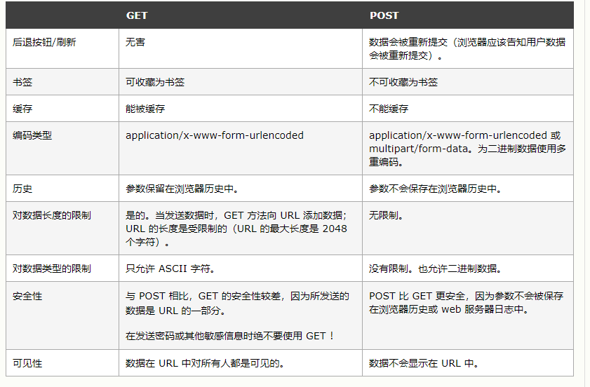

# 前端面试

## 盒子模型

在标准模式下的盒模型，盒子实际内容（content）的width/height=我们设置的width/height;盒子总宽度/高度=width/height+padding+border+margin

在怪异模式下的盒模型，盒子的（content）宽度+内边距padding+边框border宽度=我们设置的width(height也是如此)，盒子总宽度/高度=width/height + margin = 内容区宽度/高度 + padding + border + margin


## 行内元素和块级元素的区别

行内元素：

+ 设置宽高无效，根据内容撑开
+ 垂直margin无效，水平margin有效
+ 内边距无效
+ 可以和其他行内元素、块级元素共用一行

块级元素：

+ 设置宽高有效，宽度默认为父级宽度100%
+ 高度默认根据内容撑开，**没有内容则默认没有高度**
+ margin有效
+ 独占一行

行内块元素：

+ 设置宽高有效，自带默认宽高
+ margin有效
+ 共用一行

## ajax步骤

```js
var request = new XMLHttpRequest()  // 创建异步对象

request.onreadystatechange = function () { // 注册事件
  if (request.readyState == 4) {
    if (request.status == 200) {
      console.log('响应成功')
      console.log(request.responseText)
    } else {
      console.log('响应失败')
    }
  }
}

request.open('GET', 'http://localhost:3000') // 设置请求的参数

// post请求 设置头信息
// request.setRequestHeader("Content-Type", "application/x-www-form-urlencoded") 

request.send() // 发送请求

// post请求 设置请求主体
// request.send(body)
// request.send("name=v1&upwd=v2")

```


## 图片懒加载

原理：图片是通过`img`的`src属性`，当对src赋值时，浏览器会请求图片资源

当img元素的offsetTop<document.body.scrollTop+document.documentElement.offsetHeight

即img进入视口的条件成立

基于这个问题，可以利用标签的自定义属性（data-xxx），来保存图片的路径，当需要加载图片时（将要进入视口时），将data-xxx赋值给src就可以实现按需加载

### 插件（lazyload）


## 下拉刷新 上拉加载

### 插件（better-scroll）


## CSS3新特性

grid flex

圆角

媒体查询

子代选择器

过渡transition

动画animation

转换transform

阴影

渐变


## HTML5新特性

### 一、语义标签

| 标签      | 描述                               |
| --------- | ---------------------------------- |
| <header>  | 定义了文档的头部区域               |
| <footer>  | 定义了文档的尾部区域               |
| <nav>     | 定义文档的导航                     |
| <section> | 定义文档中的节                     |
| <article> | 定义文章                           |
| <aside>   | 定义页面以外的内容                 |
| <details> | 定义用户可以看到或者隐藏的额外细节 |
| <summary> | 标签包含details元素的标题          |
| <dialog>  | 定义对话框                         |
| <figure>  | 定义自包含内容，如图表             |
| <main>    | 定义文档主内容                     |
| <mark>    | 定义文档的主内容                   |
| <time>    | 定义日期/时间                      |

### 二、增强型表单

html5修改一些新的input输入特性，改善更好的输入控制和验证

| 输入类型       | 描述                     |
| -------------- | ------------------------ |
| color          | 主要用于选取颜色         |
| date           | 选取日期                 |
| datetime       | 选取日期(UTC时间)        |
| datetime-local | 选取日期（无时区）       |
| month          | 选择一个月份             |
| week           | 选择周和年               |
| time           | 选择一个时间             |
| email          | 包含e-mail地址的输入域   |
| number         | 数值的输入域             |
| url            | url地址的输入域          |
| tel            | 定义输入电话号码和字段   |
| search         | 用于搜索域               |
| range          | 一个范围内数字值的输入域 |

html5新增了五个表单元素

| <datalist> | 用户会在他们输入数据时看到域定义选项的下拉列表 |
| ---------- | ---------------------------------------------- |
| <progress> | 进度条，展示连接/下载进度                      |
| <meter>    | 刻度值，用于某些计量，例如温度、重量等         |
| <keygen>   | 提供一种验证用户的可靠方法生成一个公钥和私钥   |
| <output>   | 用于不同类型的输出比如尖酸或脚本输出           |

html5新增表单属性

| 属性         | 描述                                  |
| ------------ | ------------------------------------- |
| placehoder   | 输入框默认提示文字                    |
| required     | 要求输入的内容是否可为空              |
| pattern      | 描述一个正则表达式验证输入的值        |
| min/max      | 设置元素最小/最大值                   |
| step         | 为输入域规定合法的数字间隔            |
| height/width | 用于image类型<input>标签图像高度/宽度 |
| autofocus    | 规定在页面加载时，域自动获得焦点      |
| multiple     | 规定<input>元素中可选择多个值         |

### 三、视频和音频

html5提供了音频和视频文件的标准，既使用<audio>元素。

音频：<audio src=" "></audio>

```html
<audio controls>    //controls属性提供添加播放、暂停和音量控件。
  <source src="horse.ogg" type="audio/ogg">
  <source src="horse.mp3" type="audio/mpeg">
您的浏览器不支持 audio 元素。        //浏览器不支持时显示文字
</audio>
```

视频：<video src=" "></video>

```html
<video width="320" height="240" controls>
  <source src="movie.mp4" type="video/mp4">
  <source src="movie.ogg" type="video/ogg">
您的浏览器不支持Video标签。
</video>
```

### 四、Canvas绘图

### 五、SVG绘图

### 六、地理定位

使用`getCurrentPosition()`方法来获取用户的位置。以实现“LBS服务”

```html
<script>
var x=document.getElementById("demo");
function getLocation()
  {
  if (navigator.geolocation)
    {
    navigator.geolocation.getCurrentPosition(showPosition);
    }
  else{x.innerHTML="Geolocation is not supported by this browser.";}
  }
function showPosition(position)
  {
  x.innerHTML="Latitude: " + position.coords.latitude +
  "<br />Longitude: " + position.coords.longitude;
  }
</script>
```

### 七、拖放API

拖放是一种常见的特性，即捉取对象以后拖到另一个位置。

在html5中，拖放是标准的一部分，任何元素都能够拖放。

```html
<div draggable="true"></div>
```

当元素拖动时，我们可以检查其拖动的数据。

```html
<div draggable="true" ondragstart="drag(event)"></div>
<script>
function drap(ev){
    console.log(ev);
}
</script>
```

| 拖动生命周期 | 属性名      | 描述                                           |
| ------------ | ----------- | ---------------------------------------------- |
| 拖动开始     | ondragstart | 在拖动操作开始时执行脚本                       |
| 拖动过程中   | ondrag      | 只要脚本在被拖动就运行脚本                     |
| 拖动过程中   | ondragenter | 当元素被拖动到一个合法的防止目标时，执行脚本   |
| 拖动过程中   | ondragover  | 只要元素正在合法的防止目标上拖动时，就执行脚本 |
| 拖动过程中   | ondragleave | 当元素离开合法的防止目标时                     |
| 拖动结束     | ondrop      | 将被拖动元素放在目标元素内时运行脚本           |
| 拖动结束     | ondragend   | 在拖动操作结束时运行脚本                       |

 

### 八、WebWorker

### 九、WebStorage

### 十、WebSocket


## GET POST请求方式的区别

GET:是从服务器上获取数据，post 是向服务器传送数据



### GET 方法

查询字符串（名称/值对）是在 GET 请求的 URL 中发送的：

- GET 请求保留在浏览器历史记录中
- GET 请求可被收藏为书签
- GET 请求不应在处理敏感数据时使用
- GET 请求有长度限制
- 编码类型application/x-www-form-urlencoded
- 对数据长度有限制（url限制2048个字符）

### POST 方法

查询字符串（名称/值对）是在 POST 请求的 HTTP 消息主体中发送的：

+ 编码类型常见encodedapplication/x-www-form-urlencoded或multipart/form-data
+ POST数据长度无限制
+ POST 请求不会保留在浏览器历史记录中


## axios取消请求

```js
let cancel = null
div.onclick = function () {
  if (cancel !== null) {
    cancel()
  }
  axios({
    method: 'GET',
    url: 'http://localhost:3000/get',
    cancelToken: new axios.CancelToken(function (c) {
      cance = c
    })
  }).then(res => {
    console.log(res)
    cancel = null
  })
}
```


## 单页面应用和多页面应用

|                   | 单页面应用（SinglePage Web Application，SPA）                | 多页面应用（MultiPage Application，MPA）     |
| :---------------- | :----------------------------------------------------------- | -------------------------------------------- |
| 组成              | 一个外壳页面和多个页面片段组成                               | 多个完整页面构成                             |
| 资源共用(css,js)  | 共用，只需在外壳部分加载                                     | 不共用，每个页面都需要加载                   |
| 刷新方式          | 页面局部刷新或更改                                           | 整页刷新                                     |
| url 模式          | a.com/#/pageone a.com/#/pagetwo                              | a.com/pageone.html a.com/pagetwo.html        |
| 用户体验          | 页面片段间的切换快，用户体验良好                             | 页面切换加载缓慢，流畅度不够，用户体验比较差 |
| 转场动画          | 容易实现                                                     | 无法实现                                     |
| 数据传递          | 容易                                                         | 依赖 url传参、或者cookie 、localStorage等    |
| 搜索引擎优化(SEO) | 需要单独方案、实现较为困难、不利于SEO检索 可利用服务器端渲染(SSR)优化 | 实现方法简易                                 |
| 试用范围          | 高要求的体验度、追求界面流畅的应用                           | 适用于追求高度支持搜索引擎的应用             |
| 开发成本          | 较高，常需借助专业的框架                                     | 较低 ，但页面重复代码多                      |
| 维护成本          | 相对容易                                                     | 相对复杂                                     |


## ES5构造函数和ES6 class的对比

1. class不能提升
2. class 只能通过new创建实例
3. class采用严格模式
4. class的原型上的属性不能被for of 等遍历