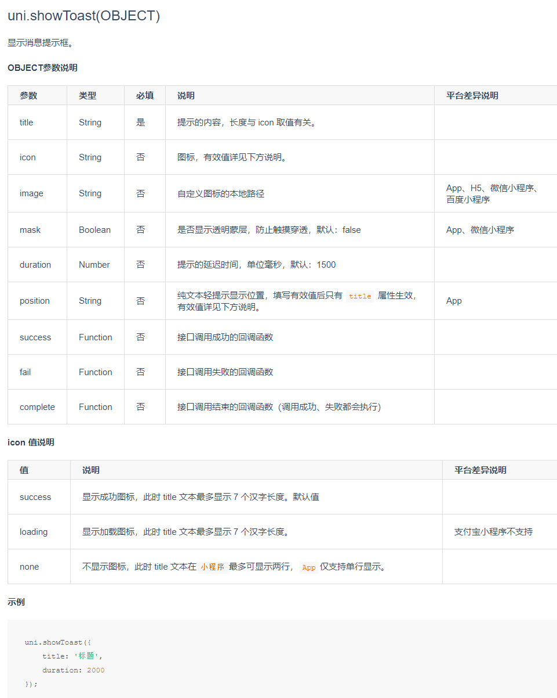

## 前言

最近看别人的小程序代码，学到了一个过去没遇到过的关于api封装的技巧，在这里做一下记录。

本文以`uni-app`的内置api：`uni.showToast`， `uni.navigateTo()`的封装为例，阐述这一技巧。

## 官方文档

该api的官方文档见下图




## 案例代码

```js
/* src/main.js */

// 保存原api地址,不至于被覆盖丢失
let originToast = uni.showToast
// 重新给uni.showToast套一层壳
uni.showToast = (option) => {
  // 自定义默认参数
  let defaultOpt = {
    mask=true
  }
  // 合并参数
  let tragetOpt = Object.assign(defaultOpt, option)
  return	originToast(tragetOpt)	// 此处一定要用return,因为有些api支持promise
}
```


## 解读

此方法的优点是保证了代码调用层面和官方并无差异，可以在不影响已有业务代码的前提下针对自己的项目底层api做微调。

比如该案例中，官方默认的`mask`的默认值是false，如果当前业务需要默认值是`true`就可以用这种方式达到目的且不会影响到已有的代码。

也可以针对`uni.navigateTo()`api做封装处理，比如：

```js
import qs from 'qs'

let originNav = uni.navigateTo
uni.navigateTo = (option) => {
  if (option.url) {
    let checkResult = checkUrlSync(option.url)
    if (!checkResult) {
      return Promise.reject('目标页面不存在或当前用户无权访问该页面')
    }
  }

  // 可以在option实参中使用$params,调用时以对象形式传入参数,在此处做url处理,省去拼接计算字符串的时间.
  // 这么做会与官方文档上的调用产生差异,要根据实际情况决定是否这么封装,此处只提供想法.
  if (option.$params) {
    option.url = option.url + qs.stringify(option.params)
  }

  let tragetOpt = Object.assign(defaultOpt, option)
  return originNav(tragetOpt)
}
```

## 为什么不采取在xxx.js 中包装单个api，在页面中import的形式？

在不同的页面文件反复import同一个文件开发体验其实挺差的，因为每次新建一个页面文件都要复制粘贴一模一样的import语句。

每个页面都要用到就没必要在每个页面的顶部去import，看起来很蠢。事实上如果是调用比较频繁的公共函数比如（`uni.navigate uni.showLoading`），直接在`main.js`里做修改或挂载在全局对象的prototype上是最方便。

其实主要还是因为我懒。

