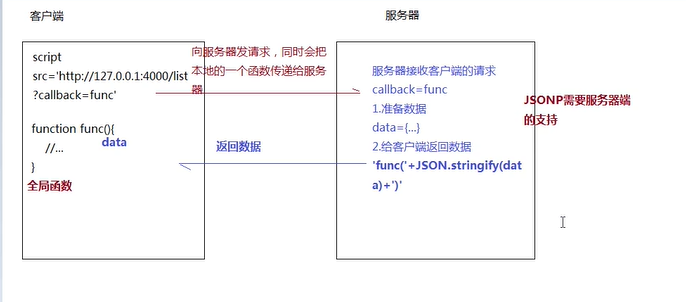
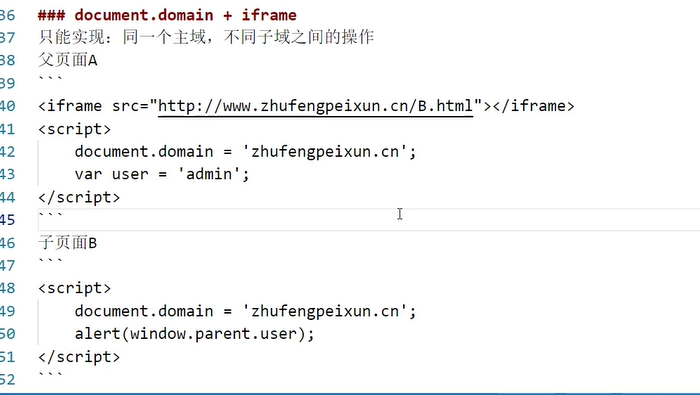

## 跨域

- 同源策略请求 ajax / fetch
- 跨域传输（非同源策略请求）


部署在同一个web服务器上：同源策略

- xampp 修改本地的host文件

  ```js
  127.0.0.1:1234 http://api.qq.com 模拟同源
  ```

开发过程中不是同源策略


服务器拆分

web服务器：静态资源   kbs.sports.qq.com

data服务器：业务逻辑和数据分析  api.sports.qq.com

图片服务器


三者都一样就是同源，否则就是跨域

+ 协议
+ 域名
+ 端口号

WEB服务器地址：http://127.0.0.1:3000/index.html

数据接口地址：http://127.0.0.1:4000/list

## JSONP

不存在跨域请求限制的标签

- script
- img
- link
- iframe



缺点：JSONP只能处理GET请求


## CORS

[跨域资源共享 CORS 详解 - 阮一峰的网络日志 (ruanyifeng.com)](http://www.ruanyifeng.com/blog/2016/04/cors.html)

跨域资源共享

+ 客户端（发送ajax/fetch）

+ 服务器端设置相关的头信息（需处理options试探性请求）

  `Access-Control-Allow-Origin`设置为 `*`就不允许携带cookie了

```js
app.use((req, res, next) => {
	const {
		ALLOW_ORIGIN,
		CREDENTIALS,
		HEADERS,
		ALLOW_METHODS
	} = CONFIG.CROS;
	res.header("Access-Control-Allow-Origin", ALLOW_ORIGIN);
	res.header("Access-Control-Allow-Credentials", CREDENTIALS);
	res.header("Access-Control-Allow-Headers", HEADERS);
	res.header("Access-Control-Allow-Methods", ALLOW_METHODS);
	req.method === 'OPTIONS' ? res.send('CURRENT SERVICES SUPPORT CROSS DOMAIN REQUESTS!') : next();
});

//config.js
module.exports = {
	//=>WEB服务端口号
	PORT: 3001,

	//=>CROS跨域相关信息
	CROS: {
		ALLOW_ORIGIN: 'http://127.0.0.1:5500', // => *
		ALLOW_METHODS: 'PUT,POST,GET,DELETE,OPTIONS,HEAD',
		HEADERS: 'Content-Type,Content-Length,Authorization, Accept,X-Requested-With',
		CREDENTIALS: true
	},

	//=>SESSION存储相关信息
	SESSION: {
		secret: 'ZFPX',
		saveUninitialized: false,
		resave: false,
		cookie: {
			maxAge: 1000 * 60 * 60 * 24 * 30
		}
	}
};

```


## http proxy

=>webpack webpack-dev-server


## Nginx反向代理


## postMessage


## WebSocket协议跨域


## document.domain + iframe




## window.name + iframe


## location.hash + iframe