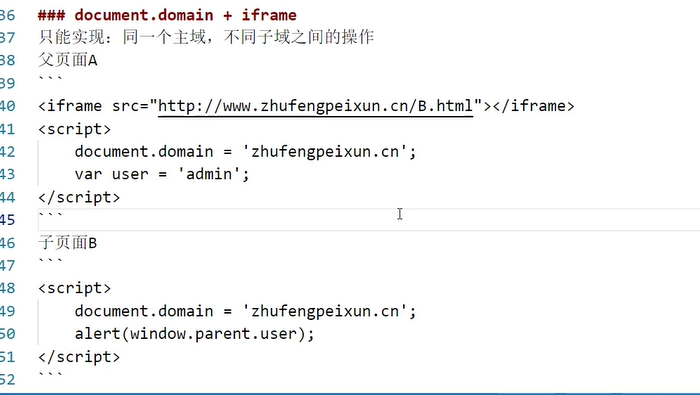

# 跨域

## 参考资料

[浏览器同源政策及其规避方法 - 阮一峰的网络日志 (ruanyifeng.com)](https://www.ruanyifeng.com/blog/2016/04/same-origin-policy.html)

[跨域资源共享 CORS 详解 - 阮一峰的网络日志 (ruanyifeng.com)](https://www.ruanyifeng.com/blog/2016/04/cors.html)

[跨域访问方法介绍(4)--使用 window.name 传值 - 码农公寓 (553668.com)](https://www.553668.com/manong/402282.html)

## 特征

同源指：

- 协议相同
- 域名相同
- 端口相同

举例来说，`http://www.example.com/dir/page.html`这个网址，协议是`http://`，域名是`www.example.com`，端口是`80`（默认端口可以省略）。它的同源情况如下。

> - `http://www.example.com/dir2/other.html`：同源
> - `http://example.com/dir/other.html`：不同源（域名不同）
> - `http://v2.www.example.com/dir/other.html`：不同源（域名不同）
> - `http://www.example.com:81/dir/other.html`：不同源（端口不同）

如果非同源，共有三种行为受到限制。

> （1） Cookie、LocalStorage 和 IndexDB 无法读取。
>
> （2） DOM 无法获得。
>
> （3） AJAX 请求不能发送。

## 如何规避限制

### Cookie

Cookie 是服务器写入浏览器的一小段信息，只有同源的网页才能共享。但是，两个网页一级域名相同，只是二级域名不同，浏览器允许通过设置`document.domain`共享 Cookie。

> 如果成功设置`document.domain`属性，则原始端口的端口部分也将设置为 `null`.（[Document.domain - Web API 接口参考 | MDN (mozilla.org)](https://developer.mozilla.org/zh-CN/docs/Web/API/Document/domain)）

举例来说，A网页是`http://w1.example.com/a.html`，B网页是`http://w2.example.com/b.html`，那么只要设置相同的`document.domain`，两个网页就可以共享Cookie。

```js
document.domain = 'example.com';
```

现在，A网页通过脚本设置一个 Cookie。

```js
document.cookie = "test1=hello";
```

B网页就可以读到这个 Cookie。

```js
var allCookie = document.cookie;
```

注意，这种方法只适用于 Cookie 和 iframe 窗口，LocalStorage 和 IndexDB 无法通过这种方法，规避同源政策

另外，服务器也可以在设置Cookie的时候，指定Cookie的所属域名为一级域名，比如`.example.com`。

```js
Set-Cookie: key=value; domain=.example.com; path=/
```

这样的话，二级域名和三级域名不用做任何设置，都可以读取这个Cookie。

### 二级域名之间的访问


> window.open返回值：
>
> 一个 [`WindowProxy` (en-US)](https://developer.mozilla.org/en-US/docs/Glossary/WindowProxy) 对象。只要符合[同源策略](https://developer.mozilla.org/zh-CN/docs/Web/Security/Same-origin_policy)安全要求，返回的引用就可用于访问新窗口的属性和方法。

### iframe

如果两个网页不同源，就无法拿到对方的DOM。典型的例子是`iframe`窗口和`window.open`方法打开的窗口，它们与父窗口无法通信。

比如，父窗口运行下面的命令，如果`iframe`窗口不是同源，就会报错。

```js
document.getElementById("myIFrame").contentWindow.document
// Uncaught DOMException: Blocked a frame from accessing a cross-origin frame.
```

上面命令中，父窗口想获取子窗口的DOM，因为跨源导致报错。

反之亦然，子窗口获取主窗口的DOM也会报错。

```js
window.parent.document.body
// 报错
```

如果两个窗口一级域名相同，只是二级域名不同，那么设置上一节介绍的`document.domain`属性，就可以规避同源政策，拿到DOM。

对于完全不同源的网站，目前有三种方法，可以解决跨域窗口的通信问题。

- 片段识别符（fragment identifier）
- window.name
- 跨文档通信API（Cross-document messaging）

#### 片段识别符

段标识符（fragment identifier）指的是，URL的`#`号后面的部分，比如`http://example.com/x.html#fragment`的`#fragment`。如果只是改变片段标识符，页面不会重新刷新。

父窗口可以把信息，写入子窗口的片段标识符。

```JS
var src = originURL + '#' + data;
document.getElementById('myIFrame').src = src;
```

子窗口通过监听`hashchange`事件得到通知。

```JS
window.onhashchange = checkMessage;

function checkMessage() {
  var message = window.location.hash;
  // ...
}
```

同样的，子窗口也可以改变父窗口的片段标识符。

```JS
parent.location.href= target + "#" + hash;
```

#### window.name

浏览器窗口有`window.name`属性。这个属性的最大特点是，无论是否同源，只要在同一个窗口里，前一个网页设置了这个属性，后一个网页可以读取它。

父窗口先打开一个子窗口，载入一个不同源的网页，该网页将信息写入`window.name`属性。

```js
window.name = data;
```

接着，子窗口跳回一个与主窗口同域的网址。

```js
location = 'http://parent.url.com/xxx.html';
```

然后，主窗口就可以读取子窗口的`window.name`了。

```javascript
var data = document.getElementById('myFrame').contentWindow.name; // 此时父子窗口同源
```

这种方法的优点是，`window.name`容量很大，可以放置非常长的字符串；缺点是必须监听子窗口`window.name`属性的变化，影响网页性能。

#### window.postMessage


## JSONP

不存在跨域请求限制的标签

- script
- img
- link
- iframe


缺点：JSONP只能处理GET请求


## CORS

[跨域资源共享 CORS 详解 - 阮一峰的网络日志 (ruanyifeng.com)](http://www.ruanyifeng.com/blog/2016/04/cors.html)

跨域资源共享

+ 客户端（发送ajax/fetch）

+ 服务器端设置相关的头信息（需处理options试探性请求）

  `Access-Control-Allow-Origin`设置为 `*`就不允许携带cookie了

```js
app.use((req, res, next) => {
	const {
		ALLOW_ORIGIN,
		CREDENTIALS,
		HEADERS,
		ALLOW_METHODS
	} = CONFIG.CROS;
	res.header("Access-Control-Allow-Origin", ALLOW_ORIGIN);
	res.header("Access-Control-Allow-Credentials", CREDENTIALS);
	res.header("Access-Control-Allow-Headers", HEADERS);
	res.header("Access-Control-Allow-Methods", ALLOW_METHODS);
	req.method === 'OPTIONS' ? res.send('CURRENT SERVICES SUPPORT CROSS DOMAIN REQUESTS!') : next();
});

//config.js
module.exports = {
	//=>WEB服务端口号
	PORT: 3001,

	//=>CROS跨域相关信息
	CROS: {
		ALLOW_ORIGIN: 'http://127.0.0.1:5500', // => *
		ALLOW_METHODS: 'PUT,POST,GET,DELETE,OPTIONS,HEAD',
		HEADERS: 'Content-Type,Content-Length,Authorization, Accept,X-Requested-With',
		CREDENTIALS: true
	},

	//=>SESSION存储相关信息
	SESSION: {
		secret: 'ZFPX',
		saveUninitialized: false,
		resave: false,
		cookie: {
			maxAge: 1000 * 60 * 60 * 24 * 30
		}
	}
};

```


## http proxy

=>webpack webpack-dev-server


## Nginx反向代理


## postMessage


## WebSocket协议跨域


## document.domain + iframe




## window.name + iframe


## location.hash + iframe
