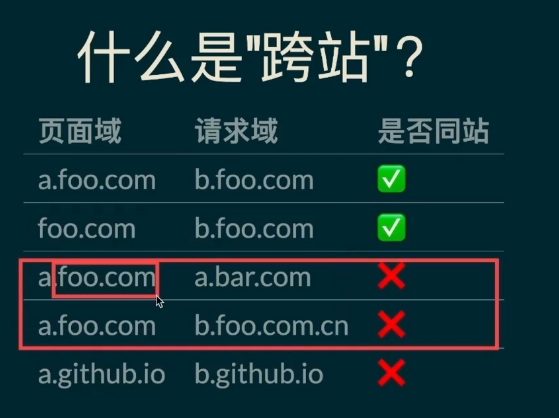

# 跨域

## 参考资料

[浏览器同源政策及其规避方法 - 阮一峰的网络日志 (ruanyifeng.com)](https://www.ruanyifeng.com/blog/2016/04/same-origin-policy.html)

[跨域资源共享 CORS 详解 - 阮一峰的网络日志 (ruanyifeng.com)](https://www.ruanyifeng.com/blog/2016/04/cors.html)

[跨域访问方法介绍(4)--使用 window.name 传值 - 码农公寓 (553668.com)](https://www.553668.com/manong/402282.html)

## 特征

同源指：

- 协议相同
- 域名相同
- 端口相同

举例来说，`http://www.example.com/dir/page.html`这个网址，协议是`http://`，域名是`www.example.com`，端口是`80`（默认端口可以省略）。它的同源情况如下。

> - `http://www.example.com/dir2/other.html`：同源
> - `http://example.com/dir/other.html`：不同源（域名不同）
> - `http://v2.www.example.com/dir/other.html`：不同源（域名不同）
> - `http://www.example.com:81/dir/other.html`：不同源（端口不同）

如果非同源，共有三种行为受到限制。

> （1） Cookie、LocalStorage 和 IndexDB 无法读取。
>
> （2） DOM 无法获得。
>
> （3） AJAX 请求不能发送。

## 没有跨域限制的标签

+ script
+ img
+ iframe
+ link

## 如何规避限制

### Cookie

Cookie 是服务器写入浏览器的一小段信息，只有同源的网页才能共享。但是，两个网页一级域名相同，只是二级域名不同，浏览器允许通过设置`document.domain`共享 Cookie。

> 如果成功设置`document.domain`属性，则原始端口的端口部分也将设置为 `null`.（[Document.domain - Web API 接口参考 | MDN (mozilla.org)](https://developer.mozilla.org/zh-CN/docs/Web/API/Document/domain)）

举例来说，A网页是`http://w1.example.com/a.html`，B网页是`http://w2.example.com/b.html`，那么只要设置相同的`document.domain`，两个网页就可以共享Cookie。

```js
document.domain = 'example.com';
```

现在，A网页通过脚本设置一个 Cookie。

```js
document.cookie = "test1=hello";
```

B网页就可以读到这个 Cookie。

```js
var allCookie = document.cookie;
```

注意，这种方法只适用于 Cookie 和 iframe 窗口，LocalStorage 和 IndexDB 无法通过这种方法，规避同源政策

另外，服务器也可以在设置Cookie的时候，指定Cookie的所属域名为一级域名，比如`.example.com`。

```js
Set-Cookie: key=value; domain=.example.com; path=/
```

这样的话，二级域名和三级域名不用做任何设置，都可以读取这个Cookie。

### 二级域名之间的访问


> window.open返回值：
>
> 一个 [`WindowProxy` (en-US)](https://developer.mozilla.org/en-US/docs/Glossary/WindowProxy) 对象。只要符合[同源策略](https://developer.mozilla.org/zh-CN/docs/Web/Security/Same-origin_policy)安全要求，返回的引用就可用于访问新窗口的属性和方法。

### iframe

如果两个网页不同源，就无法拿到对方的DOM。典型的例子是`iframe`窗口和`window.open`方法打开的窗口，它们与父窗口无法通信。

比如，父窗口运行下面的命令，如果`iframe`窗口不是同源，就会报错。

```js
document.getElementById("myIFrame").contentWindow.document
// Uncaught DOMException: Blocked a frame from accessing a cross-origin frame.
```

上面命令中，父窗口想获取子窗口的DOM，因为跨源导致报错。

反之亦然，子窗口获取主窗口的DOM也会报错。

```js
window.parent.document.body
// 报错
```

如果两个窗口一级域名相同，只是二级域名不同，那么设置上一节介绍的`document.domain`属性，就可以规避同源政策，拿到DOM。

对于完全不同源的网站，目前有三种方法，可以解决跨域窗口的通信问题。

- 片段识别符（fragment identifier）
- window.name
- 跨文档通信API（Cross-document messaging）

#### 片段识别符hash

段标识符（fragment identifier）指的是，URL的`#`号后面的部分，比如`http://example.com/x.html#fragment`的`#fragment`。如果只是改变片段标识符，页面不会重新刷新。

父窗口可以把信息，写入子窗口的片段标识符。

```JS
var src = originURL + '#' + data;
document.getElementById('myIFrame').src = src;
```

子窗口通过监听`hashchange`事件得到通知。

```JS
window.onhashchange = checkMessage;

function checkMessage() {
  var message = window.location.hash;
  // ...
}
```

同样的，子窗口也可以改变父窗口的片段标识符。

```JS
parent.location.href= target + "#" + hash;
```

#### window.name

浏览器窗口有`window.name`属性。这个属性的最大特点是，无论是否同源，只要在同一个窗口里，前一个网页设置了这个属性，后一个网页可以读取它。

父窗口先打开一个子窗口，载入一个不同源的网页，该网页将信息写入`window.name`属性。

```js
window.name = data;
```

接着，子窗口跳回一个与主窗口同域的网址。

```js
location = 'http://parent.url.com/xxx.html';
```

然后，主窗口就可以读取子窗口的`window.name`了。

```javascript
var data = document.getElementById('myFrame').contentWindow.name; // 此时父子窗口同源
```

这种方法的优点是，`window.name`容量很大，可以放置非常长的字符串；缺点是必须监听子窗口`window.name`属性的变化，影响网页性能。

#### window.postMessage

举例来说，父窗口`http://aaa.com`向子窗口`http://bbb.com`发消息

```js
var popup = window.open('http://bbb.com', 'title');
popup.postMessage('Hello World!', 'http://bbb.com');
```

子窗口向父窗口发送消息的写法类似。

```javascript
window.opener.postMessage('Nice to see you', 'http://aaa.com');
```

父窗口和子窗口都可以通过`message`事件，监听对方的消息。

```javascript
window.addEventListener('message', function(e) {
  console.log(e.data);
},false);
```

`message`事件的事件对象`event`，提供以下三个属性。

- `event.source`：发送消息的窗口
- `event.origin`: 消息发向的网址
- `event.data`: 消息内容

### AJAX

同源政策规定，AJAX请求只能发给同源的网址，否则就报错。

除了架设服务器代理（浏览器请求同源服务器，再由后者请求外部服务），有三种方法规避这个限制。

- JSONP
- WebSocket
- CORS

#### JSONP

缺点：JSONP只能处理GET请求

不存在跨域请求限制的标签

- script
- img
- link
- iframe

它的基本思想是，网页通过添加一个`<script>`元素，向服务器请求JSON数据，这种做法不受同源政策限制；服务器收到请求后，将数据放在一个指定名字的回调函数里传回来。

```js
function addScriptTag(src) {
  var script = document.createElement('script');
  script.setAttribute("type","text/javascript");
  script.src = src;
  document.body.appendChild(script);
}

window.onload = function () {
  addScriptTag('http://example.com/ip?callback=foo');
}

function foo(data) {
  console.log('Your public IP address is: ' + data.ip);
};
```

上面代码通过动态添加`<script>`元素，向服务器`example.com`发出请求。注意，该请求的查询字符串有一个`callback`参数，用来指定回调函数的名字，这对于JSONP是必需的。

服务器收到这个请求以后，会将数据放在回调函数的参数位置返回。

```js
foo({
  "ip": "8.8.8.8"
});
```

由于`<script>`元素请求的脚本，直接作为代码运行。这时，只要浏览器定义了`foo`函数，该函数就会立即调用。作为参数的JSON数据被视为JavaScript对象，而不是字符串，因此避免了使用`JSON.parse`的步骤。


#### WebSocket

WebSocket是一种通信协议，使用`ws://`（非加密）和`wss://`（加密）作为协议前缀。该协议不实行同源政策，只要服务器支持，就可以通过它进行跨源通信。

浏览器发出的WebSocket请求的头信息有一个字段是`Origin`，表示该请求的请求源（origin），即发自哪个域名。

正是因为有了`Origin`这个字段，所以WebSocket才没有实行同源政策。因为服务器可以根据这个字段，判断是否许可本次通信。

#### CORS

CORS是一个W3C标准，全称是"跨域资源共享"（Cross-origin resource sharing）。

CORS需要浏览器和服务器同时支持。目前，所有浏览器都支持该功能，IE浏览器不能低于IE10。

整个CORS通信过程，**都是浏览器自动完成，不需要用户参与。**对于开发者来说，CORS通信与同源的AJAX通信没有差别，代码完全一样。浏览器一旦发现AJAX请求跨源，**就会自动添加一些附加的头信息，有时还会多出一次附加的请求，但用户不会有感觉。**

因此，实现CORS通信的关键是服务器。**只要服务器实现了CORS接口，就可以跨源通信**。

##### 两种请求

浏览器将CORS请求分成两类：简单请求（simple request）和非简单请求（not-so-simple request）。

只要同时满足以下两大条件，就属于简单请求。

> （1) 请求方法是以下三种方法之一：
>
> - HEAD
> - GET
> - POST
>
> （2）HTTP的头信息不超出以下几种字段：
>
> - Accept
> - Accept-Language
> - Content-Language
> - Last-Event-ID
> - Content-Type：只限于三个值`application/x-www-form-urlencoded`、`multipart/form-data`、`text/plain`

##### 简单请求

对于简单请求，浏览器直接发出CORS请求。具体来说，就是在头信息之中，增加一个`Origin`字段。

下面是一个例子，浏览器发现这次跨源AJAX请求是简单请求，就自动在头信息之中，添加一个`Origin`字段。

```http
GET /cors HTTP/1.1
Origin: http://api.bob.com
Host: api.alice.com
Accept-Language: en-US
Connection: keep-alive
User-Agent: Mozilla/5.0...
```

`Origin`字段用来说明，本次请求来自哪个源（协议 + 域名 + 端口）。服务器根据这个值，决定是否同意这次请求。

如果`Origin`指定的源，不在许可范围内，服务器会返回一个正常的HTTP回应。浏览器发现，这个回应的头信息没有包含`Access-Control-Allow-Origin`字段（详见下文），就知道出错了，从而抛出一个错误，被`XMLHttpRequest`的`onerror`回调函数捕获。注意，这种错误无法通过状态码识别，因为HTTP回应的状态码有可能是200。

如果`Origin`指定的域名在许可范围内，服务器返回的响应，会多出几个头信息字段。

```http
Access-Control-Allow-Origin: http://api.bob.com
Access-Control-Allow-Credentials: true
Access-Control-Expose-Headers: FooBar
Content-Type: text/html; charset=utf-8
```

上面的头信息之中，有三个与CORS请求相关的字段，都以`Access-Control-`开头。

**（1）Access-Control-Allow-Origin**

该字段是必须的。它的值要么是请求时`Origin`字段的值，要么是一个`*`，表示接受任意域名的请求。

**（2）Access-Control-Allow-Credentials**

该字段可选。它的值是一个布尔值，表示是否允许发送Cookie。默认情况下，Cookie不包括在CORS请求之中。设为`true`，即表示服务器明确许可，Cookie可以包含在请求中，一起发给服务器。这个值也只能设为`true`，如果服务器不要浏览器发送Cookie，删除该字段即可。

**（3）Access-Control-Expose-Headers**

该字段可选。CORS请求时，`XMLHttpRequest`对象的`getResponseHeader()`方法只能拿到6个基本字段：`Cache-Control`、`Content-Language`、`Content-Type`、`Expires`、`Last-Modified`、`Pragma`。如果想拿到其他字段，就必须在`Access-Control-Expose-Headers`里面指定。上面的例子指定，`getResponseHeader('FooBar')`可以返回`FooBar`字段的值。

##### withCredentials 

上面说到，CORS请求默认不发送Cookie和HTTP认证信息。如果要把Cookie发到服务器，一方面要服务器同意，指定`Access-Control-Allow-Credentials`字段。

```http
Access-Control-Allow-Credentials: true
```

另一方面，开发者必须在AJAX请求中打开`withCredentials`属性。

```javascript
var xhr = new XMLHttpRequest();
xhr.withCredentials = true;
```

否则，即使服务器同意发送Cookie，浏览器也不会发送。或者，服务器要求设置Cookie，浏览器也不会处理。

但是，如果省略`withCredentials`设置，有的浏览器还是会一起发送Cookie。这时，可以显式关闭`withCredentials`。

```javascript
xhr.withCredentials = false;
```

需要注意的是，**如果要发送Cookie，`Access-Control-Allow-Origin`就不能设为星号，必须指定明确的、与请求网页一致的域名。**同时，Cookie依然遵循同源政策，只有用服务器域名设置的Cookie才会上传，其他域名的Cookie并不会上传，且（跨源）原网页代码中的`document.cookie`也无法读取服务器域名下的Cookie。

##### 非简单请求

##### 预检请求

非简单请求是那种对服务器有特殊要求的请求，比如请求方法是`PUT`或`DELETE`，或者`Content-Type`字段的类型是`application/json`。

非简单请求的CORS请求，会在正式通信之前，增加一次HTTP查询请求，称为"预检"请求（preflight）。

浏览器先询问服务器，当前网页所在的域名是否在服务器的许可名单之中，以及可以使用哪些HTTP动词和头信息字段。只有得到肯定答复，浏览器才会发出正式的`XMLHttpRequest`请求，否则就报错。

下面是一段浏览器的JavaScript脚本。

```javascript
var url = 'http://api.alice.com/cors';
var xhr = new XMLHttpRequest();
xhr.open('PUT', url, true);
xhr.setRequestHeader('X-Custom-Header', 'value');
xhr.send();
```

上面代码中，HTTP请求的方法是`PUT`，并且发送一个自定义头信息`X-Custom-Header`。

浏览器发现，这是一个非简单请求，就自动发出一个"预检"请求，要求服务器确认可以这样请求。下面是这个"预检"请求的HTTP头信息。

```http
OPTIONS /cors HTTP/1.1
Origin: http://api.bob.com
Access-Control-Request-Method: PUT
Access-Control-Request-Headers: X-Custom-Header
Host: api.alice.com
Accept-Language: en-US
Connection: keep-alive
User-Agent: Mozilla/5.0...
```

"预检"请求用的请求方法是`OPTIONS`，表示这个请求是用来询问的。头信息里面，关键字段是`Origin`，表示请求来自哪个源。

除了`Origin`字段，"预检"请求的头信息包括两个特殊字段。

**（1）Access-Control-Request-Method**

该字段是必须的，用来列出浏览器的CORS请求会用到哪些HTTP方法，上例是`PUT`。

**（2）Access-Control-Request-Headers**

该字段是一个逗号分隔的字符串，指定浏览器CORS请求会额外发送的头信息字段，上例是`X-Custom-Header`。

##### 预检请求的回应

服务器收到"预检"请求以后，检查了`Origin`、`Access-Control-Request-Method`和`Access-Control-Request-Headers`字段以后，确认允许跨源请求，就可以做出回应。

```http
HTTP/1.1 200 OK
Date: Mon, 01 Dec 2008 01:15:39 GMT
Server: Apache/2.0.61 (Unix)
Access-Control-Allow-Origin: http://api.bob.com
Access-Control-Allow-Methods: GET, POST, PUT
Access-Control-Allow-Headers: X-Custom-Header
Content-Type: text/html; charset=utf-8
Content-Encoding: gzip
Content-Length: 0
Keep-Alive: timeout=2, max=100
Connection: Keep-Alive
Content-Type: text/plain
```

上面的HTTP回应中，关键的是`Access-Control-Allow-Origin`字段，表示`http://api.bob.com`可以请求数据。该字段也可以设为星号，表示同意任意跨源请求。

```http
Access-Control-Allow-Origin: *
```

如果服务器否定了"预检"请求，会返回一个正常的HTTP回应，但是没有任何CORS相关的头信息字段。这时，浏览器就会认定，服务器不同意预检请求，因此触发一个错误，被`XMLHttpRequest`对象的`onerror`回调函数捕获。控制台会打印出如下的报错信息。

```bash
XMLHttpRequest cannot load http://api.alice.com.
Origin http://api.bob.com is not allowed by Access-Control-Allow-Origin.
```

服务器回应的其他CORS相关字段如下。

```http
Access-Control-Allow-Methods: GET, POST, PUT
Access-Control-Allow-Headers: X-Custom-Header
Access-Control-Allow-Credentials: true
Access-Control-Max-Age: 1728000
```

**（1）Access-Control-Allow-Methods**

该字段必需，它的值是逗号分隔的一个字符串，表明服务器支持的所有跨域请求的方法。注意，返回的是所有支持的方法，而不单是浏览器请求的那个方法。这是为了避免多次"预检"请求。

**（2）Access-Control-Allow-Headers**

如果浏览器请求包括`Access-Control-Request-Headers`字段，则`Access-Control-Allow-Headers`字段是必需的。它也是一个逗号分隔的字符串，表明服务器支持的所有头信息字段，不限于浏览器在"预检"中请求的字段。

**（3）Access-Control-Allow-Credentials**

该字段与简单请求时的含义相同。

**（4）Access-Control-Max-Age**

该字段可选，用来指定本次预检请求的有效期，单位为秒。上面结果中，有效期是20天（1728000秒），即允许缓存该条回应1728000秒（即20天），在此期间，不用发出另一条预检请求。

##### 浏览器的正常请求和回应

一旦服务器通过了"预检"请求，以后每次浏览器正常的CORS请求，就都跟简单请求一样，会有一个`Origin`头信息字段。服务器的回应，也都会有一个`Access-Control-Allow-Origin`头信息字段。

下面是"预检"请求之后，浏览器的正常CORS请求。

```http
PUT /cors HTTP/1.1
Origin: http://api.bob.com
Host: api.alice.com
X-Custom-Header: value
Accept-Language: en-US
Connection: keep-alive
User-Agent: Mozilla/5.0...
```

上面头信息的`Origin`字段是浏览器自动添加的。

下面是服务器正常的回应

```http
Access-Control-Allow-Origin: http://api.bob.com
Content-Type: text/html; charset=utf-8
```

上面头信息中，`Access-Control-Allow-Origin`字段是每次回应都必定包含的。

##### 优点

JSONP只支持`GET`请求，CORS支持所有类型的HTTP请求。JSONP的优势在于支持老式浏览器，以及可以向不支持CORS的网站请求数据。


```js
app.use((req, res, next) => {
	const {
		ALLOW_ORIGIN,
		CREDENTIALS,
		HEADERS,
		ALLOW_METHODS
	} = CONFIG.CROS;
	res.header("Access-Control-Allow-Origin", ALLOW_ORIGIN);
	res.header("Access-Control-Allow-Credentials", CREDENTIALS);
	res.header("Access-Control-Allow-Headers", HEADERS);
	res.header("Access-Control-Allow-Methods", ALLOW_METHODS);
	req.method === 'OPTIONS' ? res.send('CURRENT SERVICES SUPPORT CROSS DOMAIN REQUESTS!') : next();
});

//config.js
module.exports = {
	//=>WEB服务端口号
	PORT: 3001,

	//=>CROS跨域相关信息
	CROS: {
		ALLOW_ORIGIN: 'http://127.0.0.1:5500', // => *
		ALLOW_METHODS: 'PUT,POST,GET,DELETE,OPTIONS,HEAD',
		HEADERS: 'Content-Type,Content-Length,Authorization, Accept,X-Requested-With',
		CREDENTIALS: true
	},

	//=>SESSION存储相关信息
	SESSION: {
		secret: 'ZFPX',
		saveUninitialized: false,
		resave: false,
		cookie: {
			maxAge: 1000 * 60 * 60 * 24 * 30
		}
	}
};

```

## 基于cookie实现的登录页与iframe的限制

基于cookie实现的登录页面，通过iframe被嵌入到主页面后，是否能登录成功，需要根据主页面和子页面的域名是否相同来判断：

- 若主子页面跨域，则由于同源策略限制，子页面无法访问主页面的cookie，同时也无法操作自己域名下的cookie（没有显式设置cookie的samesite属性）。所以子页面无法通过cookie进行登录验证。
- 若主子页面同域，那么两个页面之间可以共享cookie，子页面可以正常实现登录功能。

[解决iframe嵌套项目无法登录的问题 - 掘金 (juejin.cn)](https://juejin.cn/post/6949881366628532237)


# 跨站

## SameSite



浏览器发起请求时只能携带与目标网站匹配的Cookie，并没有限制在哪个网站发起的请求才可以携带Cookie，即：

在网站A网页中，如果有一个按钮是向网站B发起了一个请求，虽然B网站和A一点关系都没有，但仍然会带上你在B网站的Cookie将请求发出去

`SameSite` 属性有以下几个值：

- `SameSite=None`：无论是否跨站都会发送 Cookie
- `SameSite=Lax`：允许部分第三方请求携带 Cookie（a标签）
- `SameSite=Strict`：仅允许同站请求携带 Cookie，即当前网页 URL 与请求目标 URL 完全一致

```http
Set-Cookie: name=lizheming; SameSite=None; Secure
```

浏览器仅针对 HTTPS 域名才支持 `SameSite=None` 配置。如果你要设置 `SameSite=None` 的话，则必须还要携带 `Secure` 属性才行。

