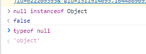

## var、let、const的区别

1. var定义的变量，没有块级作用域，有函数作用域，有变量提升，可以重复声明。
2. let定义的变量，有块级作用域，有函数作用域，不存在变量提升（暂时性死区），不可重复声明。
3. const用来定义只读常量，使用时必须初始化而且值不能被修改，有块级作用域，不可重复声明。
4. 同一个变量只能使用一种方式声明，不然会报错

[var、let、const 的本质区别是什么 - 知乎 (zhihu.com)](https://zhuanlan.zhihu.com/p/373652940)

## 原型链

当谈到继承时，JavaScript 只有一种结构：对象。

**每个实例对象（ object ）都有一个私有属性（称之为 `__proto__` ）指向它的构造函数的原型对象（`prototype`）。**

该原型对象也有一个自己的原型对象( `__proto__` ) ，层层向上直到一个对象的原型对象为 `null`。根据定义，`null` 没有原型，并作为这个**原型链**中的最后一个环节。

JavaScript 对象是动态的属性“包”（指其自己的属性）。JavaScript 对象有一个指向一个原型对象的链。当试图访问一个对象的属性时，它不仅仅在该对象上搜寻，还会搜寻该对象的原型，以及该对象的原型的原型，依次层层向上搜索，直到找到一个名字匹配的属性或到达原型链的末尾。


## event loop

微任务：promise的回调，process.nextTick，MutationObserver

每个宏任务之后，引擎会立即执行微任务队列中的所有任务，然后再执行其他的宏任务，或渲染，或进行其他任何操作。

```
宏任务 → 所有微任务 → 下一个宏任务
```

```js
题 1：

setTimeout(function () {
    console.log(1)
});
new Promise(function(resolve,reject){
    console.log(2)
    resolve(3)
}).then(function(val){
    console.log(val)
})
console.log(4)

Result:
2 → 4 → 3 → 1
```

```js
题 2：

new Promise(resolve => {
    resolve(1);

    Promise.resolve().then(() => {
    	// t2
    	console.log(2)
    });
    console.log(4)
}).then(t => {
	// t1
	console.log(t)
});
console.log(3);

Result:
4 → 3 → 2 → 1
```


## valueOf和toString

### valueOf转换规则

非原始值(也就是对象)重写规则如下：

| 对象     | valueOf返回值        |
| -------- | -------------------- |
| Array    | 数组本身             |
| Boolean  | 布尔值               |
| Date     | 返回毫秒形式的时间戳 |
| Function | 函数本身             |
| Number   | 数字值               |
| Object   | 对象本身             |
| String   | 字符串值             |

#### 对象转换为布尔值

1. 直接转换为true（包装类型也一样），不调用valueOf和toString

#### 对象转换为数字

在预期会将对象用作数字使用时，比如参与算术运算等等操作，对象转换为数字会依次调用valueOf和toString方法，具体规则如下：

1. 如果对象具有`valueOf`方法且返回原始值(string、number、boolean、undefined、null)，则将该原始值转换为数字(转换失败会返回NaN)，并返回这个数字
2. 如果对象具有`toString`方法且返回原始值(string、number、boolean、undefined、null)，则将该原始值转换为数字(转换失败会返回NaN)，并返回这个数字
3. 转换失败，抛出`TypeError`

#### 对象转换为字符串

1. 如果对象具有`toString`方法且返回原始值(string、number、boolean、undefined、null)，则将该原始值转换为字符串，并返回该字符串
2. 如果对象具有`valueOf`方法且返回原始值(string、number、boolean、undefined、null)，则将该原始值转换为字符串，并返回该字符串
3. 转换失败，抛出`TypeError`

### toString转换规则

| 对象     | toString返回值                                               |
| -------- | ------------------------------------------------------------ |
| Array    | 以逗号分割的字符串，如[1,2]的toString返回值为"1,2"           |
| Boolean  | "true"                                                       |
| Date     | 可读的时间字符串，如"Tue Oct 15 2019 12:20:56 GMT+0800 (中国标准时间)" |
| Function | 声明函数的JS源代码字符串                                     |
| Number   | "数字值"                                                     |
| Object   | "[object Object]"                                            |
| String   | "字符串"                                                     |

### 面试题

```
var a = {};
var b = {};
var c = {};
c[a] = 1;
c[b] = 2;

console.log(c[a]);
console.log(c[b]);
复制代码
```

### 题解

由于对象的key是字符串，所以`c[a]`和`c[b]`中的`a`和`b`会执行[对象到字符串]的转换。

根据转换规则, `a`和`b`都转换为了`[object Object]`，所以`c[a]`和`c[b]`操作的是同一个键。

答案是`输出两个2`，c对象的最终结构如下：

```
{
  '[object Object]':2
}
```


## 函数累加

问题：用 `JS `实现一个无限累加的函数 `add`，示例如下：

```js
add(1); // 1
add(1)(2);  // 3
add(1)(2)(3)； // 6
add(1)(2)(3)(4)； // 10
// 以此类推
```


```js
function add(a) {
  function sum(b) { // 使用闭包
    a = b ? a + b : a; // 累加
    return sum;
  }
  sum.toString = function () { // 重写toSting() 方法 把结果a返回出去
    return a;
  }
  return sum; // 返回一个函数
}
```

> `add()`每次都会返回一个函数`sum`，直到最后一个没被调用，默认会触发`toString`方法，所以我们这里重写`toString`方法，并返回累计的最终值`a`

当一个对象转换成原始值时，先查看对象是否有`valueOf`方法，如果有并且返回值是一个原始值，则直接返回这个值；如果没有`valueOf`或返回的不是原始值，那么调用`toString`方法，返回字符串表示。

```js
function add(){
    // 1 把所有参数转换成数组
    let args = Array.prototype.slice.call(arguments)
    // 2 再次调用add函数，传递合并当前与之前的参数
    let fn = function() {
        let arg_fn = Array.prototype.slice.call(arguments)
        return add.apply(null, args.concat(arg_fn))
    }
    // 3 最后默认调用，返回合并的值
    fn.toString = function() {
        return args.reduce(function(a, b) {
            return a + b
        })
    }
    return fn
}

// ES6写法
function add () {
    let args = [...arguments];
    let fn = function(){
        return add.apply(null, args.concat([...arguments]))
    }
    fn.toString = () => args.reduce((a, b) => a + b)
    return fn;
}
```


## new做了什么事情

1. 创建一个空对象
2. 将空对象的原型指向构造函数的原型对象
3. 执行时将构造函数内部的this指向空对象


## typeof instanceof toString



在 javascript 的最初版本中，使用的 32 位系统，为了性能考虑使用低位存储了变量的类型信息：

- 000：对象
- 010：浮点数
- 100：字符串
- 110：布尔
- 1：整数

对于 `undefined` 和 `null` 来说，这两个值的信息存储是有点特殊的。

`null`：对应机器码的 NULL 指针，一般是全零

`undefined`：用 −2^30 整数来表示

所以，`typeof` 在判断 `null` 的时候就出现问题了，由于 `null` 的所有机器码均为0，因此直接被当做了对象来看待。

### typeof返回值

- "undefined"
- "object"
- "boolean"
- "number"
- "bigint"
- "string"
- "symbol"
- "function"

```js
typeof null // 'object'
typeof undefined; // "undefined"
typeof false; // "boolean"
typeof 1; // "number"
typeof '1'; // "string"
typeof {}; // "object"
typeof []; // "object"
typeof new Date(); // "object"
typeof Symbol(); // "Symbol"
typeof 123n // 'bigint'
typeof function foo() {}; // 'function'
```

### instanceof

**instanceof** **运算符**用于检测构造函数的 `prototype` 属性是否出现在某个实例对象的原型链上。

#### 手写instanceof

```javascript
function my_instance_of(leftVaule, rightVaule) {
    if(typeof leftVaule !== 'object' || leftVaule === null) return false;
    let rightProto = rightVaule.prototype,
        leftProto = leftVaule.__proto__;
    while (true) {
        if (leftProto === null) {
            return false;
        }
        if (leftProto === rightProto) {
            return true;
        }
        leftProto = leftProto.__proto__
    }
}
```

### toString

```js
var toString=Object.prototype.toString;

console.log(toString.call(und));  // [object Undefined]
console.log(toString.call(nul));  // [object Null]
console.log(toString.call(boo));  // [object Boolean]
console.log(toString.call(num));  // [object Number]
console.log(toString.call(str));  // [object String]
console.log(toString.call(obj));  // [object Object]
console.log(toString.call(arr));  // [object Array]
console.log(toString.call(fun));  // [object Function]
console.log(toString.call(date));  // [object Date]
console.log(toString.call(reg));  // [object RegExp]
console.log(toString.call(err));  // [object Error]
console.log(toString.call(arg));  // [object Arguments]
```

+ 使用 typeof 来判断基本数据类型是可行的,需要注意的是typeof判断null类型时的问题
+ 判断一个对象考虑用instanceof，但是instanceof判断一个数组的时候,它可以被instanceof判断为Object
+ 比较准确的的判断对象实例的类型，采取`Object.prototype.toString.call()`方法

## map和parseInt

```js
[1, 2, 3].map(parseInt);
// 等同于
[1, 2, 3].map((item, index, arr) => {
  return parseInt(item, index);
});
// 1 NaN NaN
```

```js
parseInt(string, radix);
```

**parseInt(\*string\*, \*radix\*)** 解析一个字符串并返回指定基数的十进制整数

`string`

要被解析的值。如果参数不是一个字符串，则将其转换为字符串 (使用 [`ToString`](https://www.ecma-international.org/ecma-262/6.0/#sec-tostring)抽象操作)。字符串开头的空白符将会被忽略。

`radix`_ 可选_

从 `2` 到 `36` 的整数，表示进制的基数。例如指定 `16` 表示被解析值是十六进制数。如果超出这个范围，将返回 `NaN`。**假如指定 `0` 或未指定，基数将会根据字符串的值进行推算。**注意，推算的结果不会永远是默认值 `10`！

参考资料：

[parseInt - JavaScript | MDN (mozilla.org)](https://developer.mozilla.org/zh-CN/docs/Web/JavaScript/Reference/Global_Objects/parseInt)


## 请求并发数控制器

```js
//异步调度器
class Scheduler {
    constructor(maxNum) {
      //等待执行的任务队列
      this.taskList = []
      //当前任务数
      this.count = 0
      //最大任务数
      this.maxNum = maxNum
    }

    run() {
      this.count++
      this.taskList.shift()().then((result) => {
        this.count--
        if(this.taskList.length) this.run()
      })
    }

    add(promiseCreator) {
       this.taskList.push(() => promiseCreator())
       //当当前任务数小于最大任务数就将其任务执行
       this.count < this.maxNum && this.run()
    }
  }
```

```js
// 并发请求函数
const concurrencyRequest = (urls, maxNum) => {
    return new Promise((resolve) => {
        if (urls.length === 0) {
            resolve([]);
            return;
        }
        const results = [];
        let index = 0; // 下一个请求的下标
        let count = 0; // 当前请求完成的数量

        // 发送请求
        async function request() {
            if (index === urls.length) return;
            const i = index; // 保存序号，使result和urls相对应
            const url = urls[index];
            index++;
            try {
                const resp = await fetch(url);
                // resp 加入到results
                results[i] = resp;
            } catch (err) {
                // err 加入到results
                results[i] = err;
            } finally {
                count++;
                // 判断是否所有的请求都已完成
                if (count === urls.length) {
                    console.log('完成了');
                    resolve(results);
                }
                request();
            }
        }

        // maxNum和urls.length取最小进行调用
        const times = Math.min(maxNum, urls.length);
        for(let i = 0; i < times; i++) {
            request();
        }
    })
}
```

参考资料：

[Promise 事件执行控制 - 掘金 (juejin.cn)](https://juejin.cn/post/6901912409343492103)

https://juejin.cn/post/7163522138698153997

## 代码运行题

### 1

浏览器下：

```js
// 最终结果 10 10 10 undefined

var obj = {
  age: 18,
  foo: function (func) {
    func() // window.func() 由window调用
    let zz = arguments[0] // window.func() 由window调用
    zz()
    arguments[0]() // arguments.0() 由arguments调用
  }
}
var age = 10
function temp() {
  console.log(this.age);
}
temp() // window.func() 由window调用

obj.foo(temp)
```


### 2

闭包

```js
// 最终结果 11 12 0
var n = 0
function a() {
  var n = 10
  function b() {
    n++ // 10+1
    console.log(n) // 11
  }
  b()
  return b
}
var c = a()
c() // 12
console.log(n) //0

```


### 3

```js
var a = 10
var b = 11
var c = 12
function test(a) { // 形参等同于var a
  a = 1
  var b = 2
  c = 3
}
test(100)
console.log(a) // 10
console.log(b) // 11
console.log(c) // 3

```


### 4

html下：

```js
var num = 10
var obj = { num: 20 }
obj.fn = (function (num) {
  this.num = num * 3 // 20*3
  num++ // 20+1
  return function (n) {
    this.num += n // 5+20*3  // obj.fn(10) 此时this.num指向obj.num 20+10
    num++ // 20+1+1  // 闭包,此处num指向外层匿名函数的num 22+1
    console.log(num)  // 22  // 23
  }
})(obj.num) // 20

var fn = obj.fn
fn(5) // window.fn() 输出 22
obj.fn(10) // 输出 23
console.log(num, obj.num) // 65 30
```

第三行匿名函数自调用，传入实参20，此时函数内的`this.num`指向全局下的`num`

### 5

html下：

```js
let obj = {
    age:20,
    info:function(){
        return () => {
            console.log(this.age)
        }
    }
}
let person = { age:28 }
let info1 = obj.info()
info1() // 20
let info2 = obj.info.call(person)
info2() // 28
```


### 6

**箭头函数不能在call方法修改里面的this**

函数的this可以通过call等显式绑定的方式修改，而为了减少this的复杂性，箭头函数无法用call()来指定this

```js
const obj = {
    a: () => {
        console.log(this)
    }
}
obj.a.call('123')  //打出来的结果依然是window对象
```


### 7

不管我们给函数进行几次bind显式绑定，函数中的this永远由 **第一次bind** 决定

```js
let a = {}
let fn = function(){
    console.log(this)
}
fn.bind().bind(a)() // => Window
```


### 8

```js
var a = 1
let b = 1
const c = 1
console.log(window.a) // 1
console.log(window.b) // undefined
console.log(window.c) // undefined

在全局作用域下使用let和const声明变量，变量并不会被挂载到window上，这一点与var不同

关于const，还有两个注意点：
- const声明之后必须马上赋值，否则报错
- const简单类型一旦声明就不能修改，而复杂类型（数组，对象）指针指向的地址不能修改，但内部数据可以修改
```


### 9

```html
<script>
    let a={}
    b='0'
    c=0
    a[b]='1'
    a[c]=2
    console.log(a[b]) // 2
 </script>
```

### 10

```html
  <script>
    let a={}
    b={
      n: '0'
    }
    c={
      m:'2'
    }
    a[b]='qaz'
    a[c]='abc'
    console.log(a[b]) // 'abc'
  </script>
```

### 11

```html
<script>
    var test=(function(i){
      return function(){
        alert(i*2)
      }
    })(2)
    test(5) // '4' alert默认调用.toString()
</script>
```

### 12

```html
  <script>
    var a = 0, b = 0
    function A(a) {
      A = function (b) {
        alert(a + b++) // a闭包
      }
      alert(a++)
    }
    A(1) // '1'
    A(2) // '4'
  </script>
```

