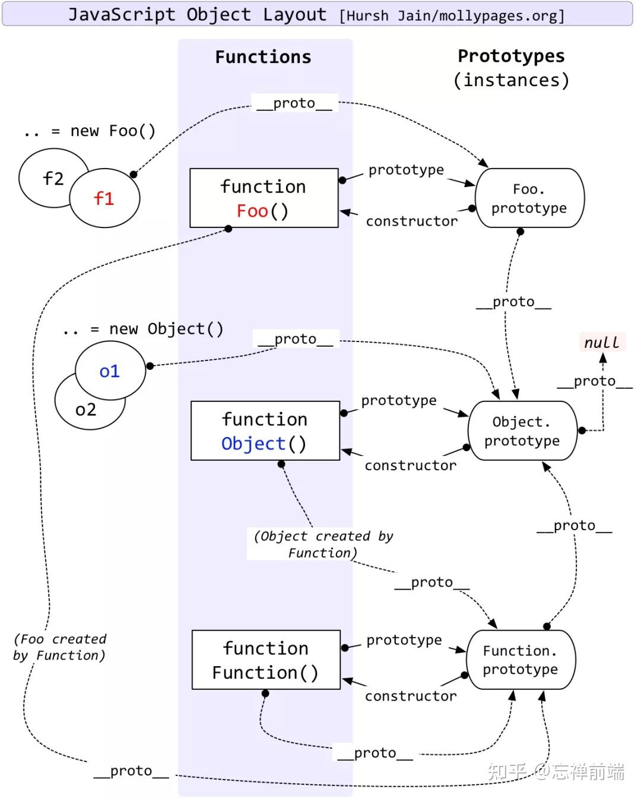

## hash、chunkhash、contenthash

```js
    output: {
      path: resolveApp("./build"),
      filename: "js/[name].[chunkhash:6].bundle.js",
      chunkFilename: "js/[name].[contenthash:6].chunk.js",
      publicPath: ""
    },
```

hash：一整个项目，一次打包，只有一个hash值

chunkhash：从入口entry出发，到它的依赖，以及依赖的依赖，依赖的依赖的依赖，等等，一直下去，所打包构成的代码块(模块的集合)叫做一个chunk，也就是说，入口文件和它的依赖的模块构成的一个代码块，被称为一个chunk。 所以，一个入口对应一个chunk，多个入口，就会产生多个chunk 所以，单入口文件，打包后chunkhash和hash值是不同的，但是效果是一样的

contenthash：只和内容有关系

hash -> chunkhash -> contenthash，生成效率依次降低，精度依次增高。

## 编译过程

- 初始化：启动构建，读取与合并配置参数，加载 Plugin，实例化 Compiler
- 编译：从 Entry 出发，开始解析文件构建AST语法树，针对每个 Module 串行调用对应的 Loader 去翻译文件的内容，再找到该 Module 依赖的 Module，递归地进行编译处理
- 输出：将编译后的 Module 组合成 Chunk，将 Chunk 转换成文件，输出到文件系统中

## var、let、const的区别

1. var定义的变量，没有块级作用域，有函数作用域，有变量提升，可以重复声明。
2. let定义的变量，有块级作用域，有函数作用域，不存在变量提升（暂时性死区），不可重复声明。
3. const用来定义只读常量，使用时必须初始化而且值不能被修改，有块级作用域，不可重复声明。
4. 同一个变量只能使用一种方式声明，不然会报错

[var、let、const 的本质区别是什么 - 知乎 (zhihu.com)](https://zhuanlan.zhihu.com/p/373652940)

## 原型链

当谈到继承时，JavaScript 只有一种结构：对象。

**每个实例对象（ object ）都有一个私有属性（称之为 `__proto__` ）指向它的构造函数的原型对象（`prototype`）。**

该原型对象也有一个自己的原型对象( `__proto__` ) ，层层向上直到一个对象的原型对象为 `null`。根据定义，`null` 没有原型，并作为这个**原型链**中的最后一个环节。

JavaScript 对象是动态的属性“包”（指其自己的属性）。JavaScript 对象有一个指向一个原型对象的链。当试图访问一个对象的属性时，它不仅仅在该对象上搜寻，还会搜寻该对象的原型，以及该对象的原型的原型，依次层层向上搜索，直到找到一个名字匹配的属性或到达原型链的末尾。





## event loop

微任务：promise的回调，process.nextTick，MutationObserver

每个宏任务之后，引擎会立即执行微任务队列中的所有任务，然后再执行其他的宏任务，或渲染，或进行其他任何操作。

```
宏任务 → 所有微任务 → 下一个宏任务
```

```js
题 1：

setTimeout(function () {
    console.log(1)
});
new Promise(function(resolve,reject){
    console.log(2)
    resolve(3)
}).then(function(val){
    console.log(val)
})
console.log(4)

Result:
2 → 4 → 3 → 1
```

```js
题 2：

new Promise(resolve => {
    resolve(1);

    Promise.resolve().then(() => {
    	// t2
    	console.log(2)
    });
    console.log(4)
}).then(t => {
	// t1
	console.log(t)
});
console.log(3);

Result:
4 → 3 → 2 → 1
```


## valueOf和toString

### valueOf转换规则

非原始值(也就是对象)重写规则如下：

| 对象     | valueOf返回值        |
| -------- | -------------------- |
| Array    | 数组本身             |
| Boolean  | 布尔值               |
| Date     | 返回毫秒形式的时间戳 |
| Function | 函数本身             |
| Number   | 数字值               |
| Object   | 对象本身             |
| String   | 字符串值             |

#### 对象转换为布尔值

1. 直接转换为true（包装类型也一样），不调用valueOf和toString

#### 对象转换为数字

在预期会将对象用作数字使用时，比如参与算术运算等等操作，对象转换为数字会依次调用valueOf和toString方法，具体规则如下：

1. 如果对象具有`valueOf`方法且返回原始值(string、number、boolean、undefined、null)，则将该原始值转换为数字(转换失败会返回NaN)，并返回这个数字
2. 如果对象具有`toString`方法且返回原始值(string、number、boolean、undefined、null)，则将该原始值转换为数字(转换失败会返回NaN)，并返回这个数字
3. 转换失败，抛出`TypeError`

#### 对象转换为字符串

1. 如果对象具有`toString`方法且返回原始值(string、number、boolean、undefined、null)，则将该原始值转换为字符串，并返回该字符串
2. 如果对象具有`valueOf`方法且返回原始值(string、number、boolean、undefined、null)，则将该原始值转换为字符串，并返回该字符串
3. 转换失败，抛出`TypeError`

### toString转换规则

| 对象     | toString返回值                                               |
| -------- | ------------------------------------------------------------ |
| Array    | 以逗号分割的字符串，如[1,2]的toString返回值为"1,2"           |
| Boolean  | "true"                                                       |
| Date     | 可读的时间字符串，如"Tue Oct 15 2019 12:20:56 GMT+0800 (中国标准时间)" |
| Function | 声明函数的JS源代码字符串                                     |
| Number   | "数字值"                                                     |
| Object   | "[object Object]"                                            |
| String   | "字符串"                                                     |

### 面试题

```
var a = {};
var b = {};
var c = {};
c[a] = 1;
c[b] = 2;

console.log(c[a]);
console.log(c[b]);
复制代码
```

### 题解

由于对象的key是字符串，所以`c[a]`和`c[b]`中的`a`和`b`会执行[对象到字符串]的转换。

根据转换规则, `a`和`b`都转换为了`[object Object]`，所以`c[a]`和`c[b]`操作的是同一个键。

答案是`输出两个2`，c对象的最终结构如下：

```
{
  '[object Object]':2
}
```


## 函数累加

问题：用 `JS `实现一个无限累加的函数 `add`，示例如下：

```js
add(1); // 1
add(1)(2);  // 3
add(1)(2)(3)； // 6
add(1)(2)(3)(4)； // 10
// 以此类推
```


```js
function add(a) {
  function sum(b) { // 使用闭包
    a = b ? a + b : a; // 累加
    return sum;
  }
  sum.toString = function () { // 重写toSting() 方法 把结果a返回出去
    return a;
  }
  return sum; // 返回一个函数
}
```

> `add()`每次都会返回一个函数`sum`，直到最后一个没被调用，默认会触发`toString`方法，所以我们这里重写`toString`方法，并返回累计的最终值`a`

当一个对象转换成原始值时，先查看对象是否有`valueOf`方法，如果有并且返回值是一个原始值，则直接返回这个值；如果没有`valueOf`或返回的不是原始值，那么调用`toString`方法，返回字符串表示。

```js
function add(){
    // 1 把所有参数转换成数组
    let args = Array.prototype.slice.call(arguments)
    // 2 再次调用add函数，传递合并当前与之前的参数
    let fn = function() {
        let arg_fn = Array.prototype.slice.call(arguments)
        return add.apply(null, args.concat(arg_fn))
    }
    // 3 最后默认调用，返回合并的值
    fn.toString = function() {
        return args.reduce(function(a, b) {
            return a + b
        })
    }
    return fn
}

// ES6写法
function add () {
    let args = [...arguments];
    let fn = function(){
        return add.apply(null, args.concat([...arguments]))
    }
    fn.toString = () => args.reduce((a, b) => a + b)
    return fn;
}
```


## new做了什么事情

1. 创建一个空对象
2. 将空对象的原型指向构造函数的原型对象
3. 执行时将构造函数内部的this指向空对象


## typeof instanceof toString


在 javascript 的最初版本中，使用的 32 位系统，为了性能考虑使用低位存储了变量的类型信息：

- 000：对象
- 010：浮点数
- 100：字符串
- 110：布尔
- 1：整数

对于 `undefined` 和 `null` 来说，这两个值的信息存储是有点特殊的。

`null`：对应机器码的 NULL 指针，一般是全零

`undefined`：用 −2^30 整数来表示

所以，`typeof` 在判断 `null` 的时候就出现问题了，由于 `null` 的所有机器码均为0，因此直接被当做了对象来看待。

### typeof返回值

- "undefined"
- "object"
- "boolean"
- "number"
- "bigint"
- "string"
- "symbol"
- "function"

```js
typeof null // 'object'
typeof undefined; // "undefined"
typeof false; // "boolean"
typeof 1; // "number"
typeof '1'; // "string"
typeof {}; // "object"
typeof []; // "object"
typeof new Date(); // "object"
typeof Symbol(); // "Symbol"
typeof 123n // 'bigint'
typeof function foo() {}; // 'function'
```

### instanceof

**instanceof** **运算符**用于检测构造函数的 `prototype` 属性是否出现在某个实例对象的原型链上。

#### 手写instanceof

```javascript
function my_instance_of(leftVaule, rightVaule) {
    if(typeof leftVaule !== 'object' || leftVaule === null) return false;
    let rightProto = rightVaule.prototype,
        leftProto = leftVaule.__proto__;
    while (true) {
        if (leftProto === null) {
            return false;
        }
        if (leftProto === rightProto) {
            return true;
        }
        leftProto = leftProto.__proto__
    }
}
```

### toString

```js
var toString=Object.prototype.toString;

console.log(toString.call(und));  // [object Undefined]
console.log(toString.call(nul));  // [object Null]
console.log(toString.call(boo));  // [object Boolean]
console.log(toString.call(num));  // [object Number]
console.log(toString.call(str));  // [object String]
console.log(toString.call(obj));  // [object Object]
console.log(toString.call(arr));  // [object Array]
console.log(toString.call(fun));  // [object Function]
console.log(toString.call(date));  // [object Date]
console.log(toString.call(reg));  // [object RegExp]
console.log(toString.call(err));  // [object Error]
console.log(toString.call(arg));  // [object Arguments]
```

+ 使用 typeof 来判断基本数据类型是可行的,需要注意的是typeof判断null类型时的问题
+ 判断一个对象考虑用instanceof，但是instanceof判断一个数组的时候,它可以被instanceof判断为Object
+ 比较准确的的判断对象实例的类型，采取`Object.prototype.toString.call()`方法

## map和parseInt

```js
[1, 2, 3].map(parseInt);
// 等同于
[1, 2, 3].map((item, index, arr) => {
  return parseInt(item, index);
});
// 1 NaN NaN
```

```js
parseInt(string, radix);
```

**parseInt(\*string\*, \*radix\*)** 解析一个字符串并返回指定基数的十进制整数

`string`

要被解析的值。如果参数不是一个字符串，则将其转换为字符串 (使用 [`ToString`](https://www.ecma-international.org/ecma-262/6.0/#sec-tostring)抽象操作)。字符串开头的空白符将会被忽略。

`radix`_ 可选_

从 `2` 到 `36` 的整数，表示进制的基数。例如指定 `16` 表示被解析值是十六进制数。如果超出这个范围，将返回 `NaN`。**假如指定 `0` 或未指定，基数将会根据字符串的值进行推算。**注意，推算的结果不会永远是默认值 `10`！

参考资料：

[parseInt - JavaScript | MDN (mozilla.org)](https://developer.mozilla.org/zh-CN/docs/Web/JavaScript/Reference/Global_Objects/parseInt)


## 请求并发数控制器

```js
//异步调度器
class Scheduler {
    constructor(maxNum) {
      //等待执行的任务队列
      this.taskList = []
      //当前任务数
      this.count = 0
      //最大任务数
      this.maxNum = maxNum
    }

    run() {
      this.count++
      this.taskList.shift()().then((result) => {
        this.count--
        if(this.taskList.length) this.run()
      })
    }

    add(promiseCreator) {
       this.taskList.push(() => promiseCreator())
       //当当前任务数小于最大任务数就将其任务执行
       this.count < this.maxNum && this.run()
    }
  }
```

```js
// 并发请求函数
const concurrencyRequest = (urls, maxNum) => {
    return new Promise((resolve) => {
        if (urls.length === 0) {
            resolve([]);
            return;
        }
        const results = [];
        let index = 0; // 下一个请求的下标
        let count = 0; // 当前请求完成的数量

        // 发送请求
        async function request() {
            if (index === urls.length) return;
            const i = index; // 保存序号，使result和urls相对应
            const url = urls[index];
            index++;
            try {
                const resp = await fetch(url);
                // resp 加入到results
                results[i] = resp;
            } catch (err) {
                // err 加入到results
                results[i] = err;
            } finally {
                count++;
                // 判断是否所有的请求都已完成
                if (count === urls.length) {
                    console.log('完成了');
                    resolve(results);
                }
                request();
            }
        }

        // maxNum和urls.length取最小进行调用
        const times = Math.min(maxNum, urls.length);
        for(let i = 0; i < times; i++) {
            request();
        }
    })
}
```

参考资料：

[Promise 事件执行控制 - 掘金 (juejin.cn)](https://juejin.cn/post/6901912409343492103)

https://juejin.cn/post/7163522138698153997

## 代码运行题

### 1

浏览器下：

```js
// 最终结果 10 10 10 undefined

var obj = {
  age: 18,
  foo: function (func) {
    func() // window.func() 由window调用
    let zz = arguments[0] // window.func() 由window调用
    zz()
    arguments[0]() // arguments.0() 由arguments调用
  }
}
var age = 10
function temp() {
  console.log(this.age);
}
temp() // window.func() 由window调用

obj.foo(temp)
```


### 2

闭包

```js
// 最终结果 11 12 0
var n = 0
function a() {
  var n = 10
  function b() {
    n++ // 10+1
    console.log(n) // 11
  }
  b()
  return b
}
var c = a()
c() // 12
console.log(n) //0

```


### 3

```js
var a = 10
var b = 11
var c = 12
function test(a) { // 形参等同于var a
  a = 1
  var b = 2
  c = 3
}
test(100)
console.log(a) // 10
console.log(b) // 11
console.log(c) // 3

```


### 4

html下：

```js
var num = 10
var obj = { num: 20 }
obj.fn = (function (num) {
  this.num = num * 3 // 20*3
  num++ // 20+1
  return function (n) {
    this.num += n // 5+20*3  // obj.fn(10) 此时this.num指向obj.num 20+10
    num++ // 20+1+1  // 闭包,此处num指向外层匿名函数的num 22+1
    console.log(num)  // 22  // 23
  }
})(obj.num) // 20

var fn = obj.fn
fn(5) // window.fn() 输出 22
obj.fn(10) // 输出 23
console.log(num, obj.num) // 65 30
```

第三行匿名函数自调用，传入实参20，此时函数内的`this.num`指向全局下的`num`

### 5

html下：

```js
let obj = {
    age:20,
    info:function(){
        return () => {
            console.log(this.age)
        }
    }
}
let person = { age:28 }
let info1 = obj.info()
info1() // 20
let info2 = obj.info.call(person)
info2() // 28
```


### 6

**箭头函数不能在call方法修改里面的this**

函数的this可以通过call等显式绑定的方式修改，而为了减少this的复杂性，箭头函数无法用call()来指定this

```js
const obj = {
    a: () => {
        console.log(this)
    }
}
obj.a.call('123')  //打出来的结果依然是window对象
```


### 7

不管我们给函数进行几次bind显式绑定，函数中的this永远由 **第一次bind** 决定

```js
let a = {}
let fn = function(){
    console.log(this)
}
fn.bind().bind(a)() // => Window
```


### 8

```js
var a = 1
let b = 1
const c = 1
console.log(window.a) // 1
console.log(window.b) // undefined
console.log(window.c) // undefined

在全局作用域下使用let和const声明变量，变量并不会被挂载到window上，这一点与var不同

关于const，还有两个注意点：
- const声明之后必须马上赋值，否则报错
- const简单类型一旦声明就不能修改，而复杂类型（数组，对象）指针指向的地址不能修改，但内部数据可以修改
```


### 9

```html
<script>
    let a={}
    b='0'
    c=0
    a[b]='1'
    a[c]=2
    console.log(a[b]) // 2
 </script>
```

### 10

```html
  <script>
    let a={}
    b={
      n: '0'
    }
    c={
      m:'2'
    }
    a[b]='qaz'
    a[c]='abc'
    console.log(a[b]) // 'abc'
  </script>
```

### 11

```html
<script>
    var test=(function(i){
      return function(){
        alert(i*2)
      }
    })(2)
    test(5) // '4' alert默认调用.toString()
</script>
```

### 12

```html
  <script>
    var a = 0, b = 0
    function A(a) {
      A = function (b) {
        alert(a + b++) // a闭包
      }
      alert(a++)
    }
    A(1) // '1'
    A(2) // '4'
  </script>
```

## css 引入方式 link 和 @import 的区别

link是html标签，@import是CSS中的一种规则，必须写在样式表文件的顶部。

link标签除了加载css 还可以加载其他内容，比如RSS，ico图标等。@import只能加载css

link标签支持并行下载，可以同时下载多个CSS文件，加快页面加载速度。@import逐个加载

link引入样式可以在页面加载时加载。@import引入样式必须等页面加载完成再加载

## 宽高等比例布局

### 百分比padding

百分比padding值都是相对于宽度进行计算

```css
div { padding: 50%; }
```

或者：

```css
div { padding: 100% 0 0; }
```

或者：

```css
div { padding-bottom: 100%; }
```

都表示宽高为1:1的正方形

### aspect-ratio

[ˈæspekt] [ˈreɪʃiəʊ]

```css
aspect-ratio: 1 / 1;  // 宽/高
```

首选纵横比为指定的 `width` / `height` 比率。如果省略 `height` 和前面的斜杠字符，则 `height` 默认为 `1`。

### cqw

```css
.box {
    display: flex;
    gap: .5rem;
    flex-wrap: wrap;
    container-type: inline-size;
}
.box img {
    width: calc(25cqw - 1.5rem / 4);
    height: calc(25cqw - 1.5rem / 4);
    object-fit: cover;
}
```

资料地址

[CSS高宽不等图片固定比例布局的三重进化 « 张鑫旭-鑫空间-鑫生活 (zhangxinxu.com)](https://www.zhangxinxu.com/wordpress/2023/07/css-image-aspect-ratio-layout/)

## 响应式布局尺寸

响应式布局一般可以分为以下几个常见的屏幕尺寸范围： 

记住：768 992 1200三个分割尺寸

1. 小屏幕设备 (移动设备):
   - 窄屏手机（非常小的屏幕）：小于 576px
   - 手机（小型到中型屏幕）：576px - 767px
2. 中屏幕设备 (平板电脑和小型笔记本电脑):
   - 平板电脑（普通和大屏幕）：768px - 991px
3. 大屏幕设备 (桌面电脑):
   - 桌面显示器（小到中型屏幕）：992px - 1199px
4. 极大屏幕设备 (大型桌面显示器和电视):
   - 大型桌面显示器和电视（大屏幕）：1200px 及以上

## http缓存

通常 HTTP 缓存策略分为两种：

- 强缓存
- 协商缓存

**强缓存**

强缓存不会向服务器发送请求，直接从缓存中读取资源，在 chrome 控制台的 network 选项中可以看到该请求返回 200 的状态码，并且`size`显示`from disk cache`或`from memory cache`；

强缓存可以通过设置`Expires`和`Cache-Control` 两种响应头实现。如果同时存在，`Cache-Control`优先级高于`Expires`。

Expires 代表该资源的过期时间，其值为一个绝对时间。

```http
Expires: Wed, 21 Oct 2015 07:28:00 GMT
```

Cache-Control表示资源缓存的最大有效时间。其过期时间指令的值是相对时间

+ `no-cache` 不使用强缓存，需要与服务器验协商缓存验证。
+ `max-age=<seconds>` 缓存存储的最大周期，超过这个周期被认为过期。

协商缓存会先向服务器发送一个请求，服务器会根据这个请求的 request header 的一些参数来判断是否命中协商缓存，如果命中，则返回 304 状态码并带上新的 response header 通知浏览器从缓存中读取资源。

**协商缓存**

通过 `Last-Modified`/`If-Modified-Since`和`ETag`/`If-None-Match`这两对 Header 来控制。

`Last-Modified`与`If-Modified-Since` 的值都是 GMT 格式的时间字符串，代表的是文件的最后修改时间。

服务器在响应请求时，会通过`Last-Modified`告诉浏览器资源的最后修改时间。

第二次请求前，在浏览器请求头里加上If-Modified-Since，If-Modified-Since值也跟Last-Modified值一致，服务端会响应304，并且不会发送文件内容，节约了网络流量。

第三次请求，同Last-Modified不一致，服务端响应200，发送最新的文件内容。

**缺点：只取决于时间，不取决于实际内容**


`Etag`都是服务器为每份资源生成的唯一标识，就像一个指纹，资源变化都会导致 ETag 变化，跟最后修改时间没有关系，`ETag`可以保证每一个资源是唯一的。

在浏览器发起请求，浏览器的请求报文头会包含 `If-None-Match` 字段，其值为上次返回的`Etag`，服务器接收到次报文后发现 `If-None-Match` 则与被请求资源的唯一标识进行对比。如果相同说明资源没有修改，则响应返 304，浏览器直接从缓存中获取数据信息。如果不同则说明资源被改动过，则响应整个资源内容，返回状态码 200。

参考资料：

【实践中的浏览器缓存问题排查，和你面试背的八股文有出入】 https://www.bilibili.com/video/BV1v8411U74G/?share_source=copy_web&vd_source=dc1323228f1470bd561672c18d78adf3


## 行内、行内块、块级元素区别

行内：

宽高无效，margin只有左右有效，padding无效，和其他元素共用一行

行内块：

input、img、button

和其他元素共用一行

块：

独占一行，margin padding 都有效，宽度默认100%父级


## 盒子模型

标准盒子（content-box）：width和height只包括内容宽高

怪异盒子（border-box）：width和height包括内容 padding border


## cookie session  token区别

session由服务端生成，集中存储在服务端，相对cookie更安全

cookie由服务端生成，存储在浏览器，属于http协议规定，与域名绑定，不支持跨域，每个不能超过 4KB

token由服务端生成，是开发者定义不属于http协议规定


## get post区别

get

由地址栏发起的get请求可以被保存在浏览器历史，URL长度最大2048个字符，安全性差

post

支持文件上传`enctype:multipart/form-data `，参数长度无限制，更安全


## forin forof区别

`for key in`循环用于遍历对象的可枚举属性键名。会遍历原型中的属性

`for val of`循环用于遍历可迭代对象的值，而不是键名。


## BFC

应用场景：边距合并，边距溢出，float高度塌陷，清除浮动，浮动环绕文字

如何创建：

float不为none

overflow:hidden

display:flow-root flex

position:absolute fixed


## 闭包

闭包就是能够读取其他函数内部变量的函数。


## src和href的区别

src表示对资源的引用，它指向的内容会嵌入到当前标签所在的位置，比如图片。

src会将其指向的资源下载并应⽤到⽂档内，比如JS文件。

href表示超文本引用，指向一些网络资源，建立和当前元素或本文档的链接关系，比如a标签的href。

href被识别到指向文件时，会并⾏下载资源，比如link加载css文件。

## script标签中defer和async

如果没有defer async表示浏览器立即加载并执行脚本，会阻塞后续文档加载

defer异步加载js文件，下载执行不阻塞，会在文档所有元素解析完成后按声明顺序执行JS文件

async异步加载js文件，下载不阻塞，执行阻塞，会在下载完成后立刻执行，执行顺序取决于下载完成先后顺序

## em和rem

em，相对单位，这个单位表示元素的 [`font-size`](https://developer.mozilla.org/zh-CN/docs/Web/CSS/font-size) 的计算值。如果用在[`font-size`](https://developer.mozilla.org/zh-CN/docs/Web/CSS/font-size) 属性本身，它则表示元素*继承*的 `font-size` 值。em不仅可以用作font-size的计算值，也可用于width等。

rem，相对单位，这个单位代表根元素（通常为<html> 元素）的 font-size 大小。当用在根元素的 font-size 上面时，它代表了它的初始值。

移动端屏幕适配meta

```html
<meta name="viewport" content="width=device-width, initial-scale=1, maximum-scale=1">
```

## requestAnimationframe

一个尾递归定时器，delay为16.7ms（取决于显示器刷新率）

**window.requestAnimationFrame(callback);**

callback是**下一次重绘之前更新动画帧所调用的函数**，该方法属于**宏任务**，所以会在执行完微任务之后再去执行。

相比于setTimeout的优势：

节约性能，页面处于不可见或不可用状态时，raf也会被暂停

setTimeout固定时间间隔有误差


## margin百分比取值

`margin-top:100%`，上外边距间距值为父元素width * 100% 。

padding也有类似的特性，参考前面的 **宽高等比例布局**


## 幽灵元素

ul的子li之间，img和行内元素之间会有一个空隙，使用`font-size:0`规避这一问题

## 箭头函数

相比于普通函数：

不能作为构造函数执行，没有prototype

没有this，其函数内的this指向取决于定义时的上下文环境，不能被call bind apply更改

没有arguments

## map和object的区别

object的键名只能是string类型，map可以是任意类型

遍历时object的键是无序的，map取决于插入顺序

object的键值个数统计需要手动，而map有size属性


## JSON.stringify深克隆的缺点

不支持function  undefined Date RegExp

循环引用对象不适用

## history模式和hash模式的区别

history能适用ssr，hash不能

history是html5新特性，hash是浏览器锚点，兼容性有差异

## 完整的HTTP请求过程

当我们在web浏览器的地址栏中输入：www.baidu.com，具体发生了什么？

1. 对www.baidu.com这个网址进行DNS[域名解析](https://cloud.tencent.com/product/cns?from_column=20065&from=20065)，得到对应的IP地址
2. 根据这个IP，找到对应的[服务器](https://cloud.tencent.com/product/cvm?from_column=20065&from=20065)，发起TCP的三次握手
3. 建立TCP连接后发起HTTP请求
4. 服务器响应HTTP请求，浏览器得到html代码
5. 浏览器解析html代码，并请求html代码中的资源（如js、css、图片等）（先得到html代码，才能去找这些资源）
6. 浏览器对页面进行渲染呈现给用户
7. 服务器关闭关闭TCP连接

[一次完整的HTTP请求过程-腾讯云开发者社区-腾讯云 (tencent.com)](https://cloud.tencent.com/developer/article/1500463)

## http和https区别

http明文传输，https = http + ssl

+ HTTP是明文传输，数据未经过加密，客户端与服务器之间无法进行身份验证，安全性较差，HTTPS(HTTP + TLS)数据传输过程是加密的，客户端与服务器之间可以进行身份验证，安全性较好。

+ HTTP不需要证书，HTTPS需要证书。

+ HTTP直接面向TCP，使用TCP三次握手建立连接，而HTTPS直接面向TLS，通过TLS进行安全性验证，然后TLS面向TCP，这使得HTTP页面响应速度比HTTPS快。

+ 同样的原因，HTTPS比HTTP更加耗费资源。

## SSL与TLS区别

- **SSL**(Secure Socket Layer)安全套接层。

- **TLS**(Transport Layer Security)传输层安全性协议，是基于SSL3.0设计的协议。

## http2.0 和http1.0区别

一共5点都要答

连接复用：
HTTP1.0：每个HTTP请求都需要建立一个新的TCP连接，请求结束后立即关闭连接。这样的方式会导致每个请求都需要重新建立连接，增加了延迟和开销。
HTTP2.0：引入了多路复用技术，允许在同一个TCP连接上并发发送多个请求和响应>避免了建立和关闭多个连接的开销（握手？），提高了性能和效率。

 请求-响应方式：

`HTTP1.0`：采用的是单向请求-响应模式，即每个请求只能对应一个响应，请求和响应是一一对应的关系。

`HTTP2.0`：引入了`Server Push`机制，服务器可以在客户端请求之前主动推送相关资源，避免了客户端重复请求的等待时间，提高了页面加载速度。

头部压缩

`HTTP1.0`：每个请求和响应的头部都包含大量的重复信息，造成了较大的网络传输开销。

`HTTP2.0`：使用了HPACK算法对头部进行压缩，减少了头部的大小，降低了网络传输开销。

二进制协议：

`HTTP1.0`：采用文本（明文）形式进行数据传输，**易于阅读和调试**，但是传输效率较低。

`HTTP2.0`：采用二进制格式传输数据，减少了解析的复杂性，提高了传输效率。

长连接支持：

`HTTP1.0`：基本上都是短连接，每个请求响应完成后立即关闭连接。

`HTTP2.0`：支持长连接，即一个TCP连接可以承载多个请求和响应，减少了连接的建立和关闭次数，提高了性能。

## 三次握手四次挥手，为什么要四次挥手 （待补充）

tcp双全工

## webpack loader执行顺序

loader的执行顺序是从下往上，从右往左。

```js
module.exports = {
  module: {
    rules: [
      {
        test: /\.less$/,
        use: ['style-loader', 'css-loader', 'less-loader'],
      },
    ],
  },
};
// less-loader -> css-loader -> style-loader
```

enforce更改loader执行顺序，enforce可选值有 pre、post，当设置 pre时，loader 的执行时时机会提前；当设置为 post 时，loader 的执行时机会延后。

```js
module.exports = {
  module: {
    rules: [
      {
        test:/\.js$/,
        rules: [
          {
            loader: 'loader1'
          },
          {
            loader: 'loader2',
            enforce: 'pre'
          },
          {
            loader: 'loader3'
          }
        ]
      }
    ],
  },
};
// loader2 -> loader3 -> loader1：
```

**pitching loader**

所有一个接一个地进入的 loader，都有两个阶段：

1. **Pitching** 阶段: loader 上的 pitch 方法，按照 `后置(post)、行内(inline)、普通(normal)、前置(pre)` 的顺序调用。更多详细信息，请查看 [Pitching Loader](https://webpack.docschina.org/api/loaders/#pitching-loader)。
2. **Normal** 阶段: loader 上的 常规方法，按照 `前置(pre)、普通(normal)、行内(inline)、后置(post)` 的顺序调用。模块源码的转换， 发生在这个阶段。

loader **总是** 从右到左被调用。有些情况下，loader 只关心 request 后面的 **元数据(metadata)**，并且忽略前一个 loader 的结果。在实际（从右到左）执行 loader 之前，**会先 从左到右 调用 loader 上的 `pitch` 方法。**

参考资料

打破认知——webpack loader执行顺序真的是从右向左吗？ - 掘金 (juejin.cn)](https://juejin.cn/post/7224363940661887035?searchId=20230817235437D44A2EF96609214314FA)


## 判断一个对象是否为空

**遍历可枚举属性**

```
Object.keys()`、`Object.getOwnPropertyNames()`、`JSON.stringify()、for in、for of
```

**Symbol 值作为属性名**

Symbol 值作为属性名，遍历对象的时候，该属性不会出现在`for...in`、`for...of`循环中，也不会被`Object.keys()`、`Object.getOwnPropertyNames()`、`JSON.stringify()`返回。有一个`Object.getOwnPropertySymbols()`方法，可以获取指定对象的所有 Symbol 属性名。该方法返回一个数组，成员是当前对象的所有用作属性名的 Symbol 值。

**Reflect.ownKeys()**

`Reflect.ownKeys()`方法可以返回所有类型的键名，包括常规键名和 Symbol 键名。

【【前端面试】如何判断一个对象为空】 https://www.bilibili.com/video/BV1mh4y1S7EM/?share_source=copy_web&vd_source=dc1323228f1470bd561672c18d78adf3

[Symbol - ECMAScript 6入门 (ruanyifeng.com)](https://es6.ruanyifeng.com/#docs/symbol#属性名的遍历)


## xss攻击

指攻击者通过注入恶意HTML、JS脚本到网页中，当用户浏览网页时执行恶意代码，从而实施攻击的过程。

产生原因：

1. 浏览器具有解析和执行js脚本的能力，但是并不能判断代码是否恶意
2. 输入和输出时缺少必要的安全策略，导致恶意代码执行

分类：

**反射性XSS**：攻击者构造特制的恶意链接，诱使用户点击该链接来触发漏洞，当服务器返回的响应（HTML文档）中包含恶意脚本时，恶意代码将在用户浏览器中执行。

```js
https://example.com/search?keyword=<script>alert('XSS Attack');</script>
```

**存储型**：攻击者将恶意脚本代码存储到目标网站的数据库中，当其他用户浏览该网站时，恶意脚本会从数据库中被读取并执行。

利用留言板的存储功能，发布了一条包含恶意脚本的留言，如下所示：

```js
<script>alert('Stored XSS Attack');</script>
```

留言存储在数据库中的记录可能类似于：

```js
Username: John
Message: Hello, everyone! <script>alert('Stored XSS Attack');</script>
```

当其他用户访问留言板时，网站会从数据库中读取并显示留言，恶意脚本也会被读取并在用户的浏览器中执行。这就导致在其他用户的浏览器中弹出一个警示框，其中包含"Stored XSS Attack"的提示信息。

> HTML5中指定不执行由innerHTML插入的script标签，但是仍然可以通过其他方式执行js

```html

```

**DOM型XSS**

由`document.write` `eval`等处理才产生的XSS

**基于DOM属性的XSS**

```html

```

[XSS常见的触发标签_可以触发xss的标签_H3rmesk1t的博客-CSDN博客](https://blog.csdn.net/LYJ20010728/article/details/116462782?ops_request_misc=&request_id=0a77edb6be9c46b9af3a6ef6dfb0c74b&biz_id=&utm_medium=distribute.pc_search_result.none-task-blog-2~blog~koosearch~default-1-116462782-null-null.268^v1^control&utm_term=xss&spm=1018.2226.3001.4450)


预防：

cookie：httponly

参数校验

避免使用eval

对返回值使用.text方式而不是.html方式
